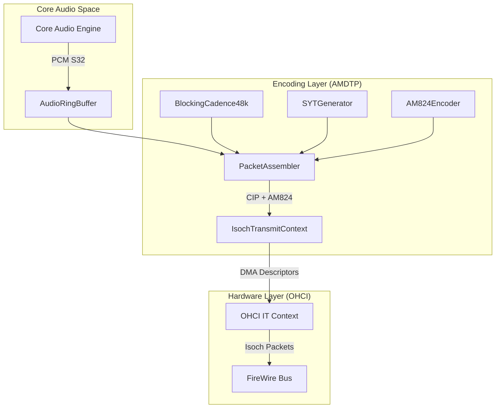
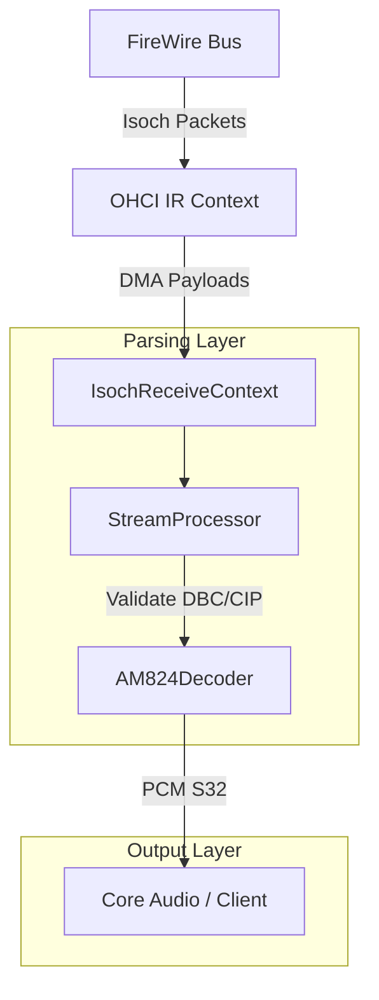
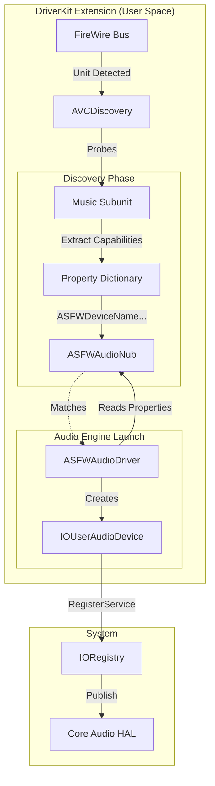
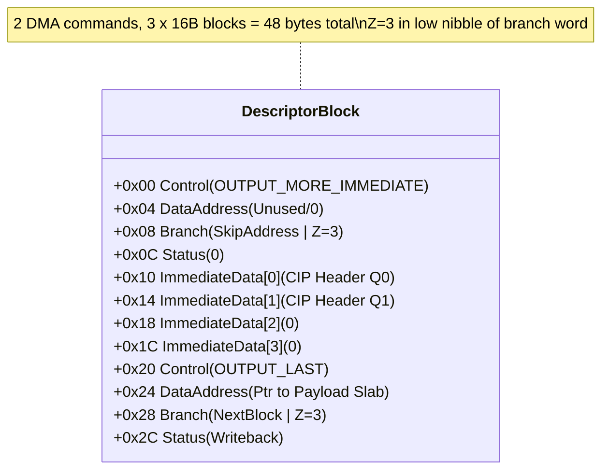

# Isochronous (Isoch) Stack

The Isoch stack handles **bidirectional real-time audio streaming** over IEEE 1394 isochronous channels, implementing IEC 61883-1 (CIP) and IEC 61883-6 (AM824) protocols.

This is the most critical part of the FireWire stack. FireWire isochronous transfers run at 8000 Hz (125 µs cycle time). Hot paths must be deterministic and low-latency; otherwise, packet underruns or overruns cause audible glitches.

The Isoch stack is currently focused on audio hardware testing. However, it serves as a robust starting point for supporting other isochronous device types in the future.

The goal is to provide a generic framework for building isochronous DMA programs for various devices (e.g., cameras or storage devices using isochronous transport), acknowledging that isochronous streams do not guarantee data integrity.

**Status:** 
- 🚧 **Receive (IR)**: Work-in-progress / Experimental.
- ✅ **Transmit (IT)**: Functional. Capable of transmitting data to hardware with SYT smoothing and cadence generation.

---

> [!IMPORTANT]
> **Descriptor Behavior Warning (Spec vs Reality)**
> Some published OHCI 1.1 descriptor diagrams do **not** match the behavior observed on modern controllers and in Apple's legacy stack. This project follows **Linux firewire-ohci + AppleFWOHCI-validated behavior** for IT descriptor layout and stepping.
> **Always cross-validate with those sources when changing descriptor fields (especially OMI/branch/Z handling).**

---

## Architecture Flow

### Audio Transmit (IT) Flow


### Audio Receive (IR) Flow



---

## AudioDriverKit Integration

The integration with macOS CoreAudio is handled by a three-stage pipeline that bridges device discovery with audio processing, all running in user space as a DriverKit extension.

### 1. Discovery & Publication Layer (User Space / DriverKit)
The process begins in `AVCDiscovery` (part of the main ASFW DriverKit extension), which scans the FireWire bus for units.
1.  **Unit Detection**: `AVCDiscovery` detects an AV/C unit (Spec ID `0x00A02D`).
2.  **Subunit Probing**: It probes the unit for a **Music Subunit** (type `0x0C`; often seen as `0x60` when stored in the full subunit-ID byte).
3.  **Capability Extraction**: If a Music Subunit is found, it parses its plugs to determine:
    *   **Channel Count**: From the number of plugs or channel clusters.
    *   **Sample Rates**: By querying supported formats on the plugs.
    *   **Device Name**: From the Config ROM (Vendor/Model leaf).
4.  **Nub Creation**: `AVCDiscovery` creates an `ASFWAudioNub` (an `IOService` subclass) and populates it with a properties dictionary containing these discovered capabilities (e.g., `ASFWDeviceName`, `ASFWSampleRates`).
5.  **Nub Registration**: The nub is registered in the IORegistry, acting as a dynamic match point.

### 2. Driver Matching Layer (System)
*   **Matching**: The `ASFWAudioDriver` (a `.dext` service) has an `Info.plist` entry matching `ASFWAudioNub`.
*   **Loading**: macOS matches the `ASFWAudioDriver` on the registered nub. Since both are part of the same DriverKit extension, they share the same user-space process.

### 3. Audio Engine Layer (User Space)
`ASFWAudioDriver::Start(provider)` initializes the audio engine using the properties passed from the nub:
1.  **Property Ingestion**: It reads `ASFWSampleRates`, `ASFWChannelCount`, and plug names from the provider (the `ASFWAudioNub` proxy).
2.  **Device Creation**: It calls `IOUserAudioDevice::Create()` to instantiate the audio device object.
3.  **Stream Configuration**:
    *   Creates `IOUserAudioStream` objects for Input and Output.
    *   Configures standard **24-bit PCM** formats (packed in 32-bit integers) for each supported sample rate.
    *   Sets channel names (e.g., "Analog Out 1") to appear correctly in Audio MIDI Setup.
4.  **Registration**: Finally, it calls `RegisterService()`, which publishes the `IOUserAudioDevice` to the system. CoreAudio's HAL (Hardware Abstraction Layer) then picks this up and presents it to applications.

### Capability Processing Summary
| Capability | Source | Path to CoreAudio |
| :--- | :--- | :--- |
| **Sample Rates** | Music Subunit Plug Formats | `AVCDiscovery` → `Nub Properties` → `IOUserAudioStream::SetAvailableStreamFormats` |
| **Channel Count** | Music Subunit Topology | `AVCDiscovery` → `Nub Properties` → `IOUserAudioStream` (channels per frame) |
| **Current Rate** | Active Plug Signal Format | `AVCDiscovery` checks signal format → `Nub Properties` → `IOUserAudioDevice::SetSampleRate` |

### Integration Flow Chart


---

## File Manifest

The Isoch stack is organized into functional layers:

### Root Directory
*   [IsochReceiveContext.cpp](Receive/IsochReceiveContext.cpp) / [IsochReceiveContext.hpp](Receive/IsochReceiveContext.hpp)
    *   **Role**: OHCI Isochronous Receive (IR) DMA Context Manager.
    *   **Responsibilities**: Manages the IR DMA context lifecycle (setup, start, stop), handles `kIsochRx` interrupts, and dispatches processing jobs.
    *   **Key Classes**: `IsochReceiveContext`.
    *   **Note**: Implementation lives under `Receive/` to match the `Transmit/` structure.
*   [IsochTypes.hpp](IsochTypes.hpp)
    *   **Role**: Hardware Register Definitions.
    *   **Responsibilities**: Defines low-level OHCI 1.1/1.2 register layouts, including ContextControl (`CommandPtr`, `ContextMatch`), event codes, and interrupt masks.
    *   **Note**: Critical for understanding bit-level interactions with the OHCI controller.

### Audio/
*   [AM824Decoder.hpp](Audio/AM824Decoder.hpp)
    *   **Role**: IEC 61883-6 Audio Decoder.
    *   **Responsibilities**: Unpacks 32-bit AM824 quadlets into 24-bit signed integer PCM samples. Handles byte swapping (Big Endian wire -> Host Endian) and label stripping (removing the `0x40` MBLA prefix).
    *   **Goal**: Produce a clean, interleaved, signed integer PCM stream for Core Audio.
*   [ASFWAudioDriver.cpp](Audio/ASFWAudioDriver.cpp) / [ASFWAudioDriver.iig](Audio/ASFWAudioDriver.iig)
    *   **Role**: AudioDriverKit Engine.
    *   **Responsibilities**: The main entry point for CoreAudio. Manages the device lifecycle (`Start`/`Stop`), sample rate negotiation, and I/O operations (`IOOperationHandler`).
*   [ASFWAudioNub.cpp](Audio/ASFWAudioNub.cpp) / [ASFWAudioNub.iig](Audio/ASFWAudioNub.iig)
    *   **Role**: Match Point + Capability Carrier.
    *   **Responsibilities**: Publishes discovered properties (name, rates, channels, plug labels) to be consumed by `ASFWAudioDriver`. If shared memory is enabled, exposes a ring buffer region used for low-overhead audio transfer between producer/consumer components.

### Core/
*   [CIPHeader.hpp](Core/CIPHeader.hpp)
    *   **Role**: IEC 61883-1 CIP Parser.
    *   **Responsibilities**: parses the Common Isochronous Packet (CIP) header (2 quadlets). Extracts critical timing (SYT), format (FMT/FDF), and sequence (DBC) fields.
    *   **Note**: Some vendor-specific protocols (e.g., MOTU, RME) might skip CIP headers entirely this parser is specifically for standard IEC 61883 compliant streams.
*   [IsochTypes.hpp](Core/IsochTypes.hpp)
    *   **Role**: Protocol Type Definitions.
    *   **Responsibilities**: Defines high-level protocol enums like `SampleRate`, `SampleRateFamily` (44.1k vs 48k base), and SYT interval constants. Differentiated from the root `IsochTypes.hpp` which is hardware-focused.

### Encoding/
*   [AM824Encoder.hpp](Encoding/AM824Encoder.hpp)
    *   **Role**: IEC 61883-6 Audio Encoder.
    *   **Responsibilities**: Packs 24-bit PCM samples into 32-bit AM824 quadlets (**A**udio/**M**usic, **8**-bit label, **24**-bit data), applying the Multi-Bit Linear Audio (MBLA) label (`0x40`) and handling endianness.
*   [AudioRingBuffer.hpp](Encoding/AudioRingBuffer.hpp)
    *   **Role**: Lock-Free Ring Buffer.
    *   **Responsibilities**: A high-performance Single-Producer Single-Consumer (SPSC) ring buffer. Safely transfers audio data from the high-priority audio callback thread to the isochronous transmit thread without locking.
*   [BlockingCadence48k.hpp](Encoding/BlockingCadence48k.hpp)
    *   **Role**: Transmission Cadence Generator.
    *   **Responsibilities**: Implements the strict N-D-D-D blocking pattern required for 48kHz audio streams. Determines whether the current isochronous cycle sends a DATA packet (8 samples) or a NO-DATA packet (empty CIP only).
*   [BlockingDbcGenerator.hpp](Encoding/BlockingDbcGenerator.hpp)
    *   **Role**: Data Block Counter (DBC) Tracker.
    *   **Responsibilities**: Maintains DBC continuity across DATA and NO-DATA packets, ensuring compliance with the IEC 61883-1 blocking transmission specification.
*   [CIPHeaderBuilder.hpp](Encoding/CIPHeaderBuilder.hpp)
    *   **Role**: CIP Header Factory.
    *   **Responsibilities**: Constructs valid 8-byte CIP headers for outgoing packets, populating fields like SID, DBS, FN, QPC, SPH, and DBC/SYT.
*   [PacketAssembler.hpp](Encoding/PacketAssembler.hpp)
    *   **Role**: Transmit orchestrator.
    *   **Responsibilities**: The central hub for the transmit path. Pulls data from the ring buffer, consults the Cadence and DBC generators, encodes samples, and builds the final packet payload for the DMA engine.
*   [SYTGenerator.cpp](Encoding/SYTGenerator.cpp) / [SYTGenerator.hpp](Encoding/SYTGenerator.hpp)
    *   **Role**: Timestamp (SYT) Engine.
    *   **Responsibilities**: Generates precise presentation timestamps (SYT) for outgoing packets. Correlates host time with the FireWire cycle timer, implementing a smoothing algorithm to prevent jitter.
*   [TimingUtils.hpp](Encoding/TimingUtils.hpp)
    *   **Role**: Timing Constants & Helpers.
    *   **Responsibilities**: Provides conversion utilities for FireWire time units (ticks, cycles, seconds) and defines constants for the 24.576 MHz cycle clock.

### Memory/

*   [IIsochDMAMemory.hpp](Memory/IIsochDMAMemory.hpp)
    *   **Role**: Memory Interface.
    *   **Responsibilities**: Abstract base class defining the contract for allocating DMA-capable memory regions.
*   [IsochDMAMemoryManager.cpp](Memory/IsochDMAMemoryManager.cpp) / [IsochDMAMemoryManager.hpp](Memory/IsochDMAMemoryManager.hpp)
    *   **Role**: Dual-Slab Allocator.
    *   **Responsibilities**: Manages two distinct memory pools to satisfy hardware constraints:
        1.  **Descriptor Slab**: 16-byte aligned, physically contiguous for OHCI command usage.
        2.  **Payload Slab**: 16KB (page) aligned, for actual audio data buffers.

### Receive/
*   [StreamProcessor.hpp](Receive/StreamProcessor.hpp)
    *   **Role**: Receive Stream Analyzer.
    *   **Responsibilities**: Validates the integrity of the incoming isochronous stream. specific tasks include checking DBC continuity to detect dropped packets and parsing CIP headers to identify stream format changes.

### Transmit/
*   [IsochTransmitContext.cpp](Transmit/IsochTransmitContext.cpp) / [IsochTransmitContext.hpp](Transmit/IsochTransmitContext.hpp)
    *   **Role**: OHCI Isochronous Transmit (IT) DMA Context Manager.
    *   **Responsibilities**: Manages the IT DMA context. Handles descriptor ring priming, interrupt-driven recycling of completed packets, and synchronizes with the hardware cycle timer.
*   [SimITEngine.hpp](Transmit/SimITEngine.hpp)
    *   **Role**: Offline Hardware Simulator.
    *   **Responsibilities**: A test harness that mocks the behavior of the OHCI IT context. Used for validating the `PacketAssembler` and `CadenceGenerator` logic without requiring physical FireWire hardware.

---

## DMA Memory Architecture

Isoch memory uses a **Dual-Slab** approach to prevent fragmentation and meet strict Alignment requirements:

1.  **Descriptor Slab**: 16-byte aligned, holds OHCI DMA descriptors.
2.  **Payload Slab**: 16KB (page) aligned, holds raw packet data.

> **Note:** The sizes below are for the **IR (Receive)** context (512 descriptors). The **IT (Transmit)** context uses a smaller ring (~4KB, 84 packets × 3 blocks) constrained to fit in a single page.

```
IR Context (Receive):
┌──────────────────┐              ┌─────────────────────┐
│ Descriptor Slab  │              │   Payload Slab      │
│   ~8KB (512×16B) │              │    ~2MB (512×4KB)   │
│                  │              │                     │
│ [Desc 0: 16B]    │──points to──▶│ [Buf 0: 4KB]        │
│ [Desc 1: 16B]    │              │ [Buf 1: 4KB]        │
│ ...              │              │ ...                 │
│ [Desc 511: 16B]  │              │ [Buf 511: 4KB]      │
└──────────────────┘              └─────────────────────┘
```

---

## IT DMA Program Structure

The Isoch Transmit (IT) context uses a carefully constructed descriptor program to handle the 8000Hz isochronous cycle. Each isochronous packet is described by **two DMA commands** (OMI header + OL payload) but occupies **three 16-byte descriptor blocks (48 bytes)**, because the OMI command carries an additional 16-byte immediate-data block containing the CIP header quadlets.

### Descriptor Layout (Linux/Apple Validated)
This driver follows **Linux firewire-ohci + AppleFWOHCI-validated behavior** for `OUTPUT_MORE_IMMEDIATE` descriptors.
> [!WARNING]
> Critical Difference: The **Skip Address** is located at **Offset 0x08** (Branch Word), NOT at Offset 0x04 (Data Address) as seen in some OHCI 1.1 documentation.

#### Diagram


### Components
1.  **OUTPUT_MORE_IMMEDIATE (OMI Header)**:
    *   Carries the **CIP Header** (8 bytes) as immediate data stored in the 16-byte immediate block.
    *   **Skip Address**: Points to the *next packet's* first descriptor (used if this command were skipped, though normal execution chains to `OUTPUT_LAST`).
2.  **OUTPUT_LAST (OL Payload)**:
    *   Points to the **Data Payload** (audio samples) in the Payload Slab.
    *   **Branch Address**: Points to the *next* packet's descriptor block in the ring.
    *   **Interrupt**: Configured to fire every 8th packet (1kHz interval) to trigger the `IsochTransmitContext::HandleInterrupt` refill mechanism.

---

## Key Parameters

### Global Constraints
| Parameter | Value | Notes |
|-----------|-------|-------|
| **Max payload size** | 4096 bytes | Current implementation cap (one 4KB buffer per packet) |
| **DMA payload align** | 16KB | Required for macOS IOBufferMemoryDescriptor |

### Packet Size & Bandwidth Guide

The packet size is determined by the **Sample Rate** (which dictates the blocking factor) and the **Channel Count**.

**Formula:**
`PacketSizeBytes = CIP_Header(8) + (BlocksPerPacket × Channels × 4)`

> **Note:** This calculates the **Payload Size** (`data_length`). It includes the 8-byte CIP header (part of the payload) but **excludes** the 4-byte Isochronous Packet Header and CRCs (transport overhead), as the 4096-byte limit applies to the payload.

**Blocking Factors (IEC 61883-6):**
*   **48 kHz**: 8 blocks/packet (125µs window)
*   **96 kHz**: 16 blocks/packet
*   **192 kHz**: 32 blocks/packet

**Scenarios:**

| Rate | Blocks | Channels | Calculation | Total Size | Bus Speed | 
| :--- | :--- | :--- | :--- | :--- | :--- |
| **48 kHz** | 8 | 2 (Stereo) | `8 + (8 × 2 × 4)` | **72 B** | S100 |
| **48 kHz** | 8 | 64 | `8 + (8 × 64 × 4)` | **2056 B** | S400 |
| **96 kHz** | 16 | 32 | `8 + (16 × 32 × 4)` | **2056 B** | S400 |
| **192 kHz** | 32 | 2 | `8 + (32 × 2 × 4)` | **264 B** | S100 |
| **192 kHz** | 32 | 31 | `8 + (32 × 31 × 4)` | **3976 B** | **S800** |
| **192 kHz** | 32 | 32 | `8 + (32 × 32 × 4)` | **4104 B** | ❌ **Exceeds S800** |

> [!NOTE]
> At **192 kHz** with 32 blocks/packet, the payload exceeds 4KB at just 32 channels. Actual feasible payload depends on bus bandwidth allocation, other devices on the bus, and packet overhead.

> [!CAUTION]
> **Full-Duplex Consideration:** The above calculations are for a **single direction** (simplex). For full-duplex audio (simultaneous TX + RX), two isochronous streams share the bus bandwidth, effectively **halving** the available channels per direction (e.g., ~15-16 ch @ 192kHz full-duplex instead of ~31 simplex).

### Context Specifics
| Parameter | IT (Transmit) | IR (Receive) | Notes |
|-----------|---------------|--------------|-------|
| **Ring Size (Packets)** | **84** (~10.5ms) | **512** (~64ms) | IT constrained by 1-page descriptor ring (~4KB) |
| **Commands per Pkt** | 2 (OMI+OL) | 1 | IT uses 3 blocks (48B) per packet |
| **IRQ Coalescing** | Every 8th packet | Variable | IT triggers refill @ 1kHz |

---

## References

**Specifications:**
- IEC 61883-1 (CIP) / IEC 61883-6 (AM824)
- OHCI 1.1 (reference) + Linux/Apple validated behaviors
- Various 1394TA (Trade Association) specifications

**Tools:**
- `FireBug`: For bus-level captures and packet analysis.
- `it_dma_program.py`: Visualizes and validates descriptor rings. Outdated - should be refactored to use OHCI 1.2 specifications. Potentially could be used for generatig DMA programs for hardware others than audio.
