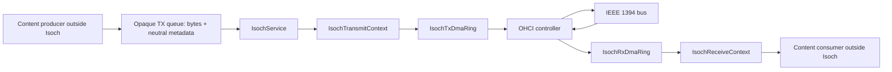

# Isochronous transport

`ASFWDriver/Isoch` implements payload-opaque IEEE 1394 isochronous receive and
transmit transport. It owns OHCI DMA programs, context registers, interrupt
handling, descriptor recycling, and packet-buffer ownership. It does not own a
content format, content clock, frame cursor, decoder, packetizer, or device
policy.

The boundary is deliberate: any producer may supply a fully finalized packet,
and any consumer may interpret a received packet outside this directory.

## Layer boundary

```mermaid
flowchart LR
    Producer["Content producer outside Isoch"]
    TxQueue["Opaque TX queue: bytes + neutral metadata"]
    Service["IsochService"]
    TxContext["IsochTransmitContext"]
    TxRing["IsochTxDmaRing"]
    Controller["OHCI controller"]
    Bus["IEEE 1394 bus"]
    RxRing["IsochRxDmaRing"]
    RxContext["IsochReceiveContext"]
    Consumer["Content consumer outside Isoch"]

    Producer --> TxQueue --> Service --> TxContext --> TxRing --> Controller --> Bus
    Bus --> Controller --> RxRing --> RxContext --> Consumer
```

Permitted in this subsystem:

- channel, speed, cycle match, descriptor, packet-byte, and DMA-address data;
- absolute packet indices, generic queue cursors, completion stamps, and raw
  controller/host clock pairs;
- lifecycle and fault state that applies to every isochronous context;
- opaque maintenance calls classified only by cadence and cost.

Not permitted in this subsystem:

- parsing or constructing a content header;
- sample-frame, media-format, or device-family policy;
- direct access to content-owned buffers or control blocks;
- content-specific recovery, diagnostics, callback names, or geometry.

`tests/audio/TransmitBoundaryTests.cpp` scans the transport source trees for
known content dependencies and pins content-owned headers outside this layer.

## Transmit queue contract

The shared ABI is
`Core/IsochTxQueue.hpp`. The queue is single-producer/single-consumer and uses
absolute packet indices to disambiguate physical ring wraps.

```mermaid
stateDiagram-v2
    [*] --> ProducerOwned
    ProducerOwned --> Committed: "producer writes bytes and metadata; commitGeneration release-store last"
    Committed --> DmaOwned: "transport acquire-loads expected generation and publishes DMA descriptors"
    DmaOwned --> Completed: "OHCI writes completion status"
    Completed --> ProducerOwned: "transport verifies payload seal, then release-stores completionCursor"
```

The invariants are:

1. The producer is append-only: `packetIndex == committedEnd`.
2. A physical slot cannot be reused until `completionCursor` returns ownership.
3. `commitGeneration` is the release boundary for all plain metadata and packet
   bytes; the consumer acquire-loads it before reading those fields.
4. The transport verifies the opaque payload seal before advancing
   `completionCursor`. A mismatch is a fatal producer contract violation.
5. Producer and consumer startup resets are disjoint. Producer prefill must not
   be erased when the transport arms the context.
6. The configured isochronous channel is transport-owned and is stamped into
   the otherwise opaque immediate header immediately before descriptor
   publication.

Generic queue constants shared with packet producers live in
`../Shared/Isoch/IsochQueueGeometry.hpp`. OHCI-specific descriptor geometry
lives in `Core/IsochDmaGeometry.hpp`. Neither may acquire content semantics.

## OHCI transmit program

Each hardware packet uses four 16-byte descriptor blocks:

1. `OUTPUT_MORE_IMMEDIATE` command plus its two immediate quadlets;
2. `OUTPUT_MORE` for payload fragment zero;
3. `OUTPUT_LAST` for payload fragment one and completion status.

The fixed shape permits a payload to cross one DMA segment boundary. The
`OUTPUT_MORE_IMMEDIATE` skip/branch word is at offset `0x08`. Follow the Linux
low-level stack and the Apple reference implementation when changing descriptor
layout or ordering; do not infer the layout from a single diagram.

Before waking hardware, transport publishes the payload mapping, executes the
DMA barrier, and then publishes the modified descriptors. It never edits the
payload.

## Receive contract

`IsochReceiveContext` samples one raw controller/host pair per drain batch and
passes an `IsochReceiveBatch` plus an opaque `IsochReceivePacket` to an
`IIsochReceiveConsumer`. Packet interpretation and cursor advancement belong to
that consumer outside `Isoch`.

An empty completed descriptor is still delivered as an empty packet outcome;
the content consumer decides whether that is a discontinuity.

## Lifecycle

Both directions follow the same teardown rule:

```mermaid
sequenceDiagram
    participant Owner as "Owning subsystem"
    participant Context as "Isoch context"
    participant OHCI as "OHCI"
    participant Consumer as "External producer/consumer"

    Owner->>Context: "Stop"
    Context->>Context: "exclude Poll/refill"
    Context->>OHCI: "mask interrupt; clear RUN; flush posted write"
    loop "bounded escalating poll"
        Context->>OHCI: "read ACTIVE"
    end
    alt "ACTIVE cleared or provider is gone"
        Context->>Consumer: "publish stopped / quiesced"
        Context-->>Owner: "success; bindings may now be released"
    else "still active"
        Context-->>Owner: "failure; retain mappings and bindings"
    end
```

No caller-owned view or DMA mapping may be released while `ACTIVE` remains set.
No MMIO may be issued after the hardware access provider has been revoked.

## Directory map

- `Core/`: neutral public types, queue ABI, and DMA geometry.
- `Config/`: context configuration that is meaningful to OHCI transport.
- `Memory/`: DMA-memory abstractions and mappings.
- `Receive/`: IR context and descriptor ring.
- `Transmit/`: IT context, descriptor slab/layout, queue consumption, refill,
  and completion publication.
- `IsochService.*`: composition and lifecycle for generic IR/IT contexts.

## Review checklist

- Does the change still work for an arbitrary opaque payload?
- Are absolute packet index, physical producer slot, and physical hardware slot
  kept distinct?
- Is every publication boundary paired release/acquire?
- Are DMA writeback and publication barriers in the correct direction?
- Does an error stop instead of manufacturing packet state?
- Does teardown retain resources after a quiesce timeout?
- Was wire-observable behavior cross-checked against the local Linux and Apple
  reference sources?
