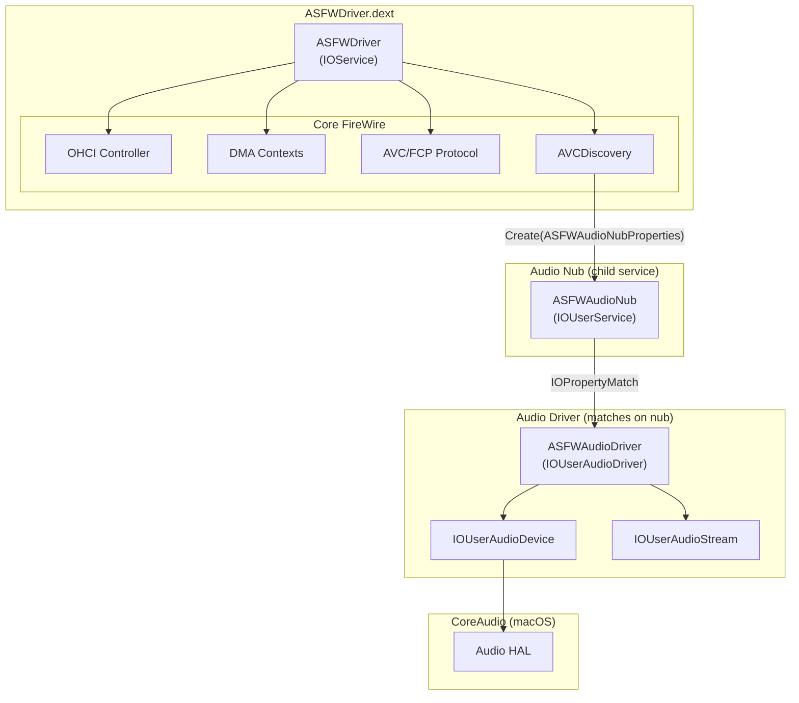
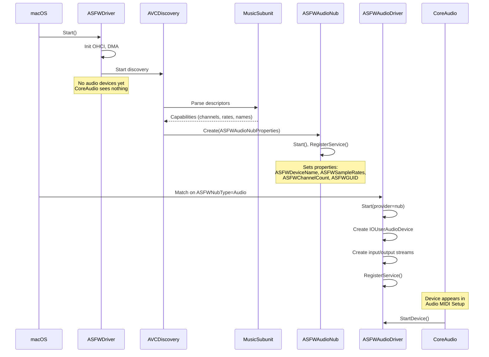

# ASFireWire Audio Driver Architecture

## Document Purpose
This document captures the complete analysis, design decisions, and implementation plan for integrating CoreAudio support into the ASFireWire driver. It serves as a reference for both the problem we solved and the solution architecture.

> [!IMPORTANT]
> **Phase 1 Scope**: This implementation focuses on CoreAudio integration only, using timer-based timestamps from the Mac clock. FireWire isochronous TX/RX integration is explicitly out of scope for Phase 1.

---

## Current Implementation Status

> [!NOTE]
> **Last Updated**: 2024-12-27

### ✅ Working Features

| Feature | Status | Notes |
|---------|--------|-------|
| Device appears in Audio MIDI Setup | ✅ | "Apogee Electronics Duet — ASFW" |
| FireWire transport icon | ✅ | Requires `SetTransportType` on **both** driver AND device |
| Correct channel count | ✅ | "2 ins / 2 outs" from MusicSubunit |
| Stream names | ✅ | "Analog In", "Analog Out" from plug names |
| Sample rate dropdown | ✅ | 4 rates: 44.1k, 48k, 88.2k, 96k |
| 24-bit audio format | ✅ | "2 ch 24-bit Integer" |

### 🚧 TODO / Known Issues

| Feature | Status | Notes |
|---------|--------|-------|
| Channel names in Audio MIDI Setup | ❌ | Shows "1", "2" instead of "Analog In 1", "Analog In 2" |
| Initial sample rate sync | ❌ | Driver sets 44.1k but AMIS shows 48k (CoreAudio queries separately) |
| Actual audio streaming | ❌ | No isochronous TX/RX yet (Phase 2) |
| SetCurrentStreamFormat | 🔄 | Only sets initial format, no runtime handling yet |

### Channel Names Issue

`SetElementName()` is being called on the device:
```cpp
ivars->audioDevice->SetElementName(ch, IOUserAudioObjectPropertyScope::Input, name.get());
```

But Audio MIDI Setup doesn't display them. **TODO**: Investigate if:
1. Apple's sample uses a different API
2. Names need to be set on streams, not device
3. Channel layout needs to be configured

### Sample Rate Sync Issue

Driver logs show correct initialization:
```
[Audio] ASFWAudioDriver: Current sample rate from nub: 44100 Hz
[Audio] ASFWAudioDriver: Initial sample rate set to 44100 Hz
```

But Audio MIDI Setup shows 48000 Hz. This appears to be because CoreAudio queries the driver separately when the device is selected, and the first format in the available formats list is used as the "current" format.

**Observation**: The HAL may ignore the initial `SetSampleRate()` and query `GetSampleRate()` independently. This is acceptable behavior - the user selects their desired rate in Audio MIDI Setup.

## Table of Contents
1. [Current Implementation Status](#current-implementation-status)
2. [Problem Statement](#problem-statement)
3. [Root Cause Analysis](#root-cause-analysis)
4. [Future Architecture (Multi-Dext Refactoring)](#future-architecture-multi-dext-refactoring)
5. [Solution Architecture](#solution-architecture)
6. [AudioDriverKit API Reference](#audiodriverkit-api-reference)
7. [Implementation Plan](#implementation-plan)
8. [Implementation Checklist](#implementation-checklist)
9. [Code Patterns & Examples](#code-patterns--examples)
10. [Apple Sample Code Reference](#apple-sample-code-reference)
11. [Testing Guide](#testing-guide)
12. [Phase 1 Scope & Strategy](#phase-1-scope--strategy)
13. [Phase 1.5: AM824/CIP Encoding Layer](#phase-15-am824cip-encoding-layer)


---

## Problem Statement

### Original Challenge
We needed to integrate CoreAudio support into the ASFireWire driver. The standard DriverKit pattern for audio devices is:

```
Hardware Driver (IOService)
    └── discovers audio device
    └── creates Audio Nub (child service)
            └── Audio Driver (IOUserAudioDriver) matches on nub
            └── creates IOUserAudioDevice for CoreAudio
```

### Initial Attempt (Had Issues)
When AVCDiscovery detected a FireWire audio device, the `IOService::Create()` call was failing:

```cpp
kern_return_t error = driver_->Create(driver_, "ASFWAudioNubProperties", &nub);
// Initially returned: -536870201 (kIOReturnNotPermitted)
```

### Solution (Now Working ✅)
The nub approach **does work** with correct Info.plist configuration. The architecture is:

```
ASFWDriver.dext (IOService)
    └── AVCDiscovery detects music subunit with audio capability
    └── Creates ASFWAudioNub (IOUserService child)
            ↓ IOPropertyMatch: ASFWNubType = "Audio"
    └── ASFWAudioDriver (IOUserAudioDriver) matches on nub
    └── Creates IOUserAudioDevice + streams for CoreAudio
```

---

## Working Architecture

### Required Info.plist Configuration

Two personalities in the same dext:

**1. Main Driver (matches on PCI)**
```xml
<key>ASFWDriverService</key>
<dict>
    <key>IOProviderClass</key>
    <string>IOPCIDevice</string>
    <key>IOUserClass</key>
    <string>ASFWDriver</string>
    
    <!-- Nub creation template -->
    <key>ASFWAudioNubProperties</key>
    <dict>
        <key>IOClass</key>
        <string>IOUserService</string>
        <key>IOUserClass</key>
        <string>ASFWAudioNub</string>
        <key>ASFWNubType</key>
        <string>Audio</string>
    </dict>
</dict>
```

**2. Audio Driver (matches on Nub via property)**
```xml
<key>ASFWAudioDriverService</key>
<dict>
    <key>IOProviderClass</key>
    <string>IOUserService</string>
    <key>IOPropertyMatch</key>
    <dict>
        <key>ASFWNubType</key>
        <string>Audio</string>
    </dict>
    <key>IOUserClass</key>
    <string>ASFWAudioDriver</string>
    
    <!-- HAL user client template -->
    <key>IOUserAudioDriverUserClientProperties</key>
    <dict>
        <key>IOClass</key>
        <string>IOUserUserClient</string>
        <key>IOUserClass</key>
        <string>IOUserAudioDriverUserClient</string>
    </dict>
</dict>
```

### Key Points

| Requirement | Solution |
|-------------|----------|
| `IOClass` for nub | Must be `IOUserService` (kernel class) |
| `IOUserClass` for nub | `ASFWAudioNub` (our DriverKit class) |
| Matching property | `ASFWNubType` = `Audio` |
| Audio driver base class | `IOUserAudioDriver` (required by AudioDriverKit) |
| HAL user client | `IOUserAudioDriverUserClient` (built-in to framework) |

---

## Future Architecture (Multi-Dext Refactoring)

> [!NOTE]
> This section documents the path to supporting multiple device types (audio, video, storage) if needed in the future.

### Current (Monolithic)
```
ASFWDriver.dext (IOUserAudioDriver)
    └── OHCI, DMA, Isoch, AM824, CIP, Audio all in one
```

### Future (Separated)
```
ASFWCore.dext (IOService)
    ├── OHCI register access
    ├── DMA context management
    ├── Isoch TX/RX engine
    └── Exposes functionality via IOUserClient

ASFWAudio.dext (IOUserAudioDriver)
    ├── Uses ASFWCore via UserClient
    ├── AM824 encoder/decoder
    └── IOUserAudioDevice, streams, controls

ASFWCamera.dext (IOUserVideoDriver) [future]
    ├── Uses ASFWCore via UserClient
    └── Video-specific functionality
```

### What's Reusable

| Component | Reusability |
|-----------|-------------|
| OHCI abstraction | ✅ Shared |
| DMA ring management | ✅ Shared |
| Isoch TX/RX contexts | ✅ Shared |
| CIP header builder | ✅ Shared |
| AM824 encoder | ✅ Shared (audio) |
| `IOUserAudioDriver` wrapper | ❌ Audio-only |

The isoch code written for Phase 1/1.5 is **FireWire plumbing**, not audio-specific. It can be extracted to ASFWCore when/if multi-dext is needed.

## Solution Architecture

### Overview

The audio subsystem uses a **nub-based architecture**:
1. **ASFWDriver** (IOService) - Main hardware driver, matches on PCI OHCI controller
2. **ASFWAudioNub** (IOService) - Child service created when music subunit discovered
3. **ASFWAudioDriver** (IOUserAudioDriver) - Matches on nub, creates CoreAudio device



### Audio Device Creation Flow



### Key Design Decisions

| Decision | Rationale |
|----------|-----------|
| Use nub pattern | Separates hardware driver from audio driver cleanly |
| `IOPropertyMatch` | Flexible matching without hardcoded class names |
| `IOUserAudioDriver` subclass | Required by `IOUserAudioDevice::Create()` API |
| Properties on nub | Device info passed from discovery to audio driver |

### Nub Properties (set by AVCDiscovery)

| Property | Type | Description |
|----------|------|-------------|
| `ASFWDeviceName` | OSString | Device name from Config ROM (Vendor + Model) |
| `ASFWChannelCount` | OSNumber | Max channel count from MusicSubunit |
| `ASFWSampleRates` | OSArray | Supported sample rates (44.1k, 48k, 88.2k, 96k) |
| `ASFWGUID` | OSNumber | FireWire GUID for device lookup |
| `ASFWInputPlugName` | OSString | Input plug name for stream naming (e.g., "Analog In") |
| `ASFWOutputPlugName` | OSString | Output plug name for stream naming (e.g., "Analog Out") |
| `ASFWCurrentSampleRate` | OSNumber | Current sample rate from device (Hz) |

### File Structure

| File | Purpose |
|------|---------|
| `Isoch/Audio/ASFWAudioNub.iig` | Nub interface (IOService subclass) |
| `Isoch/Audio/ASFWAudioNub.cpp` | Nub implementation |
| `Isoch/Audio/ASFWAudioDriver.iig` | Audio driver interface (IOUserAudioDriver) |
| `Isoch/Audio/ASFWAudioDriver.cpp` | Audio driver implementation |
| `Protocols/AVC/AVCDiscovery.cpp` | Creates nub when music subunit found |

### Class Hierarchy (Actual Implementation)

```
IOService (DriverKit)
    └── ASFWDriver (IOService) - Main hardware driver
            ├── owns → ServiceContext (core FireWire state)
            │           ├── controller → ControllerCore
            │           ├── avcHandler → AVCHandler
            │           └── discovery → AVCDiscovery
            │                   └── creates → ASFWAudioNub (child IOUserService)
            │
            └── ASFWAudioNub matches:
                    └── ASFWAudioDriver (IOUserAudioDriver)
                            ├── owns → IOUserAudioDevice
                            │           ├── input stream → IOUserAudioStream
                            │           └── output stream → IOUserAudioStream
                            └── TODO: AM824Encoder, CIPHeaderBuilder (Phase 2)
```

---

## AudioDriverKit API Reference

### Class Hierarchy

```
IOUserAudioObject (LOCALONLY base)
    ├── IOUserAudioClockDevice
    │       └── IOUserAudioDevice (extends ClockDevice)
    │               ├── manages streams
    │               ├── manages controls
    │               └── handles IO operations
    │
    ├── IOUserAudioStream
    │       ├── input or output direction
    │       ├── ring buffer (IOMemoryDescriptor)
    │       └── format configuration
    │
    └── IOUserAudioControl (abstract)
            ├── IOUserAudioLevelControl
            ├── IOUserAudioBooleanControl
            └── IOUserAudioSelectorControl
```

### IOUserAudioDriver (Base Class for Audio Drivers)

**Location**: `AppleHeaders/AudioDriverKit/IOUserAudioDriver.iig`

**Key Methods to Override**:
```cpp
// Called when CoreAudio starts the device
virtual kern_return_t StartDevice(
    IOUserAudioObjectID in_object_id,
    IOUserAudioStartStopFlags in_flags) override;

// Called when CoreAudio stops the device
virtual kern_return_t StopDevice(
    IOUserAudioObjectID in_object_id,
    IOUserAudioStartStopFlags in_flags) override;

// Handle user client creation (CoreAudio HAL connection)
virtual kern_return_t NewUserClient(
    uint32_t in_type,
    IOUserClient** out_user_client) override;
```

**Key Methods Available**:
```cpp
// Register an audio object (device, stream, control)
kern_return_t AddObject(IOUserAudioObject* object);

// Remove an audio object
kern_return_t RemoveObject(IOUserAudioObject* object);

// Get the work queue for synchronized operations
IODispatchQueue* GetWorkQueue();

// Notify CoreAudio of property changes
kern_return_t PropertiesChanged(
    IOUserAudioObjectID objectID,
    IOUserAudioObjectPropertyAddress* properties,
    uint32_t count);

// Set transport type (FireWire, USB, etc.)
kern_return_t SetTransportType(IOUserAudioTransportType type);
```

### IOUserAudioDevice (Audio Device Object)

**Location**: `AppleHeaders/AudioDriverKit/IOUserAudioDevice.iig`

**Creation**:
```cpp
static OSSharedPtr<IOUserAudioDevice> Create(
    IOUserAudioDriver* in_driver,           // Parent driver (required!)
    bool in_supports_prewarming,            // Pre-warm capability
    OSString* in_device_uid,                // Unique identifier
    OSString* in_model_uid,                 // Model identifier
    OSString* in_manufacturer_uid,          // Manufacturer name
    uint32_t in_zero_time_stamp_period);    // Samples between timestamps
```

**Configuration Methods**:
```cpp
// Device naming
void SetName(OSString* name);

// Sample rate configuration
void SetAvailableSampleRates(const double* rates, uint32_t count);
void SetSampleRate(double rate);
double GetSampleRate();

// Stream management
kern_return_t AddStream(IOUserAudioStream* stream);
kern_return_t RemoveStream(IOUserAudioStream* stream);

// Control management
kern_return_t AddControl(IOUserAudioControl* control);

// Device capabilities
void SetCanBeDefaultInputDevice(bool canBe);
void SetCanBeDefaultOutputDevice(bool canBe);

// Safety offsets (latency compensation)
void SetInputSafetyOffset(uint32_t frames);
void SetOutputSafetyOffset(uint32_t frames);

// IO operation handler (real-time callback)
void SetIOOperationHandler(IOOperationHandler handler);

// Timestamp management
void UpdateCurrentZeroTimestamp(uint64_t sampleTime, uint64_t hostTime);
```

### IOUserAudioStream (Audio Stream Object)

**Location**: `AppleHeaders/AudioDriverKit/IOUserAudioStream.iig`

**Creation**:
```cpp
static OSSharedPtr<IOUserAudioStream> Create(
    IOUserAudioDriver* in_driver,
    IOUserAudioStreamDirection in_direction,  // Input or Output
    IOMemoryDescriptor* in_io_buffer);        // Ring buffer
```

**Configuration Methods**:
```cpp
// Stream naming
void SetName(OSString* name);

// Format configuration
void SetCurrentStreamFormat(IOUserAudioStreamBasicDescription* format);
void SetAvailableStreamFormats(
    IOUserAudioStreamBasicDescription* formats,
    uint32_t count);

// Stream properties
void SetStreamIsActive(bool active);
void SetLatency(uint32_t frames);
void SetTerminalType(IOUserAudioStreamTerminalType type);
void SetStartingChannel(uint32_t channel);
```

### IOUserAudioStreamBasicDescription (Format Structure)

**Location**: `AppleHeaders/AudioDriverKit/AudioDriverKitTypes.h`

```cpp
struct IOUserAudioStreamBasicDescription {
    double mSampleRate;              // e.g., 48000.0
    IOUserAudioFormatID mFormatID;   // LinearPCM, AC3, etc.
    IOUserAudioFormatFlags mFormatFlags;  // Float, SignedInteger, etc.
    uint32_t mBytesPerPacket;
    uint32_t mFramesPerPacket;       // Usually 1 for PCM
    uint32_t mBytesPerFrame;         // sizeof(sample) * channels
    uint32_t mChannelsPerFrame;
    uint32_t mBitsPerChannel;        // 16, 24, 32
    uint32_t mReserved;
};
```

**Common Format Flags**:
```cpp
IOUserAudioFormatFlags::FormatFlagIsFloat
IOUserAudioFormatFlags::FormatFlagIsSignedInteger
IOUserAudioFormatFlags::FormatFlagsNativeEndian
IOUserAudioFormatFlags::FormatFlagIsPacked
IOUserAudioFormatFlags::FormatFlagIsNonInterleaved
```

### Transport Types

**Location**: `AppleHeaders/AudioDriverKit/AudioDriverKitTypes.h`

```cpp
enum class IOUserAudioTransportType : uint32_t {
    Unknown = 0,
    BuiltIn = 'bltn',
    USB = 'usb ',
    FireWire = '1394',      // <-- Use this for FireWire
    Thunderbolt = 'thun',
    Bluetooth = 'blue',
    HDMI = 'hdmi',
    DisplayPort = 'dprt',
    AirPlay = 'airp',
    AVB = 'eavb',
    PCI = 'pci ',
};
```

> [!IMPORTANT]
> **SetTransportType Must Be Called on BOTH Driver and Device!**
>
> For the transport type icon to appear in Audio MIDI Setup, you must call `SetTransportType()` on **both** the `IOUserAudioDriver` AND the `IOUserAudioDevice`:
>
> ```cpp
> // On the driver (this, from IOUserAudioDriver)
> SetTransportType(IOUserAudioTransportType::FireWire);
>
> // On the device (IOUserAudioDevice inherits from IOUserAudioClockDevice)
> ivars->audioDevice->SetTransportType(IOUserAudioTransportType::FireWire);
> ```
>
> Calling it on only one of them will NOT display the icon.

---

## Implementation Plan

> [!CAUTION]
> **DEPRECATED**: This section documents the **original monolithic approach** that was never implemented. We instead used the **nub-based architecture** (ASFWAudioNub + ASFWAudioDriver), which is documented in the [Solution Architecture](#solution-architecture) section and tracked in the [Implementation Checklist](#implementation-checklist).
>
> This section is kept for historical reference and contains useful code patterns that could be adapted for future use.

### ~~Phase 1: Modify ASFWDriver Class Declaration~~ (NOT USED)

**File**: `ASFWDriver/ASFWDriver.iig`

```cpp
// Change this:
#include <DriverKit/IOService.iig>
class ASFWDriver : public IOService

// To this:
#include <DriverKit/IOService.iig>
#include <AudioDriverKit/IOUserAudioDriver.iig>
class ASFWDriver : public IOUserAudioDriver
```

Add new method declarations:
```cpp
// IOUserAudioDriver overrides
virtual kern_return_t StartDevice(
    IOUserAudioObjectID in_object_id,
    IOUserAudioStartStopFlags in_flags) override;

virtual kern_return_t StopDevice(
    IOUserAudioObjectID in_object_id,
    IOUserAudioStartStopFlags in_flags) override;

// Audio device management (LOCALONLY - not exposed to kernel)
kern_return_t CreateAudioDevice(
    const MusicSubunitCapabilities::AudioConfig& config) LOCALONLY;

kern_return_t RemoveAudioDevice(uint64_t guid) LOCALONLY;
```

### Phase 2: Add Audio Device Storage

**File**: `ASFWDriver/ASFWDriver.cpp`

Add before ServiceContext:
```cpp
#include <AudioDriverKit/AudioDriverKit.h>

struct AudioDeviceInfo {
    uint64_t guid;
    OSSharedPtr<IOUserAudioDevice> device;
    OSSharedPtr<IOUserAudioStream> inputStream;
    OSSharedPtr<IOUserAudioStream> outputStream;
    OSSharedPtr<IOBufferMemoryDescriptor> inputBuffer;
    OSSharedPtr<IOBufferMemoryDescriptor> outputBuffer;
    
    // Timer-based timestamp generation (Phase 1)
    OSSharedPtr<IOTimerDispatchSource> timestampTimer;
    bool isRunning = false;
    uint64_t sampleTime = 0;
    uint64_t nextDeadline = 0;  // For deadline-based scheduling
    
    // IMPORTANT: Keep sample rates/formats alive for device lifetime!
    // AudioDriverKit may store pointers, not copy values.
    std::vector<double> sampleRates;           // Owned here
    std::vector<IOUserAudioStreamBasicDescription> formats;  // Owned here
    
    // Metrics for validation
    struct Metrics {
        std::atomic<uint64_t> totalFramesProcessed{0};
        std::atomic<uint64_t> callbackCount{0};
        std::atomic<uint64_t> underruns{0};
        std::atomic<uint64_t> overruns{0};
        uint64_t startTime = 0;  // mach_absolute_time at start
    } metrics;
};
```

> [!WARNING]
> **Lifetime Hazard (#3)**: `SetAvailableSampleRates()` and `SetAvailableStreamFormats()` may store pointers, not copy data. Keep the arrays alive in `AudioDeviceInfo` for the device lifetime.

Add to ServiceContext struct:
```cpp
struct ServiceContext {
    // ... existing members ...

    // Audio devices keyed by FireWire GUID
    std::map<uint64_t, std::shared_ptr<AudioDeviceInfo>> audioDevices;
    
    // Fast lookup: object ID → device info (avoids O(n) scan in Start/Stop)
    std::map<IOUserAudioObjectID, AudioDeviceInfo*> deviceByObjectId;
};
```

### Phase 3: Implement CreateAudioDevice

**File**: `ASFWDriver/ASFWDriver.cpp`

```cpp
// Shared constant for timestamp period
static constexpr uint32_t kZeroTimestampPeriod = 512;

kern_return_t ASFWDriver::CreateAudioDevice(
    const MusicSubunitCapabilities::AudioConfig& config)  // Accept AudioConfig from GetAudioDeviceConfiguration()
{
    if (!ivars || !ivars->context) return kIOReturnNotReady;
    auto& ctx = *ivars->context;

    // Check if device already exists
    if (ctx.audioDevices.find(config.guid) != ctx.audioDevices.end()) {
        ASFW_LOG(Audio, "Audio device already exists for GUID=%llx", config.guid);
        return kIOReturnExclusiveAccess;
    }

    auto info = std::make_shared<AudioDeviceInfo>();
    info->guid = config.guid;
    
    // Copy sample rates into owned storage (lifetime hazard protection)
    if (config.sampleRates && config.sampleRateCount > 0) {
        info->sampleRates.assign(config.sampleRates, 
                                  config.sampleRates + config.sampleRateCount);
    }
    if (info->sampleRates.empty()) {
        info->sampleRates = {44100.0, 48000.0};  // Fallback
    }

    // Create unique device UID
    char uidBuf[64];
    snprintf(uidBuf, sizeof(uidBuf), "ASFW-%llx", config.guid);
    auto deviceUID = OSSharedPtr(OSString::withCString(uidBuf), OSNoRetain);
    auto modelUID = OSSharedPtr(OSString::withCString(config.modelName), OSNoRetain);
    auto manufacturerUID = OSSharedPtr(OSString::withCString(config.vendorName), OSNoRetain);

    // Create audio device
    info->device = IOUserAudioDevice::Create(
        this,                    // IOUserAudioDriver* - valid because we extend it!
        false,                   // no prewarming
        deviceUID.get(),
        modelUID.get(),
        manufacturerUID.get(),
        kZeroTimestampPeriod);

    if (!info->device) {
        ASFW_LOG(Audio, "Failed to create IOUserAudioDevice");
        return kIOReturnNoMemory;
    }

    // Configure device with owned data
    std::string deviceName = config.GetDeviceName();
    auto name = OSSharedPtr(OSString::withCString(deviceName.c_str()), OSNoRetain);
    info->device->SetName(name.get());
    
    // Pass owned storage pointers (safe for lifetime)
    info->device->SetAvailableSampleRates(
        info->sampleRates.data(), 
        static_cast<uint32_t>(info->sampleRates.size()));
    info->device->SetSampleRate(config.defaultSampleRate);  // Use 44.1kHz default

    // Set transport type to FireWire
    SetTransportType(IOUserAudioTransportType::FireWire);

    // Build stream format (24-bit in 32-bit container, native endian)
    uint32_t channelCount = config.GetMaxChannelCount();
    if (channelCount == 0) channelCount = 2;
    
    IOUserAudioStreamBasicDescription format{};
    format.mSampleRate = info->sampleRates[0];
    format.mFormatID = IOUserAudioFormatID::LinearPCM;
    format.mFormatFlags = static_cast<IOUserAudioFormatFlags>(
        static_cast<uint32_t>(IOUserAudioFormatFlags::FormatFlagIsSignedInteger) |
        static_cast<uint32_t>(IOUserAudioFormatFlags::FormatFlagsNativeEndian));
    format.mBytesPerPacket = sizeof(int32_t) * channelCount;
    format.mFramesPerPacket = 1;
    format.mBytesPerFrame = sizeof(int32_t) * channelCount;
    format.mChannelsPerFrame = channelCount;
    format.mBitsPerChannel = 24;
    
    // Store format in owned storage
    info->formats.push_back(format);

    // Buffer size
    const uint32_t bufferBytes = kZeroTimestampPeriod * sizeof(int32_t) * channelCount;

    // Create input stream
    kern_return_t error = IOBufferMemoryDescriptor::Create(
        kIOMemoryDirectionInOut, bufferBytes, 0, info->inputBuffer.attach());
    if (error != kIOReturnSuccess) return error;

    info->inputStream = IOUserAudioStream::Create(
        this, IOUserAudioStreamDirection::Input, info->inputBuffer.get());
    if (!info->inputStream) return kIOReturnNoMemory;

    auto inputName = OSSharedPtr(OSString::withCString(caps.inputPlugName.c_str()), OSNoRetain);
    info->inputStream->SetName(inputName.get());
    info->inputStream->SetAvailableStreamFormats(info->formats.data(), 1);  // Owned storage
    info->inputStream->SetCurrentStreamFormat(info->formats.data());

    // Create output stream
    error = IOBufferMemoryDescriptor::Create(
        kIOMemoryDirectionInOut, bufferBytes, 0, info->outputBuffer.attach());
    if (error != kIOReturnSuccess) return error;

    info->outputStream = IOUserAudioStream::Create(
        this, IOUserAudioStreamDirection::Output, info->outputBuffer.get());
    if (!info->outputStream) return kIOReturnNoMemory;

    auto outputName = OSSharedPtr(OSString::withCString(caps.outputPlugName.c_str()), OSNoRetain);
    info->outputStream->SetName(outputName.get());
    info->outputStream->SetAvailableStreamFormats(info->formats.data(), 1);  // Owned storage
    info->outputStream->SetCurrentStreamFormat(info->formats.data());

    // Add streams to device
    info->device->AddStream(info->inputStream.get());
    info->device->AddStream(info->outputStream.get());

    // Add device to driver (makes it visible to CoreAudio HAL)
    error = AddObject(info->device.get());
    if (error != kIOReturnSuccess) return error;

    // Store device info and register for fast lookup
    auto* infoPtr = info.get();
    ctx.audioDevices[guid] = std::move(info);
    ctx.deviceByObjectId[infoPtr->device->GetObjectID()] = infoPtr;

    ASFW_LOG(Audio, "Created audio device: %s (GUID=%llx, %u ch)",
             deviceName.c_str(), guid, channelCount);
    return kIOReturnSuccess;
}
```

### Phase 4: Implement StartDevice/StopDevice (Timer-Based)

**File**: `ASFWDriver/ASFWDriver.cpp`

> [!NOTE]
> **Phase 1**: Uses timer-based timestamps with Mac clock. FireWire isoch integration is deferred to Phase 2.

```cpp
kern_return_t ASFWDriver::StartDevice(
    IOUserAudioObjectID in_object_id,
    IOUserAudioStartStopFlags in_flags)
{
    if (!ivars || !ivars->context) return kIOReturnNotReady;
    auto& ctx = *ivars->context;

    // Fast O(1) lookup by object ID
    auto it = ctx.deviceByObjectId.find(in_object_id);
    if (it == ctx.deviceByObjectId.end()) {
        ASFW_LOG(Audio, "StartDevice: Unknown object ID %u", in_object_id);
        return kIOReturnNotFound;
    }
    AudioDeviceInfo* deviceInfo = it->second;

    // Phase 1: Start timer for timestamp generation
    double sampleRate = deviceInfo->device->GetSampleRate();
    
    // Convert interval to Mach absolute time units
    // IMPORTANT: mach_absolute_time() returns ticks, NOT nanoseconds!
    mach_timebase_info_data_t timebase;
    mach_timebase_info(&timebase);
    double intervalNs = (kZeroTimestampPeriod / sampleRate) * 1e9;
    uint64_t intervalTicks = static_cast<uint64_t>(
        intervalNs * timebase.denom / timebase.numer);
    
    deviceInfo->isRunning = true;
    deviceInfo->sampleTime = 0;
    deviceInfo->metrics.startTime = mach_absolute_time();
    
    // Create and start timestamp timer
    kern_return_t kr = IOTimerDispatchSource::Create(
        GetWorkQueue(), deviceInfo->timestampTimer.attach());
    if (kr != kIOReturnSuccess) return kr;
    
    // Use deadline-based scheduling to avoid jitter accumulation
    // Store next deadline in device info, increment by fixed interval
    deviceInfo->nextDeadline = mach_absolute_time() + intervalTicks;
    
    deviceInfo->timestampTimer->SetHandler(^{
        if (!deviceInfo->isRunning) return;
        
        // Update timestamps
        uint64_t hostTime = mach_absolute_time();
        deviceInfo->device->UpdateCurrentZeroTimestamp(
            deviceInfo->sampleTime, hostTime);
        deviceInfo->sampleTime += kZeroTimestampPeriod;
        
        // Schedule next deadline (fixed increment, not "now + interval")
        deviceInfo->nextDeadline += intervalTicks;
        deviceInfo->timestampTimer->WakeAtTime(
            kIOTimerClockMachAbsoluteTime,
            deviceInfo->nextDeadline, 0);
    });
    
    // Start timer at first deadline
    deviceInfo->timestampTimer->WakeAtTime(
        kIOTimerClockMachAbsoluteTime,
        deviceInfo->nextDeadline, 0);

    ASFW_LOG(Audio, "StartDevice: GUID=%llx timer-based @ %.0f Hz",
             deviceInfo->guid, sampleRate);
    return kIOReturnSuccess;
}

kern_return_t ASFWDriver::StopDevice(
    IOUserAudioObjectID in_object_id,
    IOUserAudioStartStopFlags in_flags)
{
    if (!ivars || !ivars->context) return kIOReturnNotReady;
    auto& ctx = *ivars->context;

    // Fast O(1) lookup by object ID
    auto it = ctx.deviceByObjectId.find(in_object_id);
    if (it == ctx.deviceByObjectId.end()) {
        return kIOReturnNotFound;
    }
    AudioDeviceInfo* info = it->second;
    
    // Stop timer first, then clear handler to prevent late fire
    info->isRunning = false;
    if (info->timestampTimer) {
        info->timestampTimer->Cancel();
        info->timestampTimer->SetHandler(nullptr);
        info->timestampTimer.reset();
    }
    ASFW_LOG(Audio, "StopDevice: GUID=%llx stopped", info->guid);

    return kIOReturnSuccess;
}
```

### Phase 4.5: Implement IOOperationHandler (Metrics)

**File**: `ASFWDriver/ASFWDriver.cpp`

The IO operation handler is called by CoreAudio in a real-time context when audio data needs to be processed. For Phase 1, we receive output data from apps and track metrics.

> [!IMPORTANT]
> The IOOperationHandler runs in a **real-time context**. No allocations, no locks, no logging in the hot path.

```cpp
// Set up IO handler during device creation (in CreateAudioDevice):
info->device->SetIOOperationHandler(^kern_return_t(
    IOUserAudioObjectID objectID,
    IOUserAudioIOOperation operation,
    uint32_t frameCount,
    uint64_t sampleTime,
    void* inputBuffer,
    void* outputBuffer)
{
    // Find our device info (captured by block)
    auto& metrics = info->metrics;
    
    // Track callback count
    metrics.callbackCount.fetch_add(1, std::memory_order_relaxed);
    
    switch (operation) {
        case IOUserAudioIOOperation::BeginRead:
            // Input: CoreAudio wants to read from us (microphone/capture)
            // Phase 1: Generate silence
            if (inputBuffer) {
                memset(inputBuffer, 0, frameCount * sizeof(int32_t) * channelCount);
            }
            break;
            
        case IOUserAudioIOOperation::EndRead:
            // Input completed
            break;
            
        case IOUserAudioIOOperation::BeginWrite:
            // Output: CoreAudio is sending us audio data (playback)
            // Phase 1: Just receive and count
            if (outputBuffer) {
                metrics.totalFramesProcessed.fetch_add(
                    frameCount, std::memory_order_relaxed);
                    
                // TODO Phase 2: Encode to AM824, queue for FireWire TX
            }
            break;
            
        case IOUserAudioIOOperation::EndWrite:
            // Output completed
            break;
    }
    
    return kIOReturnSuccess;
});
```

**Metrics Reporting** (call periodically from a timer or user client):

```cpp
void LogAudioMetrics(AudioDeviceInfo* info) {
    auto& m = info->metrics;
    uint64_t now = mach_absolute_time();
    double elapsedSec = (now - m.startTime) / 1e9;  // Simplified
    
    uint64_t frames = m.totalFramesProcessed.load();
    double avgFramesPerSec = frames / elapsedSec;
    double expectedFPS = info->device->GetSampleRate();
    
    ASFW_LOG(Audio, "Metrics: %.0f frames/sec (expected %.0f), "
             "callbacks=%llu, underruns=%llu, overruns=%llu",
             avgFramesPerSec, expectedFPS,
             m.callbackCount.load(),
             m.underruns.load(),
             m.overruns.load());
}
```

### Phase 5: Update AVCDiscovery

**File**: `ASFWDriver/Protocols/AVC/AVCDiscovery.cpp`

Replace ASFWAudioNub creation code (around lines 137-232) with:

```cpp
// After detecting music subunit with audio capability:
if (caps.HasAudioCapability()) {
    // Get AudioConfig - contains all needed info:
    // - device name from vendorName + modelName (Config ROM)
    // - sample rates from supportedSampleRates (plug formats)
    // - channels from maxInputChannels / maxOutputChannels
    // - plug names from inputStreamName / outputStreamName
    auto audioConfig = caps.GetAudioDeviceConfiguration();
    auto* asfwDriver = static_cast<ASFWDriver*>(driver_);
    kern_return_t error = asfwDriver->CreateAudioDevice(audioConfig);

    if (error != kIOReturnSuccess) {
        ASFW_LOG(Audio, "Failed to create audio device for GUID=%llx: %d",
                 audioConfig.guid, error);
    }
}
```

**Also remove**:
- `audioNubs_` member from AVCDiscovery.hpp
- All ASFWAudioNub includes
- Nub cleanup code in OnUnitTerminated

### Phase 6: Update Info.plist

**File**: `ASFWDriver/Info.plist`

In ASFWDriverService personality, add IOUserAudioDriver user client:
```xml
<key>IOUserAudioDriverUserClientProperties</key>
<dict>
    <key>IOClass</key>
    <string>IOUserUserClient</string>
    <key>IOUserClass</key>
    <string>IOUserAudioDriverUserClient</string>
</dict>
```

Remove:
- `ASFWAudioNubProperties` dictionary
- `ASFWAudioDriverService` personality entirely

### Phase 7: Delete Unused Files

Remove from project:
- `ASFWDriver/Isoch/Audio/ASFWAudioNub.iig`
- `ASFWDriver/Isoch/Audio/ASFWAudioNub.cpp`
- `ASFWDriver/Isoch/Audio/ASFWAudioDriver.iig`
- `ASFWDriver/Isoch/Audio/ASFWAudioDriver.cpp`

---

## Implementation Checklist

> [!NOTE]
> This checklist reflects the **nub-based architecture** that is currently implemented, not the original monolithic plan.

### Phase 1: Nub Architecture ✅ COMPLETE
- [x] Create `ASFWAudioNub.iig` - IOService subclass for child nub
- [x] Create `ASFWAudioNub.cpp` - nub implementation with `Start()/RegisterService()`
- [x] Create `ASFWAudioDriver.iig` - IOUserAudioDriver subclass
- [x] Create `ASFWAudioDriver.cpp` - audio driver implementation
- [x] Configure Info.plist with two personalities (main + audio)
- [x] Add IOPropertyMatch for `ASFWNubType = "Audio"`
- [x] Add `IOUserAudioDriverUserClientProperties` template

### Phase 2: Nub Property Passing ✅ COMPLETE
- [x] Set `ASFWDeviceName` from Config ROM (Vendor + Model)
- [x] Set `ASFWChannelCount` from MusicSubunit
- [x] Set `ASFWSampleRates` array (44.1k, 48k, 88.2k, 96k)
- [x] Set `ASFWGUID` for device identification
- [x] Set `ASFWInputPlugName` / `ASFWOutputPlugName` from plugs
- [x] Set `ASFWCurrentSampleRate` from device's active format

### Phase 3: Audio Device Creation ✅ COMPLETE
- [x] Read nub properties in `ASFWAudioDriver::Start()`
- [x] Create `IOUserAudioDevice` with correct UID, model, manufacturer
- [x] Configure available sample rates (4 rates)
- [x] Configure stream format: 24-bit Integer, native endian
- [x] Create input/output streams with ring buffers
- [x] Add streams to device, device to driver
- [x] Set transport type to FireWire (on **both** driver AND device!)
- [x] Implement `NewUserClient` for HAL connection

### Phase 4: Stream/Channel Naming 🔄 PARTIAL
- [x] Set stream names from plug names ("Analog In", "Analog Out")
- [x] Generate channel names ("Analog In 1", "Analog In 2", etc.)
- [x] Call `SetElementName()` on device for each channel
- [ ] **TODO**: Investigate why channel names don't appear in Audio MIDI Setup
- [ ] **TODO**: Check if Apple sample uses different API for channel names

### Phase 5: Timer-Based Timestamps ✅ COMPLETE
- [x] Create `IOTimerDispatchSource` for timestamp generation
- [x] Implement `StartDevice()` - start timer at sample rate interval
- [x] Implement `StopDevice()` - cancel timer
- [x] Call `UpdateCurrentZeroTimestamp()` on each timer fire
- [x] Use deadline-based scheduling to avoid jitter

### Phase 6: IO Operation Handler ✅ COMPLETE
- [x] Set up `IOOperationHandler` block during device creation
- [x] Implement `BeginRead` - fill input buffer with silence (Phase 1)
- [x] Implement `WriteEnd` - receive output data from apps (Phase 1)
- [x] Add metrics tracking (frames/sec, callbacks)
- [x] Validate callback rate matches sample rate (periodic logging)

### Phase 7: Isochronous Integration (Phase 2)
- [ ] Connect to FireWire IR/IT contexts
- [ ] Implement AM824 encoder for outgoing audio
- [ ] Implement AM824 decoder for incoming audio
- [ ] Replace timer-based timestamps with FireWire cycle time
- [ ] CIP header builder/parser integration

---

## Code Patterns & Examples

### Pattern: Creating OSSharedPtr from Raw Pointer
```cpp
// When a function returns raw pointer that we own:
IOBufferMemoryDescriptor* rawPtr = nullptr;
IOBufferMemoryDescriptor::Create(..., &rawPtr);
auto sharedPtr = OSSharedPtr(rawPtr, OSNoRetain);

// Or using attach():
OSSharedPtr<IOBufferMemoryDescriptor> buffer;
IOBufferMemoryDescriptor::Create(..., buffer.attach());
```

### Pattern: Creating OSString
```cpp
auto str = OSSharedPtr(OSString::withCString("text"), OSNoRetain);
device->SetName(str.get());
```

### Pattern: Stream Format Setup
```cpp
IOUserAudioStreamBasicDescription format{};
format.mSampleRate = 48000.0;
format.mFormatID = IOUserAudioFormatID::LinearPCM;
format.mFormatFlags = static_cast<IOUserAudioFormatFlags>(
    static_cast<uint32_t>(IOUserAudioFormatFlags::FormatFlagIsSignedInteger) |
    static_cast<uint32_t>(IOUserAudioFormatFlags::FormatFlagsNativeEndian));
format.mChannelsPerFrame = 2;
format.mBitsPerChannel = 32;
format.mBytesPerFrame = sizeof(int32_t) * format.mChannelsPerFrame;
format.mBytesPerPacket = format.mBytesPerFrame;
format.mFramesPerPacket = 1;
```

### Pattern: Dispatch Queue Synchronization
```cpp
// Audio operations should be synchronized
__block kern_return_t result;
GetWorkQueue()->DispatchSync(^{
    result = doSomethingOnWorkQueue();
});
return result;
```

---

## Apple Sample Code Reference

### Location
`/Users/mrmidi/DEV/FirWireDriver/CreatingAnAudioDeviceDriver-4/SimpleAudioDriverExtension/`

### Key Files

#### SimpleAudioDriver.cpp
- Shows how to extend `IOUserAudioDriver`
- `Start_Impl`: Creates `SimpleAudioDevice`, calls `AddObject`, `RegisterService`
- `NewUserClient_Impl`: Handles `kIOUserAudioDriverUserClientType`
- `StartDevice`/`StopDevice`: Control audio IO

#### SimpleAudioDevice.cpp
- Custom `IOUserAudioDevice` subclass
- Creates input/output streams
- Manages volume controls
- Uses timer for timestamp generation (we'll use FireWire cycle time instead)

#### Info.plist
```xml
<key>IOProviderClass</key>
<string>IOUserResources</string>
<key>IOResourceMatch</key>
<string>IOKit</string>
```
Note: SimpleAudioDriver matches on `IOUserResources` (always loads). We match on `IOPCIDevice` (hardware specific).

### Key Differences from Our Implementation

| SimpleAudioDriver | ASFWDriver |
|-------------------|------------|
| Matches on IOUserResources | Matches on IOPCIDevice (FireWire OHCI) |
| Virtual audio device | Real FireWire hardware |
| Timer-based timestamps | FireWire cycle counter timestamps |
| Fixed 2-channel stereo | Dynamic channels from device |
| Uses SimpleAudioDevice subclass | Uses IOUserAudioDevice directly |

---

## Testing Guide

### Build
```bash
cd /Users/mrmidi/DEV/FirWireDriver
./build.sh
```

### Install
DriverKit extensions require reboot to load new versions:
```bash
sudo kmutil load -p /path/to/ASFW.dext
# Or just reboot
```

### Logging
```bash
# Watch audio-specific logs
log stream --predicate 'subsystem == "net.mrmidi.ASFW" AND category == "Audio"' --level debug

# Watch all driver logs
log stream --predicate 'subsystem == "net.mrmidi.ASFW"' --level debug
```

### Expected Log Sequence
```
[Audio] AVCDiscovery: Found Music subunit - hasAudioCapability=1
[Audio] Created audio device: Apogee Duet (GUID=3db0a0000d112, 2 ch)
[Audio] StartDevice: GUID=3db0a0000d112 started on channel 0
```

### Verify Audio Device
1. Open **Audio MIDI Setup** (Applications → Utilities)
2. Look for "FireWire Audio" or device name
3. Check sample rate options
4. Try setting as default output

### Troubleshooting

| Symptom | Possible Cause | Solution |
|---------|---------------|----------|
| No audio device in system | Device not created | Check logs for CreateAudioDevice errors |
| kIOReturnNoMemory | Buffer allocation failed | Check memory limits |
| Low frames/sec | Timer interval wrong | Verify interval calculation from sample rate |
| Glitchy audio | Timestamp period mismatch | Check zeroTimestampPeriod vs buffer size |
| `afplay` fails | Format mismatch | Verify stream format (sample rate, channels, bits) |

---

## Phase 2: Future Work (FireWire Integration)

> [!NOTE]
> Phase 1 validates CoreAudio integration with timer-based timing. Phase 2 connects to actual FireWire hardware.

### Audio TX Path (Phase 2)
Connect CoreAudio output to FireWire transmit:
```
CoreAudio Output Buffer 
    → IOOperationHandler (BeginWrite) 
    → AM824 Encoder 
    → Isoch TX Ring Buffer 
    → FireWire Isoch TX DMA
```

### Audio RX Path (Phase 2)  
Connect FireWire receive to CoreAudio input:
```
FireWire Isoch RX DMA 
    → Isoch RX Ring Buffer 
    → AM824 Decoder 
    → IOOperationHandler (BeginRead) 
    → CoreAudio Input Buffer
```

### CMP Integration (Phase 2)
Establish point-to-point isochronous connections:
1. Query device's oPCR/iPCR registers for plug availability
2. Use `CMPClient` to establish P2P connection
3. Get allocated isochronous channel from connection
4. Start `IsochReceiveContext` / `IsochTransmitContext` on that channel
5. Handle connection teardown on `StopDevice`

### FireWire Timestamp Synchronization (Phase 2)
Map FireWire cycle time to CoreAudio sample clock:
```cpp
void UpdateTimestampsFromFireWire() {
    // Read FireWire cycle time from OHCI
    uint32_t cycleTime = ReadCycleTime();
    
    // Extract cycle count and offset
    uint32_t cycleCount = (cycleTime >> 12) & 0x1FFF;
    uint32_t cycleOffset = cycleTime & 0xFFF;
    
    // Use DBC from received CIP headers as sample reference
    uint64_t sampleTime = lastDBC * samplesPerBlock;
    uint64_t hostTime = CycleTimeToHostTime(cycleTime);
    
    device->UpdateCurrentZeroTimestamp(sampleTime, hostTime);
}
```

---

## Phase 1 Scope & Strategy

### Goal
Validate CoreAudio integration independently of FireWire hardware, using the Mac's clock as a stable timing source.

### Data Flow (Phase 1)
```
macOS App (Music/Logic/etc.)
    → CoreAudio Framework
    → ASFWDriver (IOUserAudioDriver)
        → Output Stream Ring Buffer
        → IOOperationHandler (receives PCM, counts samples)
        → [discard for now]
```

### Success Criteria
| Metric | Expected Value | Tolerance |
|--------|----------------|----------|
| Frames/sec | ≈ sample rate | ±0.5% (Mac clock drift) |
| Callback regularity | No gaps > 20ms | Timer jitter acceptable |
| Underruns | 0 | During sustained playback |
| Device visibility | Appears in Audio MIDI Setup | N/A |
| Playback test | `afplay` completes | No error exit code |

> [!NOTE]
> Mac system clock and FireWire bus clock are independent crystals. Expect ±0.1–0.5% drift in Phase 1. Phase 1.5 introduces FireWire cycle time sync for precise timing.

### What We're Validating
1. **Device registration**: `IOUserAudioDevice` created and visible to macOS
2. **Format negotiation**: Sample rate and channel count accepted by CoreAudio
3. **Timestamp generation**: Timer-based updates don't cause glitches
4. **IO path**: Data flows into `IOOperationHandler` at correct rate
5. **Metrics accuracy**: Frame count matches expected throughput

---

## Phase 1.5: AM824/CIP Encoding Layer

> [!IMPORTANT]
> Phase 1.5 validates the encoding/packetization layer **without** touching isochronous DMA. Goal: produce correct packet data that can later be fed to IsochTransmitContext.

### Rationale

Sending malformed data to FireWire hardware makes debugging extremely difficult:
- Is the problem in encoding? Timing? DMA? Hardware?

By validating AM824/CIP encoding in isolation:
1. **Fast iteration** – no kernel/reboot cycles
2. **Deterministic** – compare against FireBug captures
3. **Fault isolation** – if DMA fails later, encoding is ruled out

### Data Flow (Phase 1.5)
```
CoreAudio Output Buffer
    → IOOperationHandler (receives PCM frames)
    → AM824 Encoder (PCM → AM824 quadlets with 0x40 label)
    → CIP Header Builder (FMT/FDF, DBC, SYT)
    → Packet Assembler (isoch header + CIP + AM824 payload)
    → Output Ring Buffer (64-byte aligned packets)
    → [Metrics / Validation / Optional file dump]
    
Note: NOT connected to DMA yet
```

### Components

#### AM824 Encoder
Converts 24-bit PCM samples to AM824 quadlets:

```cpp
struct AM824Encoder {
    // Convert PCM sample to AM824 quadlet
    // Label 0x40 = IEC 60958 conformant audio (MBLA)
    static uint32_t Encode(int32_t pcmSample, uint8_t label = 0x40) {
        // PCM sample in bits [23:0], label in bits [31:24]
        uint32_t sample24 = static_cast<uint32_t>(pcmSample) & 0x00FFFFFF;
        return (static_cast<uint32_t>(label) << 24) | sample24;
    }
    
    // Encode a block of interleaved samples
    void EncodeBlock(
        const int32_t* pcmSamples,
        uint32_t* am824Output,
        uint32_t frameCount,
        uint32_t channelCount);
};
```

#### CIP Header Builder
Builds Q0/Q1 per IEC 61883-1/61883-6:

> [!CAUTION]
> The bit positions below match the spec exactly. See [61883-1.md](docs/Isoch/61883-1.md) for the authoritative layout.

```cpp
struct CIPHeader {
    uint32_t q0;   // EOH, SID, DBS, FN, QPC, SPH, rsv, DBC
    uint32_t q1;   // EOH, FMT, FDF, SYT
    
    static CIPHeader Build(
        uint8_t sourceId,       // Node ID [5:0] from OHCI
        uint8_t dbs,            // Data block size (channels for AM824)
        uint8_t dbc,            // Data block counter (8-bit, wraps)
        uint8_t sfc,            // Sample Frequency Code (FDF[7:3])
        uint16_t syt)           // Presentation timestamp (or 0xFFFF)
    {
        CIPHeader h;
        
        // Q0 layout: [EOH:2=00][SID:6][DBS:8][FN:2][QPC:3][SPH:1][rsv:2][DBC:8]
        h.q0 = (0x00u << 30) |                    // EOH = 00 (CIP format)
               ((sourceId & 0x3F) << 24) |        // SID: bits 29:24
               ((dbs & 0xFF) << 16) |             // DBS: bits 23:16
               (0x00u << 14) |                    // FN=0: bits 15:14
               (0x00u << 11) |                    // QPC=0: bits 13:11
               (0x00u << 10) |                    // SPH=0: bit 10
               (0x00u << 8) |                     // rsv=0: bits 9:8
               (dbc & 0xFF);                      // DBC: bits 7:0
               
        // Q1 layout: [EOH:2=10][FMT:6][FDF:8][SYT:16]
        // FMT = 0x10 for AM824 (bits 29:24 = 010000)
        uint8_t fdf = (sfc << 3);  // FDF for AM824: SFC in bits [7:3], ND=0
        h.q1 = (0x02u << 30) |                    // EOH = 10 (signifies FMT present)
               (0x10u << 24) |                    // FMT = 0x10 (AM824)
               ((fdf & 0xFF) << 16) |             // FDF: bits 23:16
               (syt & 0xFFFF);                    // SYT: bits 15:0
        return h;
    }
};
```

#### Cycle Time Synchronization
Read FireWire bus cycle time from OHCI for SYT calculation:

```cpp
struct CycleTimeSync {
    // Read cycle time register (OHCI offset 0x200)
    uint32_t ReadCycleTime() {
        // Returns: seconds:7 | cycles:13 | offset:12
        return ohci->Read32(kOHCIIsochronousCycleTimer);
    }
    
    // Calculate SYT for presentation time
    // SYT = cycle:4 | offset:12 (next cycle + offset)
    uint16_t CalculateSYT(uint32_t cycleTime, uint32_t presentationOffset) {
        uint16_t cycle = (cycleTime >> 12) & 0x1FFF;
        uint16_t syt = ((cycle + 1) & 0x0F) << 12;  // Next cycle, lower 4 bits
        syt |= presentationOffset & 0x0FFF;
        return syt;
    }
};
```

#### Blocking Cadence (48 kHz Family)

> [!IMPORTANT]
> **Blocking** means packets contain the full SYT Interval (8 samples) or 0 samples.
> This is NOT the same as the accumulator-based "non-blocking" approach.
> See [BLOCKING.md](docs/Isoch/BLOCKING.md) for full details.

At 48 kHz with blocking transmission:
- **SYT Interval**: 8 samples
- **Packet sizes**: 8 samples (DATA) or 0 samples (NO-DATA)
- **Cadence**: 6 DATA packets + 2 NO-DATA packets per 8 cycles = 48 samples / 8 cycles = 6 avg
- **Pattern**: `D-D-D-D-D-D-N-N` (repeating every 8 cycles)

```cpp
struct BlockingCadence {
    static constexpr uint32_t kSytInterval = 8;  // Samples per DATA packet
    uint32_t cycleIndex = 0;
    
    // Returns number of samples for next packet (8 or 0)
    // For 48 kHz: 6 DATA, 2 NO-DATA per 8 cycles
    // Use: if (blockSize != 0) → DATA packet, else → NO-DATA
    uint32_t NextBlockSize() {
        uint32_t step = cycleIndex % 8;
        cycleIndex++;
        return (step < 6) ? kSytInterval : 0;
    }
    
    void Reset() { cycleIndex = 0; }
};
```

> [!NOTE]
> **Duet observation**: The actual Duet capture shows a 3-DATA/1-NO-DATA pattern (same 3/4 ratio).
> The DBC rules remain the same regardless of cadence length.
> See [DBC_BLOCKING_DUET.md](docs/Isoch/DBC_BLOCKING_DUET.md).

#### DBC Rules for Blocking Mode

Per IEC 61883-1 §6.2.2 and validated against Duet capture:

| Transition | DBC Behavior |
|------------|--------------|
| DATA → DATA | DBC += 8 (increment by samples transmitted) |
| DATA → NO-DATA | NO-DATA gets the *next* expected DBC value |
| NO-DATA → DATA | DATA **reuses** the same DBC as the preceding NO-DATA |
| NO-DATA → NO-DATA | Both share the same DBC value |

```cpp
/// DBC generator for blocking mode
class BlockingDbcGenerator {
public:
    explicit BlockingDbcGenerator(uint8_t initial = 0) 
        : nextDataDbc_(initial) {}
    
    uint8_t GetDbc(bool isDataPacket) noexcept {
        uint8_t dbc = nextDataDbc_;
        if (isDataPacket) {
            nextDataDbc_ = (nextDataDbc_ + 8) & 0xFF;
        }
        // NO-DATA: return current nextDataDbc without incrementing
        return dbc;
    }
    
private:
    uint8_t nextDataDbc_{0};
};
```

#### Empty Packet vs Skip Transmit

> [!WARNING]
> These are **NOT** the same thing at the OHCI level!

| Concept | Wire Behavior | OHCI Implementation |
|---------|---------------|---------------------|
| **NO-DATA (CIP-only)** | CIP header on wire, no audio data | `OUTPUT_LAST-Immediate` with reqCount=8 (just CIP) |
| **Skip Transmit** | Nothing on wire this cycle | `OUTPUT_LAST` with reqCount=0 |

For Apple/Apogee compatibility, use **NO-DATA (CIP-only)** packets. The receiver sees DBC continuity markers even in empty packets. Skip transmit may confuse some devices.

See [IT_DMA.md](docs/Isoch/IT_DMA.md) §2.4 / §3.3 for descriptor details.

### Packet Structure

```
┌─────────────────────────────────────┐
│ Isoch Header (4 bytes) - static     │  ← OHCI adds this
│   tag=1, channel, tcode=0xA, sy=0   │
├─────────────────────────────────────┤
│ CIP Q0 (4 bytes)                    │  ← We build this
├─────────────────────────────────────┤
│ CIP Q1 (4 bytes)                    │  ← We build this
├─────────────────────────────────────┤
│ AM824 Quadlet 0 (4 bytes)           │  ← We build this (DATA only)
│ AM824 Quadlet 1 (4 bytes)           │
│ ... (channels × 8 samples)          │
├─────────────────────────────────────┤
│ Padding to quadlet alignment        │
└─────────────────────────────────────┘
```

### Phase 1.5 Metrics

| Metric | Expected Value | Tolerance |
|--------|----------------|-----------|
| Packets built/sec | ~8000 | ±0.5% (Mac clock) |
| AM824 quadlets/sec | sampleRate × channels | ±0.5% |
| DBC continuity | Per blocking rules above | No gaps (verify against Duet) |
| SYT | 0xFFFF or valid presentation time | Match reference |
| DATA/NO-DATA ratio | 6:2 (or 3:1) per cadence | Exact pattern |

### Validation Strategy

1. **Unit tests**: AM824 encoder, CIP builder with known inputs
2. **Golden file comparison**: Build packets, compare against `duet.bin` captures
3. **DBC tracking**: Verify no gaps or duplicates across packet sequence
4. **Rate measurement**: Count packets/sec, compare to expected 8000

### What We're NOT Doing in Phase 1.5

- Submitting packets to DMA
- Starting isoch TX context
- Interacting with FireWire hardware (except reading cycle time)
- Connecting to CMP/oPCR

---

## Appendix: Header File Locations

| API | Header Location |
|-----|-----------------|
| IOUserAudioDriver | `AppleHeaders/AudioDriverKit/IOUserAudioDriver.iig` |
| IOUserAudioDevice | `AppleHeaders/AudioDriverKit/IOUserAudioDevice.iig` |
| IOUserAudioStream | `AppleHeaders/AudioDriverKit/IOUserAudioStream.iig` |
| IOUserAudioClockDevice | `AppleHeaders/AudioDriverKit/IOUserAudioClockDevice.iig` |
| AudioDriverKitTypes | `AppleHeaders/AudioDriverKit/AudioDriverKitTypes.h` |
| IOService | `AppleHeaders/DriverKit/IOService.iig` |
| IOBufferMemoryDescriptor | `AppleHeaders/DriverKit/IOBufferMemoryDescriptor.iig` |
| OSSharedPtr | `AppleHeaders/DriverKit/OSSharedPtr.h` |
