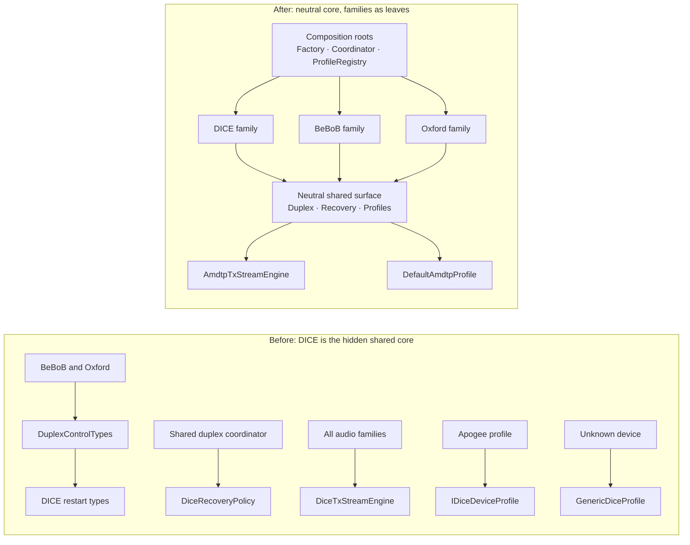

# De-DICE Refactoring Plan

## Problem

The Apogee Duet (OXFW) came first, but it was simple enough not to need heavy
shared machinery. The DICE buildout is what created the shared duplex/restart/
recovery machinery and the AMDTP TX engine — so the "generic" audio layer grew
up inside DICE names and namespaces. The seams themselves (`IDeviceProtocol`,
`IAudioBackend`, `IAudioDeviceProfile`, `AudioDuplexCoordinator`) are fine —
BeBoB and OXFW do plug into them. What was never done is de-DICE-ing the shared
surface, so every new family transitively inherits DICE plumbing.

`BeBoB_REFACTOR.md` explicitly deferred this ("Full `DuplexControlTypes.hpp`
cleanup" under *Future Flags*). This plan is that remaining work.

### Leak inventory

| # | Site | Leak |
|---|------|------|
| 1 | `Audio/Protocols/Duplex/DuplexControlTypes.hpp:15-36` | The "protocol-neutral" duplex vocabulary is a set of `using` aliases directly onto `DICE::` enums defined in `DICE/Core/DICERestartSession.hpp`. Alias veneer, not a real seam. |
| 2 | `Audio/Protocols/Backends/AVCAudioBackend.cpp:273` | AVC (BeBoB/Oxford) backend passes `DICE::DiceRestartReason::kRecoverAfterTimingLoss` directly. |
| 3 | `Audio/Protocols/Backends/DiceRecoveryPolicy.hpp` | Shared recovery policy (included by `AudioDuplexCoordinator`, `RestartJournal`, `AVCAudioBackend`) is DICE-named and DICE-namespaced. |
| 4 | `Audio/Engine/Direct/Tx/DiceTxStreamEngine.hpp` | Generic AMDTP TX engine (wraps `AmdtpTxPacketizer`) — DICE only in name/namespace (`ASFW::Protocols::Audio::DICE`). Every family transmits through it. |
| 5 | `Audio/Core/AudioCoordinator.hpp:74` + `.cpp:75-168` | Coordinator hardcodes `DiceAudioBackend dice_` member and DICE-specific recovery branches ("non-DICE active GUID" guard). |
| 6 | `Audio/DriverKit/Config/AudioProfileRegistry.cpp:52-80` | Universal fallback profile is `DiceProfileRegistry::GenericProfile()`; BeBoB got a bolted-on `RegisterBeBoBProfile(const void*)` special case. |
| 7 | `Audio/DriverKit/Config/AVC/ApogeeDuetProfile.hpp:14` | An AV/C profile inherits `DICE::IDiceDeviceProfile` — the de-facto shared isoch profile interface is DICE-named. |
| 8 | `DICE/Core/DICERestartSession.hpp:133,148` | `DiceDuplexConfirmResult` / `DiceDuplexHealthResult` carry raw DICE register words (`notification`, `status`, `extStatus`); the shared coordinator logs them (`AudioDuplexCoordinator.cpp:1417`). Model leak, not just a name leak. |
| 9 | Shared log tags / docs | `ASFW_LOG(DICE, ...)` in the shared duplex coordinator (`AudioDuplexCoordinator.cpp:827`); DICE assumptions in `IDeviceProtocol.hpp:57,97` doc comments; `"dice-working-1536"` strings in `Shared/Isoch/AudioHalBufferProfiles.hpp`. |

### Measured blast radius

`DiceRestartReason` 13 files, `DiceRestartSession` 7, `DiceRecoveryPolicy` 4,
`DiceTxStreamEngine` 5, `TxSlotPrepareResult` 4, `DiceRuntimeDeviceConfig` 3.
Roughly 30–40 files total, almost all mechanical.

## Principles

- **Shared code owns the neutral vocabulary; families consume it.** Same model as
  Linux `sound/firewire`: `firewire-lib` owns everything shared; snd-dice /
  snd-oxfw / snd-bebob are leaves that never see each other.
- **Composition roots are explicitly allowed to know all families.**
  `DeviceProtocolFactory` and the `AudioCoordinator` backend wiring legitimately
  name every family — that is their job. The boundary rule targets *shared
  machinery* (duplex coordinator, recovery policy, TX/RX engines, profile
  contracts), not the roots that assemble it.
- **Three recovery concepts, three types.** Today one DICE enum family serves
  all three roles. After this refactor:
  - `DuplexRestartReason` — why a restart session exists (stored in the session).
  - `RecoveryPolicyReason` — why the policy decided what it decided
    (`kMissingDependency`, `kRetryableFailure`, …).
  - `BackendRecoveryEvent` — external events delivered to a backend
    (bus reset, cycle inconsistency, …).
- **No back-compat aliases.** No `using DiceRestartReason = DuplexRestartReason;`
  left behind — DICE code adopts the neutral names directly (project rule: no
  double paths).
- **Zero wire-observable change.** Pure renames/moves; the reference-conformance
  doctrine is untouched. Recovery *semantics* must be preserved bit-for-bit
  (Phase 4 is the only phase with real regression risk).

## Target boundary model

```
Allowed to name every family (composition roots):
  Audio/Protocols/DeviceProtocolFactory.*
  Audio/Core/AudioCoordinator.*            (backend wiring only)
  Audio/DriverKit/Config/AudioProfileRegistry.*  (family registry wiring only)

Family homes (only place family headers may live / be included from):
  Audio/Protocols/DICE/**      + Audio/DriverKit/Config/DICE/**
  Audio/Protocols/BeBoB/**     + Audio/DriverKit/Config/AVC/BeBoB*
  Audio/Protocols/Oxford/**    + Audio/DriverKit/Config/AVC/ApogeeDuet*
  Audio/Protocols/Backends/DiceAudioBackend.*   (DICE family; see Phase 5a)
  Audio/Protocols/Backends/AVCAudioBackend.*    (AV/C family shared by BeBoB+Oxford)

Shared machinery (must be family-clean after this plan):
  Audio/Protocols/Duplex/**, AudioDuplexCoordinator, StreamRecoveryPolicy,
  RestartJournal, IAudioBackend, IDeviceProtocol, IAudioDeviceProfile,
  Audio/Engine/Direct/**, Shared/Isoch/**
```

### Dependency shape before and after



## Phase 0 — Baseline

Green `./build.sh --test-only` + full `./build.sh` (IIG). Clean commit boundary
before starting.

## Phase 1 — Restart vocabulary changes owner (1 commit)

- Move the type definitions out of `DICE/Core/DICERestartSession.hpp` (262 lines:
  `DiceRestartReason`, `DiceRestartPhase`, `DiceRestartState`,
  `DiceRestartSession`, `ClassifyRestartReason`, `Has*RestartState`, the
  prepare/stage/confirm/health result enums) into a new
  `Audio/Protocols/Duplex/DuplexRestartTypes.hpp`, renamed to the `Duplex*` names
  that `DuplexControlTypes.hpp` already aliases.
- **Model leak (#8):** the raw DICE register words in `DiceDuplexConfirmResult`
  (`notification`, `status`, `extStatus`) and `DiceDuplexHealthResult` do not
  move as named DICE fields. Replace them with an explicitly protocol-opaque
  diagnostics struct on the neutral types:

  ```cpp
  // Protocol-opaque diagnostic words filled by the family protocol; the
  // shared coordinator may log them but must not interpret them.
  struct DuplexProtocolDiag {
      uint32_t words[3]{};
  };
  ```

  DICE fills them with notification/status/extStatus; other families leave them
  zero. The coordinator's logging at `AudioDuplexCoordinator.cpp:1417` logs them
  as opaque words.
- `DuplexControlTypes.hpp` stops including the DICE header; the aliases become
  real definitions (or the two headers merge into one).
- Update all usage sites (13 + 7 files) to the neutral names. DICE code uses the
  neutral names directly — no aliases back.
- Fixes leak #2 for free: `AVCAudioBackend.cpp:273` becomes
  `DuplexRestartReason::kRecoverAfterTimingLoss`.

## Phase 2 — Mechanical rename of shared machinery (2 commits)

**Commit 2a — recovery policy:**
- `DiceRecoveryPolicy.hpp` → `StreamRecoveryPolicy.hpp`, namespace out of
  `::DICE` (4 files). Renames: `DiceRecoveryPolicyReason` →
  **`RecoveryPolicyReason`** (it describes why the policy decided, e.g.
  `kMissingDependency`, `kRetryableFailure` — *not* an external event; the event
  type arrives in Phase 4), `DiceRecoveryDisposition` → `RecoveryDisposition`,
  `DiceRecoveryContext` → `RecoveryContext`.
- `RestartJournal` keeps its name, switches vocabulary (follows Phase 1).
- `ASFW_LOG(DICE, ...)` → `ASFW_LOG(Audio, ...)` **only in shared machinery**
  (`AudioDuplexCoordinator.cpp:827` and any other shared-path sites).
  `DeviceProtocolFactory`'s DICE-tagged lines describe actual DICE protocol
  creation in a composition root — they stay.
  **Note:** the tag change alters the `[Tag]` prefix in log messages — existing
  `log stream` grep patterns must be updated; call it out in the commit message.

**Commit 2b — TX engine:**
- `DiceTxStreamEngine` → `AmdtpTxStreamEngine`, `TxSlotPrepareResult` with it,
  namespace `ASFW::Protocols::Audio::DICE` → `ASFW::AudioEngine::Direct::Tx`
  (matching the RX consumer namespace established in `951abcc`). File renamed in
  place under `Audio/Engine/Direct/Tx/` (5 + 4 files, incl.
  `ASFWAudioDriverPrivate.hpp` and `ASFWAudioDriverZts.cpp`).
- File renames require `xcodegen generate`; commit the regenerated
  `ASFW.xcodeproj` together with any `project.yml` change.
- Checkpoint: `DiceRuntimeDeviceConfig` (3 files) — decide whether its contents
  are DICE-specific or shared before renaming; if only the DICE backend consumes
  it, leave it alone.

## Phase 3 — Profile contract + registry neutral (1 commit)

Two sub-problems, one commit:

**3a — the shared profile interface is DICE-named (leak #7).**
`ApogeeDuetProfile` inherits `DICE::IDiceDeviceProfile` because that interface
is the de-facto shared isoch-geometry contract. Hoist the family-neutral part of
`IDiceDeviceProfile` into the neutral contract (extend `IAudioDeviceProfile` or
introduce `IIsochStreamProfile` next to it); keep `DiceDeviceQuirks` and DICE
identity matching in a DICE-side sub-interface. `ApogeeDuetProfile` (and the
BeBoB/Phase88 profiles) then implement only the neutral contract.

**3b — the universal fallback is `GenericDiceProfile` (leak #6).**
`GenericDiceProfile` is genuinely DICE-specific (inherits `IDiceDeviceProfile`,
exposes `DiceDeviceQuirks`, names itself `"Generic DICE"`), yet
`AudioProfileRegistry.cpp:67` returns it for *every* unknown identity, and
`tests/audio/DiceProfileTests.cpp:283` pins "unknown BeBoB falls back to Generic
DICE". Decision (behavior-preserving option chosen):

- Introduce **`DefaultAmdtpProfile`** implementing the neutral contract with
  byte-identical geometry to today's `GenericDiceProfile`, owned by the registry
  (neutral location under `Config/`). The registry's ultimate fallback becomes
  `DefaultAmdtpProfile`; `GenericDiceProfile` remains as the DICE-family
  fallback *inside* `DiceProfileRegistry` only.
- **Name string check:** `Name()` returning `"Generic DICE"` may surface in
  user-visible device naming. Verify where `Name()` flows before renaming the
  fallback's string; if user-visible, changing `"Generic DICE"` →
  `"Generic AMDTP"` is a conscious, documented choice in the commit message.
- Update `DiceProfileTests.cpp:283` expectations accordingly.
- The cleaner alternative — family-aware lookup where DICE fallback applies only
  to DICE identities — changes behavior for unknown devices and is deferred as
  explicit future work.

**Registry API:** `RegisterBeBoBProfile(uint64_t, const void*)` → generic
`RegisterDynamicProfile(uint64_t guid, std::unique_ptr<IAudioDeviceProfile>)`;
the caller constructs `BeBoBProfile` itself. Also kills the `const void*` cast
at `AudioProfileRegistry.cpp:77`.

## Phase 4 — Neutral recovery dispatch (1 commit)

Scoped down from "make AudioCoordinator backend-agnostic": `IAudioBackend` today
has only start/stop, and the coordinator legitimately keeps concrete branches
for add/remove/resume/clock-config/teardown as a composition root. This phase
neutralizes **recovery dispatch only**:

- New type in shared vocabulary:

  ```cpp
  enum class BackendRecoveryEvent : uint8_t {
      kBusReset,
      kCycleInconsistent,
      kTimingLoss,
  };
  ```

  ```mermaid
  flowchart LR
      E["External event<br/>bus reset · cycle inconsistency · timing loss"]
      B["BackendRecoveryEvent"]
      C["AudioCoordinator<br/>selects backend"]
      H["Backend<br/>HandleRecoveryEvent"]
      R["DuplexRestartReason"]
      S["DuplexRestartSession"]
      P["StreamRecoveryPolicy"]
      D["RecoveryDisposition"]
      W["RecoveryPolicyReason"]

      E --> B
      B --> C
      C --> H
      H -->|backend-specific mapping| R
      R --> S
      S --> P
      P --> D
      P --> W
  ```

- New virtual `IAudioBackend::HandleRecoveryEvent(uint64_t guid,
  BackendRecoveryEvent event)`. The DICE branches in
  `AudioCoordinator.cpp:75-168` (`kBusResetRebind`,
  `kRecoverAfterCycleInconsistent`, the "non-DICE active GUID" guard) move into
  `DiceAudioBackend::HandleRecoveryEvent`, which maps events to its own
  `DuplexRestartReason` values; `AVCAudioBackend` implements today's behavior
  (timing-loss recovery; otherwise no-op).
- The coordinator routes events via `BackendForGuid(...)->HandleRecoveryEvent(...)`
  — no `dice_`-specific calls left in recovery paths. The concrete members stay.
- Recovery semantics preserved exactly — this is the one phase to review and
  HW-test carefully.
- Full lifecycle neutrality (add/remove/clock through the interface) is explicit
  future work, not this plan.

## Phase 5 — Family homes + enforcement + cosmetics (2 commits)

**Commit 5a — move family code home:**
- `DiceAudioBackend.*` moves from `Audio/Protocols/Backends/` into the DICE
  family home (e.g. `Audio/Protocols/DICE/Backend/`) — it includes
  `DICE/Core/DICENotificationMailbox.hpp`, `DICE/Core/DICETypes.hpp`,
  `DiceProfileRegistry.hpp` and is unambiguously family code. `AVCAudioBackend`
  stays under `Backends/` as the shared AV/C-family backend (BeBoB + Oxford).
- `xcodegen generate` + commit regenerated project.

**Commit 5b — enforcement + cosmetics:**
- `tools/check_family_boundaries.sh`, wired into `build.sh` / CI. Rules:
  - (a) files in *shared machinery* (see Target boundary model) must not include
    family headers or reference `::DICE::` / `::BeBoB::` / Oxford types;
  - (b) no family includes another family (DICE ↔ BeBoB ↔ Oxford);
  - (c) composition roots (`DeviceProtocolFactory`, `AudioCoordinator`,
    `AudioProfileRegistry`) are on an explicit allowlist and may include all
    family headers.
  After Phases 1–5a it should be green from day one — the allowlist makes that
  achievable without loopholes.
- Clean DICE assumptions out of `IDeviceProtocol.hpp:57,97` doc comments.
- Consider renaming the `"dice-working-1536"` / `"pre-dice-zts-192"` buffer
  profile strings in `AudioHalBufferProfiles.hpp` — **check first** whether the
  strings are matched or persisted anywhere; if they are log-only historical
  labels, leaving them is harmless.

## Verification

- Per phase: `./build.sh --test-only` (full C++ suite) + full `./build.sh` for
  IIG/dext compilation. Phases 2b/5a: regenerated `ASFW.xcodeproj` diff reviewed
  and committed.
- Hardware: one batched smoke test at the end (Phase88 + one DICE device:
  start/stop streaming, bus-reset recovery) — Phase 4 is the reason; everything
  else is pure renames/moves.

## Dependencies

Phase 1 first (2a builds on the new type names). 2a/2b in either order.
Phases 3 and 4 independent of each other, after 2. Phase 5a after 4 (backend
move lands once recovery dispatch is neutral); 5b last.

## Explicit future work (out of scope)

- Family-aware profile lookup (DICE fallback only for DICE identities) — changes
  behavior for unknown devices.
- Full `IAudioBackend` lifecycle neutrality (add/remove/resume/clock-config
  through the interface).
- Generalizing `AVCAudioBackend` if a third AV/C family diverges from
  BeBoB/Oxford needs.
