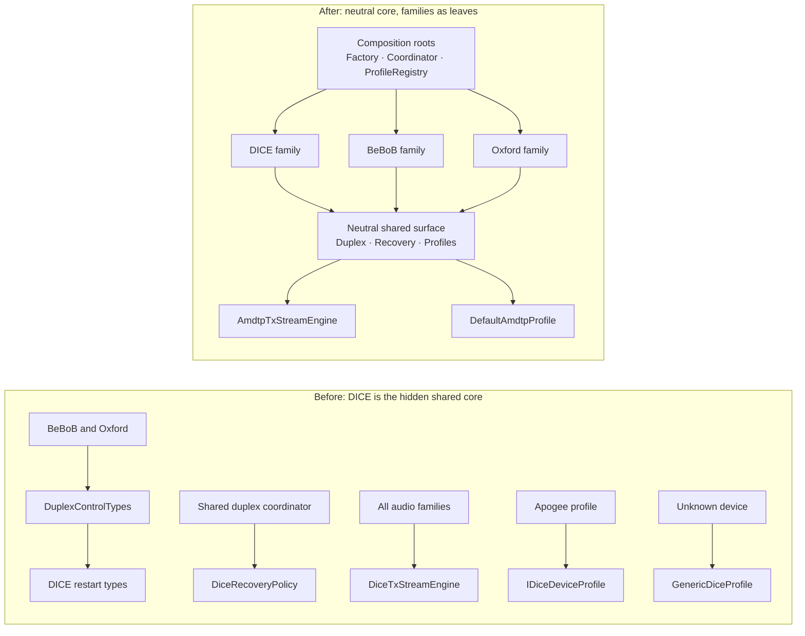

# De-DICE Refactoring Plan

## Problem

The Apogee Duet (OXFW) came first, but it was simple enough not to need heavy
shared machinery. The DICE buildout is what created the shared duplex/restart/
recovery machinery and the AMDTP TX engine — so the "generic" audio layer grew
up inside DICE names and namespaces. The seams themselves (`IDeviceProtocol`,
`IAudioBackend`, `IAudioDeviceProfile`, `AudioDuplexCoordinator`) are fine —
BeBoB and OXFW do plug into them. What was never done (completely) is
de-DICE-ing the shared surface, so new families inherit DICE plumbing
transitively.

## Status vs. in-flight branches

A large part of the original leak inventory is already fixed on branches not in
`main` yet:

- **Merged to `main`:** FW-71/72/73 — neutral duplex seams, AV/C duplex
  coordinator, mechanical neutral rename of the shared duplex transport +
  coordinator.
- **`codex/fw-73-neutral-duplex-rename`** (includes PR #67 / FW-73b): restart/
  session vocabulary is neutral — `DuplexRestartReason`, `DuplexRestartSession`
  etc. live in `Audio/Protocols/Duplex/DuplexRestartSession.hpp`; the
  `DuplexControlTypes.hpp` alias veneer is gone; `AVCAudioBackend` no longer
  names DICE enums.
- **`refactor/BeBoB`:** the `BeBoB_REFACTOR.md` implementation (identity layer,
  `GenericBeBoBProtocol`, per-GUID `BeBoBProfile`, `IsBeBoBDevice`), including
  its step-0 restart-reason namespace-leak fix.

**Integration note:** the two branches do not include each other, and
`codex/fw-73-neutral-duplex-rename` is based on `main` as of 2026-07-11 — it
predates the BeBoB-era changes to `AudioDuplexCoordinator`/`AVCAudioBackend`,
so expect mechanical conflicts when both land.

**This plan's baseline is `main` with both branches merged.** Everything below
is what remains *after* that.

### Remaining leak inventory

| # | Site | Leak |
|---|------|------|
| 1 | `Duplex/DuplexRestartSession.hpp` (fw-73b) | `DuplexConfirmResult` / `DuplexHealthResult` still carry raw DICE register words (`notification`, `status`, `extStatus`) as named fields; the shared coordinator logs them. Model leak survived the rename. |
| 2 | `Audio/Protocols/Backends/DiceRecoveryPolicy.hpp` | File name, `DiceRecoveryPolicyReason`, `DiceRecoveryDisposition`, `DiceRecoveryContext` still DICE-named (fw-73b swapped the vocabulary it consumes, not the policy's own names). |
| 3 | `Audio/Engine/Direct/Tx/DiceTxStreamEngine.hpp` | Generic AMDTP TX engine (wraps `AmdtpTxPacketizer`) — DICE only in name/namespace (`ASFW::Protocols::Audio::DICE`). Every family transmits through it. |
| 4 | `Audio/Core/AudioCoordinator` | Hardcoded `DiceAudioBackend dice_` member and DICE-specific recovery branches ("non-DICE active GUID" guard). |
| 5 | `Audio/DriverKit/Config/AudioProfileRegistry.cpp` | Universal fallback profile is `DiceProfileRegistry::GenericProfile()` (`"Generic DICE"` for an unknown BeBoB, pinned by `DiceProfileTests.cpp`); `RegisterBeBoBProfile(const void*)` special case. |
| 6 | `Audio/DriverKit/Config/AVC/ApogeeDuetProfile.hpp` | AV/C profile inherits `DICE::IDiceDeviceProfile` — the de-facto shared isoch profile interface is DICE-named. |
| 7 | Shared log tags / docs | `ASFW_LOG(DICE, ...)` in the shared duplex coordinator; DICE assumptions in `IDeviceProtocol.hpp` doc comments; `"dice-working-1536"` strings in `Shared/Isoch/AudioHalBufferProfiles.hpp`. |

## Principles

- **Shared code owns the neutral vocabulary; families consume it.** Same model as
  Linux `sound/firewire`: `firewire-lib` owns everything shared; snd-dice /
  snd-oxfw / snd-bebob are leaves that never see each other.
- **Composition roots are explicitly allowed to know all families.**
  `DeviceProtocolFactory` and the `AudioCoordinator` backend wiring legitimately
  name every family — that is their job. The boundary rule targets *shared
  machinery*, not the roots that assemble it.
- **Three recovery concepts, three types:**
  - `DuplexRestartReason` — why a restart session exists (done on fw-73b).
  - `RecoveryPolicyReason` — why the policy decided what it decided.
  - `BackendRecoveryEvent` — external events delivered to a backend.
- **No back-compat aliases** (project rule: no double paths).
- **Zero wire-observable change.** Pure renames/moves; recovery *semantics*
  preserved bit-for-bit (Phase 3 is the only phase with real regression risk).

## Target boundary model

```
Allowed to name every family (composition roots):
  Audio/Protocols/DeviceProtocolFactory.*
  Audio/Core/AudioCoordinator.*            (backend wiring only)
  Audio/DriverKit/Config/AudioProfileRegistry.*  (family registry wiring only)

Family homes (only place family headers may live / be included from):
  Audio/Protocols/DICE/**      + Audio/DriverKit/Config/DICE/**
  Audio/Protocols/BeBoB/**     + Audio/DriverKit/Config/AVC/BeBoB*
  Audio/Protocols/Oxford/**    + Audio/DriverKit/Config/AVC/ApogeeDuet*
  Audio/Protocols/Backends/DiceAudioBackend.*   (DICE family; see Phase 5a)
  Audio/Protocols/Backends/AVCAudioBackend.*    (AV/C family shared by BeBoB+Oxford)

Shared machinery (must be family-clean after this plan):
  Audio/Protocols/Duplex/**, AudioDuplexCoordinator, StreamRecoveryPolicy,
  RestartJournal, IAudioBackend, IDeviceProtocol, IAudioDeviceProfile,
  Audio/Engine/Direct/**, Shared/Isoch/**
```

### Dependency shape before and after

("Before" is `main` prior to the FW-71..73b series; the alias-veneer edge is
already gone on `codex/fw-73-neutral-duplex-rename`.)



## Phase 0 — Baseline

Land `codex/fw-73-neutral-duplex-rename` and `refactor/BeBoB` into `main`
(resolving the mechanical conflicts between them). Green `./build.sh
--test-only` + full `./build.sh` (IIG). Clean commit boundary before starting.

## Phase 1 — Finish the recovery/restart cleanup (1 commit)

- **Opaque diagnostics (leak #1):** replace the raw DICE register fields on the
  neutral result structs with a protocol-opaque struct:

  ```cpp
  // Protocol-opaque diagnostic words filled by the family protocol; the
  // shared coordinator may log them but must not interpret them.
  struct DuplexProtocolDiag {
      uint32_t words[3]{};
  };
  ```

  DICE fills them with notification/status/extStatus; other families leave them
  zero. The coordinator logs them as opaque words.
- **Policy rename (leak #2):** `DiceRecoveryPolicy.hpp` →
  `StreamRecoveryPolicy.hpp`; `DiceRecoveryPolicyReason` →
  **`RecoveryPolicyReason`** (it describes why the policy decided — *not* an
  external event; that type arrives in Phase 3), `DiceRecoveryDisposition` →
  `RecoveryDisposition`, `DiceRecoveryContext` → `RecoveryContext`.
- `ASFW_LOG(DICE, ...)` → `ASFW_LOG(Audio, ...)` **only in shared machinery**
  (the duplex coordinator). `DeviceProtocolFactory`'s DICE-tagged lines describe
  actual DICE protocol creation in a composition root — they stay.
  **Note:** the tag change alters the `[Tag]` prefix in log messages — existing
  `log stream` grep patterns must be updated; call it out in the commit message.

## Phase 2 — TX engine rename (1 commit)

- `DiceTxStreamEngine` → `AmdtpTxStreamEngine`, `TxSlotPrepareResult` with it,
  namespace `ASFW::Protocols::Audio::DICE` → `ASFW::AudioEngine::Direct::Tx`
  (matching the RX consumer namespace established in `951abcc`). File renamed in
  place under `Audio/Engine/Direct/Tx/` (touches `ASFWAudioDriverPrivate.hpp`
  and `ASFWAudioDriverZts.cpp`).
- File renames require `xcodegen generate`; commit the regenerated
  `ASFW.xcodeproj` together with any `project.yml` change.
- Checkpoint: `DiceRuntimeDeviceConfig` — decide whether its contents are
  DICE-specific or shared before renaming; if only the DICE backend consumes it,
  leave it alone.

## Phase 3 — Neutral recovery dispatch (1 commit)

`IAudioBackend` has only start/stop today, and the coordinator legitimately
keeps concrete branches for add/remove/resume/clock-config/teardown as a
composition root. This phase neutralizes **recovery dispatch only**:

- New type in shared vocabulary:

  ```cpp
  enum class BackendRecoveryEvent : uint8_t {
      kBusReset,
      kCycleInconsistent,
      kTimingLoss,
  };
  ```

  ```mermaid
  flowchart LR
      E["External event<br/>bus reset · cycle inconsistency · timing loss"]
      B["BackendRecoveryEvent"]
      C["AudioCoordinator<br/>selects backend"]
      H["Backend<br/>HandleRecoveryEvent"]
      R["DuplexRestartReason"]
      S["DuplexRestartSession"]
      P["StreamRecoveryPolicy"]
      D["RecoveryDisposition"]
      W["RecoveryPolicyReason"]

      E --> B
      B --> C
      C --> H
      H -->|backend-specific mapping| R
      R --> S
      S --> P
      P --> D
      P --> W
  ```

- New virtual `IAudioBackend::HandleRecoveryEvent(uint64_t guid,
  BackendRecoveryEvent event)`. The DICE branches in `AudioCoordinator`
  (`kBusResetRebind`, `kRecoverAfterCycleInconsistent`, the "non-DICE active
  GUID" guard) move into `DiceAudioBackend::HandleRecoveryEvent`, which maps
  events to its own `DuplexRestartReason` values; `AVCAudioBackend` implements
  today's behavior (timing-loss recovery; otherwise no-op).
- The coordinator routes events via `BackendForGuid(...)->HandleRecoveryEvent(...)`
  — no `dice_`-specific calls left in recovery paths. The concrete members stay.
- Recovery semantics preserved exactly — this is the one phase to review and
  HW-test carefully.
- Full lifecycle neutrality (add/remove/clock through the interface) is explicit
  future work, not this plan.

## Phase 4 — Profile contract + registry neutral (1 commit)

**4a — the shared profile interface is DICE-named (leak #6).**
`ApogeeDuetProfile` inherits `DICE::IDiceDeviceProfile` because that interface
is the de-facto shared isoch-geometry contract. Hoist the family-neutral part
into the neutral contract (extend `IAudioDeviceProfile` or introduce
`IIsochStreamProfile` next to it); keep `DiceDeviceQuirks` and DICE identity
matching in a DICE-side sub-interface. `ApogeeDuetProfile` (and the BeBoB
profiles) then implement only the neutral contract.

**4b — the universal fallback is `GenericDiceProfile` (leak #5).**
Behavior-preserving option chosen:

- Introduce **`DefaultAmdtpProfile`** implementing the neutral contract with
  byte-identical geometry to today's `GenericDiceProfile`, owned by the registry
  (neutral location under `Config/`). The registry's ultimate fallback becomes
  `DefaultAmdtpProfile`; `GenericDiceProfile` remains as the DICE-family
  fallback *inside* `DiceProfileRegistry` only.
- **Name string check:** `Name()` returning `"Generic DICE"` may surface in
  user-visible device naming. Verify where `Name()` flows before renaming the
  string; if user-visible, `"Generic DICE"` → `"Generic AMDTP"` is a conscious,
  documented choice in the commit message. Update the pinned test expectations.
- The cleaner alternative — family-aware lookup where the DICE fallback applies
  only to DICE identities — changes behavior for unknown devices and is deferred
  as explicit future work.

**Registry API:** `RegisterBeBoBProfile(uint64_t, const void*)` → generic
`RegisterDynamicProfile(uint64_t guid, std::unique_ptr<IAudioDeviceProfile>)`;
the caller constructs `BeBoBProfile` itself. Also kills the `const void*` cast.

## Phase 5 — Family homes + enforcement + cosmetics (2 commits)

**Commit 5a — move family code home:**
- `DiceAudioBackend.*` moves from `Audio/Protocols/Backends/` into the DICE
  family home (e.g. `Audio/Protocols/DICE/Backend/`) — it includes
  `DICENotificationMailbox`, `DICETypes`, `DiceProfileRegistry` and is
  unambiguously family code. `AVCAudioBackend` stays under `Backends/` as the
  shared AV/C-family backend (BeBoB + Oxford).
- `xcodegen generate` + commit regenerated project.

**Commit 5b — enforcement + cosmetics:**
- `tools/check_family_boundaries.sh`, wired into `build.sh` / CI. Rules:
  - (a) files in *shared machinery* (see Target boundary model) must not include
    family headers or reference `::DICE::` / `::BeBoB::` / Oxford types;
  - (b) no family includes another family (DICE ↔ BeBoB ↔ Oxford);
  - (c) composition roots (`DeviceProtocolFactory`, `AudioCoordinator`,
    `AudioProfileRegistry`) are on an explicit allowlist and may include all
    family headers.
  After Phases 1–5a it should be green from day one — the allowlist makes that
  achievable without loopholes.
- Clean DICE assumptions out of `IDeviceProtocol.hpp` doc comments.
- Consider renaming the `"dice-working-1536"` / `"pre-dice-zts-192"` buffer
  profile strings in `AudioHalBufferProfiles.hpp` — **check first** whether the
  strings are matched or persisted anywhere; if they are log-only historical
  labels, leaving them is harmless.

## Verification

- Per phase: `./build.sh --test-only` (full C++ suite) + full `./build.sh` for
  IIG/dext compilation. Phases 2/5a: regenerated `ASFW.xcodeproj` diff reviewed
  and committed.
- Hardware: one batched smoke test at the end (Phase88 + one DICE device:
  start/stop streaming, bus-reset recovery) — Phase 3 is the reason; everything
  else is pure renames/moves.

## Dependencies

Phase 0 (land the in-flight branches) gates everything. Phase 1 first after
that. Phases 2, 3, 4 independent of each other. Phase 5a after 3 (backend moves
once recovery dispatch is neutral); 5b last.

## Explicit future work (out of scope)

- Family-aware profile lookup (DICE fallback only for DICE identities) — changes
  behavior for unknown devices.
- Full `IAudioBackend` lifecycle neutrality (add/remove/resume/clock-config
  through the interface).
- Generalizing `AVCAudioBackend` if a third AV/C family diverges from
  BeBoB/Oxford needs.
