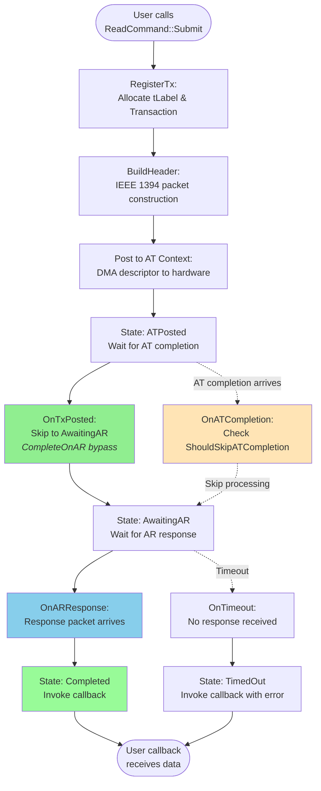
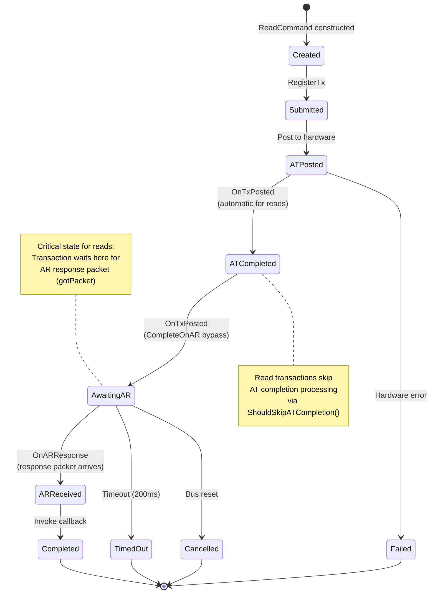
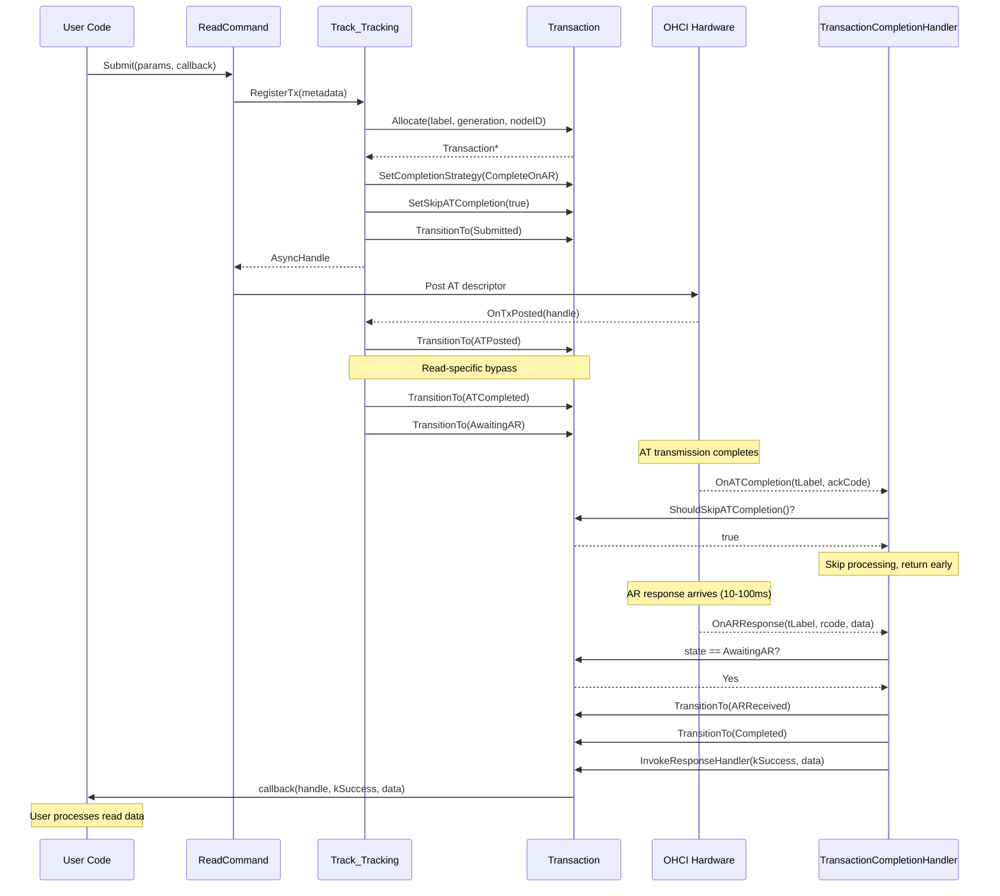
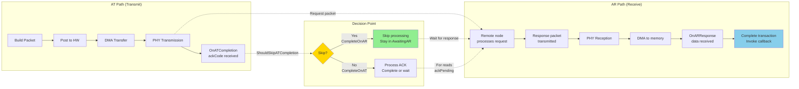
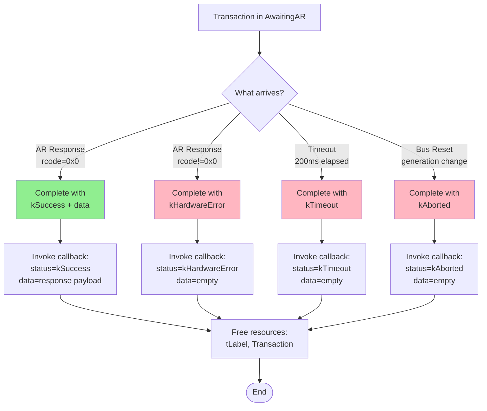
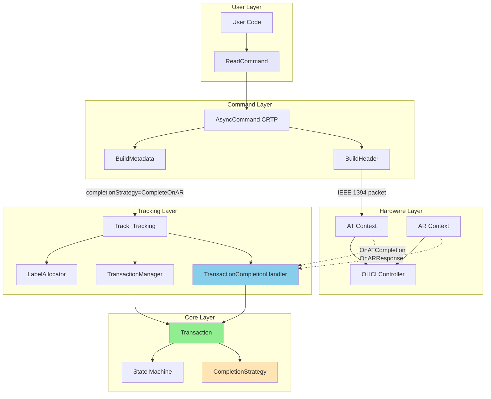

# Asynchronous Read API Documentation

## Overview

The ASFW asynchronous read API provides IEEE 1394 compliant read operations (quadlet and block reads) with a two-path completion model matching Apple's IOFireWireFamily architecture.

**Key Features:**
- Type-safe command pattern (CRTP-based)
- Explicit two-path completion (AT transmit + AR receive)
- Automatic resource management (payloads, labels, transactions)
- State machine validation (compile-time + runtime)
- IEEE 1394-1995 protocol compliance

**Completion Model:**
Read operations use `CompletionStrategy::CompleteOnAR` which means:
- AT completion (`gotAck`) stores acknowledgment but **does not complete** the operation
- AR response (`gotPacket`) completes the operation with response data
- This matches the IEEE 1394 split-transaction model where reads always wait for response packets

---

## Public API Surface

### 1. ReadCommand Class

**Location:** `ASFWDriver/Async/Commands/ReadCommand.hpp`

```cpp
class ReadCommand : public AsyncCommand<ReadCommand> {
public:
    ReadCommand(ReadParams params, CompletionCallback callback);

    // CRTP interface (internal use)
    TxMetadata BuildMetadata(const TransactionContext& txCtx);
    size_t BuildHeader(uint8_t label, const PacketContext& pktCtx, uint8_t* buffer);
    std::unique_ptr<PayloadContext> PreparePayload(HardwareInterface&);
};
```

**Parameters:**
```cpp
struct ReadParams {
    uint16_t destinationID;    // Target node ID (e.g., 0xFFC0 for local bus)
    uint64_t destinationOffset; // 48-bit address offset
    uint32_t length;            // 0 or 4 = quadlet, >4 = block
};

using CompletionCallback = std::function<void(
    AsyncHandle handle,         // Transaction identifier (tLabel + 1)
    AsyncStatus status,         // kSuccess, kTimeout, kHardwareError
    std::span<const uint8_t> data  // Response payload (empty on error)
)>;
```

**Transaction Codes:**
- `0x4` (READ_QUADLET_REQUEST): length == 0 or length == 4
- `0x5` (READ_BLOCK_REQUEST): length > 4

### 2. Usage Example

```cpp
// Create read command
ReadParams params{
    .destinationID = 0xFFC0,           // Local bus node
    .destinationOffset = 0xFFFFF0000404, // CSR CONFIG_ROM + 4
    .length = 4                         // Read single quadlet
};

auto callback = [](AsyncHandle handle, AsyncStatus status, std::span<const uint8_t> data) {
    if (status == AsyncStatus::kSuccess && data.size() == 4) {
        uint32_t value = (data[0] << 24) | (data[1] << 16) | (data[2] << 8) | data[3];
        ASFW_LOG(Async, "Read successful: 0x%08X", value);
    } else {
        ASFW_LOG(Async, "Read failed: status=%d", static_cast<int>(status));
    }
};

// Submit read command
ReadCommand cmd(params, callback);
AsyncHandle handle = cmd.Submit(asyncEngine);

// Transaction proceeds asynchronously:
// 1. AT descriptor posted to hardware
// 2. AT completion arrives (stores ACK, doesn't complete)
// 3. AR response arrives (completes with data)
// 4. Callback invoked with response data
```

### 3. CompletionStrategy Enum

**Location:** `ASFWDriver/Async/Core/CompletionStrategy.hpp`

```cpp
enum class CompletionStrategy : uint8_t {
    CompleteOnAT = 0,    // Write quadlet with ack_complete
    CompleteOnAR = 1,    // Read operations (gotPacket model)
    RequireBoth = 2      // Deferred writes with ack_pending
};

// Helper functions
constexpr bool RequiresARResponse(CompletionStrategy strategy);
constexpr CompletionStrategy StrategyFromTCode(uint8_t tCode, bool expectsDeferred = false);
```

**Read operations always use `CompletionStrategy::CompleteOnAR`.**

---

## Architecture Diagrams

### Diagram 1: High-Level Transaction Flow



**Key Points:**
- **Green nodes**: Read-specific bypass logic
- **Orange nodes**: AT completion (skipped for reads)
- **Blue nodes**: AR response (critical for reads)
- Reads transition directly to `AwaitingAR` in `OnTxPosted`, bypassing normal AT completion

---

### Diagram 2: Transaction State Machine



**State Descriptions:**

| State | Description | Duration |
|-------|-------------|----------|
| `Created` | Command constructed but not submitted | Instantaneous |
| `Submitted` | Registered with tracking, label allocated | <1ms |
| `ATPosted` | DMA descriptor on hardware | 1-10μs |
| `ATCompleted` | Bypass state (automatic for reads) | Instantaneous |
| `AwaitingAR` | Waiting for response packet | 10-100ms typical |
| `ARReceived` | Response matched, about to complete | <1ms |
| `Completed` | Callback invoked, resources freed | Terminal |
| `TimedOut` | No response within 200ms | Terminal |

---

### Diagram 3: Read Operation Sequence (Successful Path)



**Timing:**
- **AT posting**: <1ms from Submit to OnTxPosted
- **AT completion**: 1-10μs after posting (ignored for reads)
- **AR response**: 10-100ms typical, 200ms timeout
- **Total latency**: ~10-100ms for successful read

---

### Diagram 4: AT/AR Split-Path Model



**Path Selection:**
- **Writes**: Both paths matter (AT completion may be sufficient with `ack_complete`)
- **Reads**: Only AR path completes (AT completion is informational only)
- **Decision**: Based on `CompletionStrategy` set in `BuildMetadata()`

---

### Diagram 5: Error Handling Flows



**Error Types:**

| Error | Cause | User Action |
|-------|-------|-------------|
| `kHardwareError` | Invalid rcode (0x4-0x6, 0xD-0xE) | Check node ID, address, permissions |
| `kTimeout` | No response within 200ms | Retry or check node connectivity |
| `kAborted` | Bus reset during transaction | Resubmit with new generation |

---

### Diagram 6: Component Interaction Overview



**Layer Responsibilities:**

1. **User Layer**: Constructs ReadCommand with parameters
2. **Command Layer**: Builds IEEE 1394 packet, sets completion strategy
3. **Tracking Layer**: Manages transaction lifecycle, coordinates completion paths
4. **Core Layer**: State machine, completion strategy, transaction identity
5. **Hardware Layer**: DMA, PHY transmission/reception, OHCI events

---

## Implementation Details

### Completion Strategy Selection

**Location:** `ASFWDriver/Async/Commands/ReadCommand.cpp:7-24`

```cpp
TxMetadata ReadCommand::BuildMetadata(const TransactionContext& txCtx) {
    const bool isQuadlet = (params_.length == 0 || params_.length == 4);

    TxMetadata meta{};
    meta.generation = txCtx.generation;
    meta.sourceNodeID = txCtx.sourceNodeID;
    meta.destinationNodeID = params_.destinationID;
    meta.tCode = isQuadlet ? 0x4 : 0x5;  // READ_QUADLET or READ_BLOCK
    meta.expectedLength = params_.length;

    // EXPLICIT: Read operations complete on AR response only (gotPacket model)
    meta.completionStrategy = CompletionStrategy::CompleteOnAR;

    return meta;
}
```

**Why CompleteOnAR for reads:**
- IEEE 1394-1995 §6.2.4.3: Read requests always receive response packets
- AT completion only indicates transmission success (not data availability)
- Response packet contains the actual read data
- Matches Apple IOFWReadQuadCommand behavior: `gotAck()` stores ACK, `gotPacket()` completes

### Transaction Registration

**Location:** `ASFWDriver/Async/Track/Tracking.hpp:139-144`

```cpp
// EXPLICIT: Mark read operations to skip AT completion
if (meta.completionStrategy == CompletionStrategy::CompleteOnAR) {
    txn->SetSkipATCompletion(true);
    ASFW_LOG(Async, "🔍 [RegisterTx] Read operation: will skip AT completion");
}
```

**Purpose:**
- Prevents `OnATCompletion` from processing already-transitioned transactions
- Avoids illegal state transition errors (AwaitingAR → ATCompleted)
- Makes the two-path model explicit and verifiable in logs

### Early Transition to AwaitingAR

**Location:** `ASFWDriver/Async/Track/Tracking.hpp:222-230`

```cpp
// EXPLICIT: Read operations bypass AT completion (go straight to AwaitingAR)
if (txn->GetCompletionStrategy() == CompletionStrategy::CompleteOnAR) {
    txn->TransitionTo(TransactionState::ATCompleted, "OnTxPosted: CompleteOnAR bypass");
    txn->TransitionTo(TransactionState::AwaitingAR, "OnTxPosted: CompleteOnAR bypass");
    ASFW_LOG(Async, "  📤 Read operation: bypassing AT completion, going to AwaitingAR");
}
```

**Rationale:**
- Read operations don't depend on AT completion outcome
- Early transition ensures transaction is ready when AR response arrives
- Handles race condition where AR response arrives before OnATCompletion
- Matches Linux FireWire stack behavior (immediate transition to split-response state)

### AT Completion Bypass

**Location:** `ASFWDriver/Async/Track/TransactionCompletionHandler.hpp:77-83`

```cpp
// CRITICAL FIX: For READ operations that were already transitioned to AwaitingAR in OnTxPosted,
// skip AT completion processing entirely. Transaction is already in correct state.
if (txn->ShouldSkipATCompletion()) {
    ASFW_LOG(Async, "  ⏭️  OnATCompletion: Skipping (CompleteOnAR, already in %{public}s)",
             ToString(txn->state()));
    return;  // Transaction already in AwaitingAR from OnTxPosted
}
```

**Purpose:**
- Prevents double-processing of AT completion for reads
- Avoids illegal state transitions when AT completion arrives after OnTxPosted
- Maintains clean separation between AT and AR paths

### AR Response Completion

**Location:** `ASFWDriver/Async/Track/TransactionCompletionHandler.hpp:219-254`

```cpp
void OnARResponse(const MatchKey& key, uint8_t rcode, std::span<const uint8_t> data) noexcept {
    Transaction* txn = txnMgr_->FindByMatchKey(key);
    if (!txn) {
        ASFW_LOG(Async, "⚠️  OnARResponse: No transaction for key");
        return;
    }

    // Verify we're in correct state
    if (txn->state() != TransactionState::AwaitingAR) {
        ASFW_LOG(Async, "⚠️  OnARResponse: Unexpected state (expected AwaitingAR)");
        return;  // Duplicate/stale response
    }

    // Transition: AwaitingAR → ARReceived → Completed
    txn->TransitionTo(TransactionState::ARReceived, "OnARResponse");
    kern_return_t kr = (rcode == 0) ? kIOReturnSuccess : kIOReturnError;
    CompleteTransaction_(txn, kr, data);
}
```

**Key Points:**
- Response matching via `MatchKey` (nodeID + generation + tLabel)
- State validation prevents duplicate/stale response processing
- rcode determines success/failure
- Response data passed directly to user callback

---

## Logging and Debugging

### Key Log Messages

**Successful Read Operation:**
```
[Async] ✅ RegisterTx: Created txn (tLabel=4 gen=123 nodeID=0xFFC0 tCode=0x04)
[Async] 🔍 [RegisterTx] Read operation: will skip AT completion, strategy=CompleteOnAR
[Async] 📤 OnTxPosted: tLabel=4 state=AwaitingAR strategy=CompleteOnAR
[Async]   📤 Read operation: bypassing AT completion, going to AwaitingAR
[Async] 🔄 OnATCompletion: tLabel=4 ackCode=0x1 eventCode=0x11
[Async]   ⏭️  OnATCompletion: Skipping (CompleteOnAR, already in AwaitingAR)
[Async] 📥 OnARResponse: tLabel=4 nodeID=0xFFC0 gen=123 rcode=0x0 len=4
[Async]   → Completed (rcode=0x0, kr=0x00000000)
```

**Timeout:**
```
[Async] ⏱️ OnTimeout: tLabel=4 state=AwaitingAR ackCode=0x1 retries=0
[Async]   → Timeout while AwaitingAR (ackPending), might be spurious
[Async]   → TimedOut (OnTimeout)
```

### State Machine Debugging

Every transaction maintains a circular buffer of the last 16 state transitions:

```cpp
void Transaction::DumpHistory() const noexcept {
    for (const auto& entry : history_) {
        ASFW_LOG(Async, "  %{public}s → %{public}s @ %llu us (reason: %s)",
                 ToString(entry.oldState),
                 ToString(entry.newState),
                 entry.timestampUs,
                 entry.reason);
    }
}
```

---

## Performance Characteristics

### Memory Overhead

Per transaction:
```
Transaction object:           ~256 bytes
  - State machine:              24 bytes
  - Timing fields:              32 bytes
  - Callback closure:           48 bytes (typical)
  - History buffer:            128 bytes (16 × 8 bytes)
  - Padding/alignment:          24 bytes
```

### Throughput

Maximum concurrent reads: **63 transactions** (6-bit tLabel)

- Label allocator uses sequential rotation (2,3,4...63,0,1,2...)
- Labels freed on transaction completion
- Label reuse requires previous transaction completion (prevents mismatches)

---

## Testing

### Unit Tests

**Location:** `tests/CompletionStrategyTests.cpp`

18 test cases covering:

- Enum values and string conversion
- Helper functions (`RequiresARResponse`, `StrategyFromTCode`)
- tCode → strategy mapping
- C++23 concepts validation
- State machine flows
- IEEE 1394 compliance


## References

### Apple IOFireWireFamily

- **IOFWReadQuadCommand**: Reference implementation of read operations
- **IOFWAsyncCommand::gotAck()**: AT completion handling
- **IOFWAsyncCommand::gotPacket()**: AR response completion
