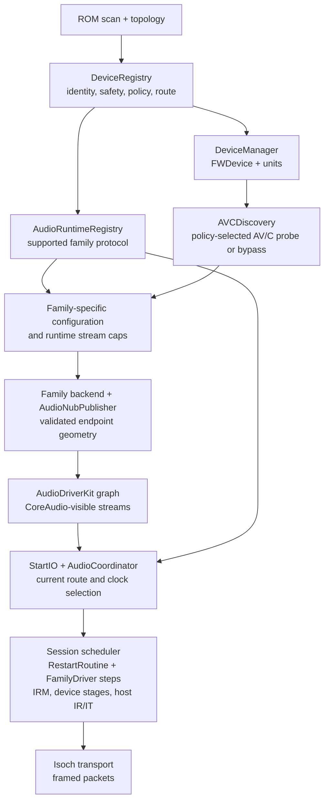

# Audio device path: discovery to isochronous traffic

This is a review map of `refactor/dice-profile` (2026-09-25): convergence
Epic 1, the audio-session redesign S0–S6 (`AUDIO_SESSION_REDESIGN.md`) and
convergence Epics 2–3. It follows the running path rather than listing classes
by name. "Device TX"
means device to host (capture); "host TX" means host to device (playback).
The static catalog decision, later wire geometry, CoreAudio graph, and live
isochronous channel are different facts and are deliberately named separately.

`AudioRuntimeRegistry` is an intentional **side path and shared owner**, not
another matching or probing stage. `DriverContext` constructs one instance
before the controller and `AudioCoordinator`, then passes that same instance
to both. During the ROM-scan callback, `ControllerCore` calls
`EnsureForDevice(record, bus ports, registry, IRM)` with the already resolved
policy. For a supported device, this constructs and initializes its concrete
`IDeviceProtocol` and stores a `shared_ptr` by GUID; a rescan reuses it and
refreshes its route. The same registry also holds `AudioEndpointRuntime`
objects, which carry each published endpoint's mutable configuration and
telemetry. `AudioCoordinator`, the family backends, the session scheduler,
and `ASFWAudioNub` later take shared ownership copies for control operations.
Every protocol that streams answers the session through one interface,
`FamilyDriver` (`IDeviceProtocol::AsFamilyDriver()`).
Removal drops both entries. `DeviceManager` separately owns the `FWDevice`
and immutable unit objects that drive observer notifications and AV/C
discovery. Keeping protocol construction outside `DeviceRegistry` lets
Discovery remain an identity/policy store while the controller supplies the
bus dependencies. The diagram joins the paths at configuration and start;
it does not mean every family executes AV/C discovery. Generic AV/C fallback
does not construct a family protocol in `EnsureForDevice`.
[DriverContext.cpp](../ASFWDriver/Service/DriverContext.cpp),
[ControllerCoreDiscovery.cpp](../ASFWDriver/Controller/ControllerCoreDiscovery.cpp),
[AudioRuntimeRegistry.cpp](../ASFWDriver/Audio/Core/AudioRuntimeRegistry.cpp),
[ASFWAudioNub.cpp](../ASFWDriver/Audio/DriverKit/ASFWAudioNub.cpp)

## 1. Identity, safety, and one static decision

1. `ControllerCore::OnDiscoveryScanComplete` uses the current Config ROM,
   topology, and speed policy. It rejects invalid node IDs, zero GUIDs, and
   duplicate GUIDs, then calls `DeviceRegistry::UpsertFromROM`. The route's
   selected async/isoch speed and its evidence are logged separately. The
   controller creates a family protocol through `AudioRuntimeRegistry` and
   publishes the `FWDevice`/unit objects through `DeviceManager` only after
   this step. [ControllerCoreDiscovery.cpp](../ASFWDriver/Controller/ControllerCoreDiscovery.cpp)
2. `DeviceRegistry::UpsertFromROM` enriches ROM identity and calls
   `AudioDeviceCatalog::Resolve(device)` **once for this appearance**. The
   resolver applies hazardous-identity rules first, matches unit-directory
   clauses, rejects ambiguous matches, and permits generic AV/C fallback only
   for the specified TA AV/C unit specifier/version pair. The result is a
   `StaticAudioEndpointPlan`: family, support level, probe policy, profile
   builder, protocol implementation, preparation cue, and matched unit. The
   registry attaches it as `ResolvedDevicePolicy` with a route token and
   assigns the AV/C command filter from the same decision. Quarantine and
   unsupported results do not become streaming protocols.
   [AudioDeviceResolver.cpp](../ASFWDriver/DeviceProfiles/Audio/AudioDeviceResolver.cpp),
   [DeviceRegistry.cpp](../ASFWDriver/Discovery/DeviceRegistry.cpp),
   [ResolvedDevicePolicy.hpp](../ASFWDriver/DeviceProfiles/Audio/ResolvedDevicePolicy.hpp)
3. Consumers use `CurrentAudioPolicy(record)` and verify the route is still
   current. A reset, removal, or replacement invalidates the old route rather
   than letting a stale plan authorize control traffic or a stream start.
   `AudioRuntimeRegistry::EnsureForDevice` only constructs a protocol for a
   current, supported plan; the factory dispatches by the catalog's concrete
   protocol implementation. Backend selection is also by the plan's family.
   [AudioRuntimeRegistry.cpp](../ASFWDriver/Audio/Core/AudioRuntimeRegistry.cpp),
   [FamilyProtocolConstruction.cpp](../ASFWDriver/Audio/Protocols/FamilyProtocolConstruction.cpp),
   [DeviceProtocolChoice.cpp](../ASFWDriver/Audio/Protocols/DeviceProtocolChoice.cpp)

**Important distinction:** "resolved once" applies to the static identity
and safety decision for an appearance. Runtime stream capabilities and clock
can be read or refreshed later. The latter is geometry measurement, not a
second catalog match.

## 2. What may probe the device

`AVCDiscovery` reads the current policy before creating an FCP producer, then
`SelectProbeBootstrap` chooses one of these paths. The per-device AV/C filter
also guards subsequent frames at submit time.
[AVCDiscovery.cpp](../ASFWDriver/Protocols/AVC/AVCDiscovery.cpp),
[SelectProbeBootstrap.hpp](../ASFWDriver/Audio/Protocols/SelectProbeBootstrap.hpp)

| Resolved family / policy | Discovery behavior | Geometry/config source |
| --- | --- | --- |
| Generic AV/C, OXFW | Generic AV/C initialize, then plug discovery | AV/C inventory plus selected audio profile |
| BeBoB plug-0 (for example PHASE 88) | Skip generic `UNIT_INFO`/`SUBUNIT_INFO`; probe the BridgeCo plug path | BeBoB inventory and profile |
| M-Audio 1814 / ProjectMix special firmware | Skip generic and BridgeCo information probes that can freeze this firmware | Fixed, catalog-selected 48 kHz formation; device control commands occur during start |
| Fireworks | Skip generic AV/C discovery; use EFC | Profile-owned publication, checked against EFC hardware information during start |
| DICE/TCAT | No generic AV/C probe | DICE section/register reads through the family protocol |
| MOTU register family | No generic AV/C probe | MOTU register protocol and runtime caps |
| Unsupported, hazardous, ambiguous | No automatic AV/C probe | No audio stream publication |

The 1814 bootloader is a preparation case, not an audio endpoint. Its resolved
plan authorizes a guarded firmware-start cue; `AVCDiscovery::PrepareMAudioBootloader`
reuses that plan and checks the live route before cueing. The device then
re-enumerates and receives a fresh catalog decision. The hardware run reported
for FW-163/FW-164 used bootloader GUID `0x000d6c04102df763` and operational
GUID `0x000d6c04002df763`. These are different registry identities, not a
same-GUID persona replacement. The log sequence supplied with that run was:
retire active session (#1100), resolve loader (#1340), cue exactly once
(#1360/#1362), resolve operational 1814 (#1581), and reach `StartStreaming`
and an immediate `StartIO` clock (#1942/#1943). This is hardware evidence for
the described path; the doc does not infer behavior for other firmware versions.
[AVCDiscovery.cpp](../ASFWDriver/Protocols/AVC/AVCDiscovery.cpp),
[DeviceManager.cpp](../ASFWDriver/Discovery/DeviceManager.cpp)

## 3. Geometry before publication

There are three related descriptions, each with a different owner:

| Description | Owner | Used for |
| --- | --- | --- |
| Static plan and stream traits | Audio device catalog | Which protocol/profile/backend may run; fixed formation and quirks; start/stop policy |
| `AudioStreamRuntimeCaps` | Family protocol after safe reads or prepare | Actual stream count, PCM channels, AM824 slots, MIDI slots, rate, supported-rate mask (DICE), and family-specific format facts |
| `DuplexStreamProfile` | `DuplexStreamProfileResolver` from current policy + caps + assigned channels | IRM charge, channel masks, receive decode geometry, wire format, and ordered device/host start |
| Nub geometry and `IAudioStreamProfile` | Backend publishes scalars/per-stream geometry; AudioDriverKit reads the selected profile | CoreAudio streams and TX packetizer framing. A DICE profile carries framing constants only; its geometry is the device's |
| `ResolvedTimingGeometry` | `ResolveProfileTimingGeometry` from the profile's declarations + the wire rate | ZTS period, active ring, IO budget, latency and safety declarations, transfer delay. Resolved once per rate; the graph, the rate change, `StartIO` and ZTS arming read that one value |

The session scheduler runs one linear `RestartRoutine` for every family. It
calls `LoadGeometry` and `Configure`, resolves the duplex profile from the
returned caps, reserves IRM bandwidth and a channel for every stream in both
directions, and hands the channels to the family (`AssignChannels`). CMP
families commit them to PCR; DICE writes them to the device, as Linux does, so
any free channel 0–31 works. The isoch speed used for packet headers and
bandwidth accounting comes from the same resolved link policy.
[RestartRoutine.cpp](../ASFWDriver/Audio/Session/RestartRoutine.cpp),
[FamilyDriver.hpp](../ASFWDriver/Audio/Protocols/Duplex/FamilyDriver.hpp),
[DuplexStreamProfile.hpp](../ASFWDriver/Audio/Protocols/Backends/DuplexStreamProfile.hpp)

DICE has the strongest publication check: `DiceAudioBackend::EnsureNubForGuid`
requires a runtime protocol and caps, resolves the device's register geometry,
refuses unusable results, and publishes the resolved per-stream geometry across
the nub. Every DICE model shares one `DiceProfile`, built from a small
`DiceProfileSpec` (name, TX encoding, two framing flags, optional measured
latency/safety). It states no channel or stream counts, as the TCAT kexts
carry none; the one exception is the Alesis MultiMix's single playback stream
(libffado). The published rates are the device's `CLOCK_CAPABILITIES`; rates
above 48 kHz are listed but refused when picked (high rates are parked). `ASFWAudioDevice::StartIO` then builds its
TX stream config from that resolved geometry plus profile framing constants,
and refuses missing required geometry or more playback streams than it can
allocate. That keeps IRM reservation and TX CIP width tied to the same device
answer. Other family paths use their own fixed/profile or probed formations.
[DiceAudioBackend.cpp](../ASFWDriver/Audio/Protocols/Backends/DiceAudioBackend.cpp),
[ResolvedStreamConfig.hpp](../ASFWDriver/Audio/DriverKit/Config/ResolvedStreamConfig.hpp),
[ASFWAudioDevice.cpp](../ASFWDriver/Audio/DriverKit/ASFWAudioDevice.cpp)

The published HAL channel count is the count of visible PCM channels; an AM824
data block can have additional MIDI/non-audio slots. For the validated 1814
48 kHz default formation, host TX is six PCM plus one MIDI slot (DBS 7,
232-byte packet with eight blocks), and device TX is ten PCM plus one MIDI
slot (DBS 11, 360-byte data packet). Its capture stream can also send an
8-byte CIP-only packet. The captured facts are pinned in
[test_1814_default_geometry.py](../tools/pydice/tests/test_1814_default_geometry.py)
and compared with `MAudioSpecialProfile` in
[AmdtpDirectTxTests.cpp](../tests/audio/AmdtpDirectTxTests.cpp).

## 4. Publication, HAL start, and wire start

1. The AV/C backend receives a ready audio configuration, stores it in its
   endpoint runtime, and calls `AudioNubPublisher::EnsureNub`. DICE and MOTU
   have their own `EnsureNubForGuid` paths. The publisher sets all nub
   properties before the nub starts; AudioDriverKit then builds the CoreAudio
   graph from that snapshot. A later property refresh cannot rebuild a live
   graph, so a changed geometry is refused until endpoint recreation.
   [AudioCoordinator.cpp](../ASFWDriver/Audio/Core/AudioCoordinator.cpp),
   [AudioNubPublisher.cpp](../ASFWDriver/Audio/Core/AudioNubPublisher.cpp),
   [ASFWAudioDriverGraph.cpp](../ASFWDriver/Audio/DriverKit/ASFWAudioDriverGraph.cpp)
2. CoreAudio's `StartIO` allocates/maps the shared audio and TX packet buffers,
   selects the profile's clock domain, builds TX stream config, prefills its
   ring, then calls the nub's `StartAudioStreaming`. The nub checks the current
   resolved policy, active route, endpoint/direct memory, and (for AV/C) a
   rebound FCP transport. It sends the request to `AudioCoordinator`, which
   admits only one active GUID in the present implementation.
   [ASFWAudioDevice.cpp](../ASFWDriver/Audio/DriverKit/ASFWAudioDevice.cpp),
   [ASFWAudioNub.cpp](../ASFWDriver/Audio/DriverKit/ASFWAudioNub.cpp),
   [AudioCoordinator.cpp](../ASFWDriver/Audio/Core/AudioCoordinator.cpp)
3. The session's `RestartRoutine` reserves IRM resources, prepares the host IR
   and IT contexts and their payload codec, then calls the family's device steps
   (`ArmDeviceRx`, `ArmDeviceTxAndEnable`, `Confirm`), and starts host contexts
   in the recipe's order. Overlapping requests coalesce into one restart;
   device events are debounced (a 400 ms quiet period for DICE); three failed
   recoveries in a row stop the streams until the next start. `MAudioSpecial` starts host transmit
   before receive; CMP receive-then-transmit and Apogee interleaving use their
   own recipes. The host transport attaches a receive consumer for each
   capture stream and hands fully framed packets to the payload-opaque isoch
   transport. RX decoding and TX CIP/AM824 framing remain in Audio.
   [RestartRoutine.cpp](../ASFWDriver/Audio/Session/RestartRoutine.cpp),
   [DuplexStreamProfile.hpp](../ASFWDriver/Audio/Protocols/Backends/DuplexStreamProfile.hpp),
   [IsochDuplexHostTransport.cpp](../ASFWDriver/Audio/Protocols/Backends/IsochDuplexHostTransport.cpp)
4. `StartIO` waits for the selected hardware zero timestamp before completing.
   On a failed start it stops any partially started backend and releases TX
   resources. Stop, reset, loss, and removal invalidate the route and quiesce
   host transport before endpoint teardown.
   [ASFWAudioDevice.cpp](../ASFWDriver/Audio/DriverKit/ASFWAudioDevice.cpp),
   [AudioCoordinator.cpp](../ASFWDriver/Audio/Core/AudioCoordinator.cpp)
5. A sample-rate change is an AudioDriverKit configuration-change transaction.
   `HandleChangeSampleRate` validates the rate (advertised, streamable, timing
   resolves) and requests a change window; the host stops IO and calls
   `PerformDeviceConfigurationChange`, where `CommitSampleRate` programs the
   device clock, then the ADK rate, ZTS period, stream formats and declarations.
   An idle rate change waits until the device runs at the new rate.
   [ASFWAudioDevice.cpp](../ASFWDriver/Audio/DriverKit/ASFWAudioDevice.cpp)
6. The CoreAudio clock is a projection of the device's one `HardwareSampleTimeline` (in the
   audio transport control block). StartIO begins its epoch: Receive for most devices,
   Transmit for M-Audio special firmware. RX packets, or M-Audio TX completions, are its
   observations, and every zero timestamp reaches the HAL through one function.
   [HARDWARE_TIMELINE_OWNERSHIP.md](HARDWARE_TIMELINE_OWNERSHIP.md)

## Review observations

These are review proposals, not claims that the hardware run exposed a fault:

1. **Make the geometry handoff easier to audit across families.** Static
   policy, runtime caps, duplex profile, nub properties, and ADK TX config are
   legitimate separate stages, but a reviewer must chase several copies of
   stream width. DICE now validates and transports its resolved per-stream
   answer explicitly. A compact per-direction provenance record (catalog
   seed, measured value, final value, and consumer) would make the same check
   straightforward for the AV/C and MOTU paths without merging their wire
   protocols. Keep HAL-visible PCM count separate from wire slots.
2. **Make geometry changes a named lifecycle transition.** The publisher
   correctly refuses a changed live graph, and `StartIO` checks missing or
   unsupported geometry. For DICE the transition now has a name:
   `DiceAudioBackend::RebuildEndpointForNewGeometry`, the counterpart of the
   TCAT kexts' `CreateStreams`. It is a documented no-op (the endpoint stays
   blocked); its TODO is the design, through an AudioDriverKit configuration
   change. It belongs to the convergence project's multi-rate milestone, and
   the refusal stays explicit until that sequence is tested.
3. **Pin the observed 1814 GUID transition.** The same-GUID replacement test
   covers one possible persona change. This hardware showed a different GUID
   after the cue, so a host test should assert old GUID retirement, new GUID
   resolution, exactly one cue on the loader route, and no accidental reuse of
   its policy or nub. That makes the FW-163/FW-164 evidence reproducible.
4. **Keep the static decision count distinct from geometry refresh count.**
   Repeated `DuplexStreamProfileResolver::Resolve` calls after preparation are
   expected because the caps can change; a second catalog match would be a
   regression. Logs and tests should use those two names consistently.
5. **Watch the registry's two lifetimes.** It owns both the protocol created
   at ROM discovery and the endpoint runtime created when audio configuration
   is published. One removal currently retires both, which is useful, but
   their creation triggers differ. If more lifecycle cases make that coupling
   hard to reason about, separate the two stores behind the same explicit
   removal owner; do not add a second identity resolver.

The current path is coherent at the policy boundary: identity and safety are
decided before probing, and live route checks fence consumers. The main review
pressure is on proving that each family's measured geometry reaches both
the host transport and HAL packet framing, especially for devices with
multiple streams or formats that change after publication.
