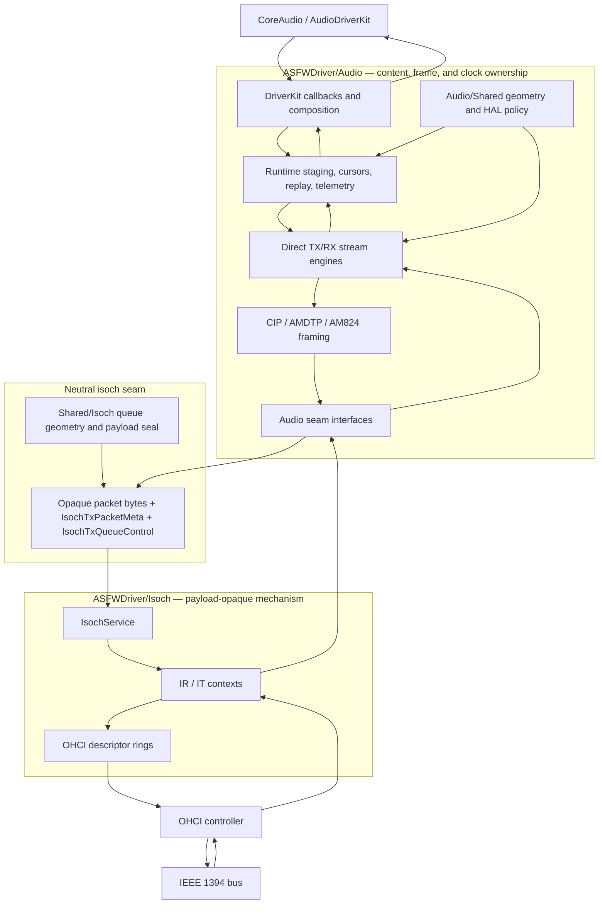
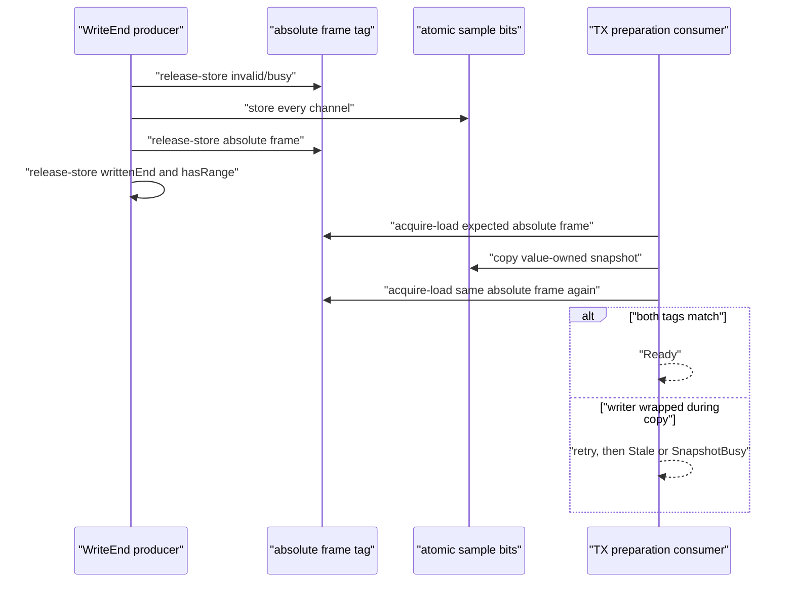
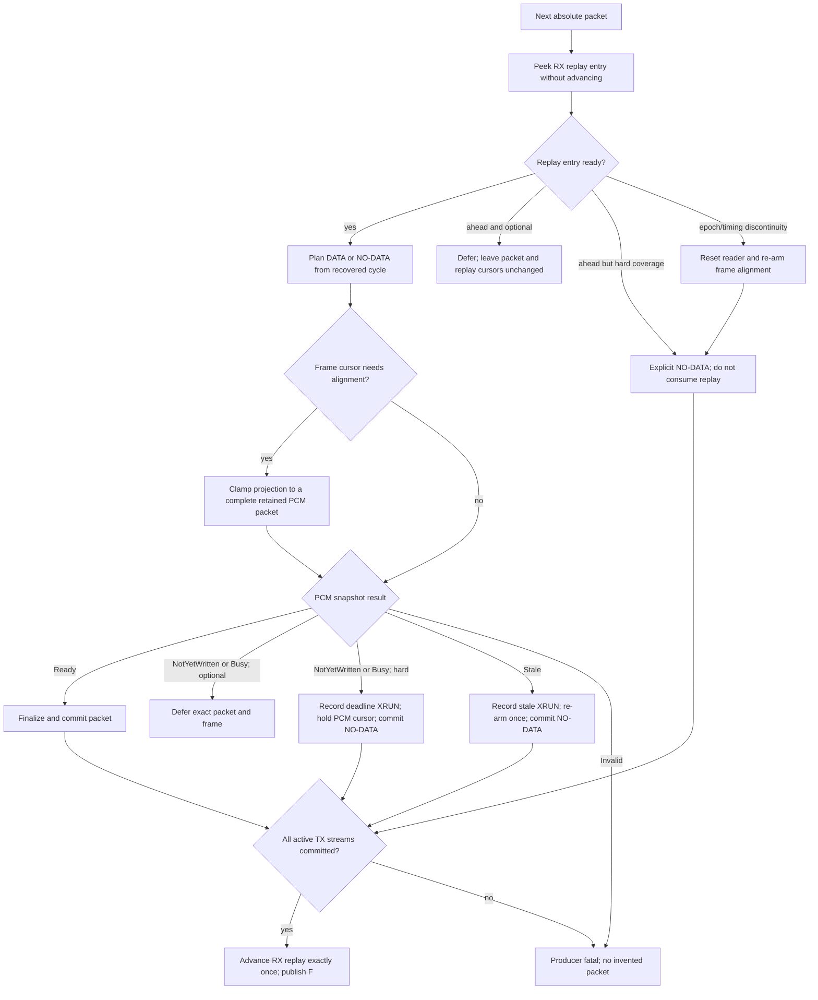
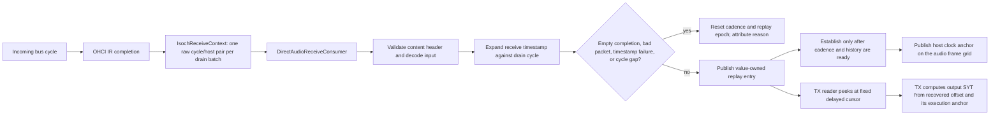

# Audio TX code-review guide

This is the manual review path for the DICE transmit regression work on branch
`DICE-fix`. It follows one output sample from the CoreAudio `WriteEnd` callback
to the OHCI transmit descriptor, and follows enough of RX to review the timing
authority used by TX.

Use this guide together with [`DICE_REGRESSION.md`](DICE_REGRESSION.md), which
contains the regression history, reference-stack findings, captured telemetry,
test evidence, and hardware-test record.

## Review objective

Prove these three properties end to end:

1. A TX DATA packet is never release-committed until every requested host frame
   has been copied into value-owned staging and encoded into the final packet.
2. After release commit, neither the producer nor transport mutates the packet
   payload until OHCI completes it and transport returns slot ownership.
3. RX-derived cadence and clock state is consumed exactly once for each fully
   committed output cycle; a discontinuity is explicit and cannot silently
   jump a frame or replay cursor.

The principal content invariant is:

```text
oldest staged frame <= finalized DATA frames <= F <= W <= staged written end

W = completed CoreAudio host-write frontier, in sample frames
F = end-exclusive frontier of host content finalized into TX DATA packets
```

`F` may stop while `W` advances. `F` must never advance past `W`. A hard
transport deadline may produce explicit NO-DATA, but it must not consume PCM,
advance DBC, or pretend that future host frames contain zeroes.

## Architectural boundary



The directory is the ownership boundary:

| Location | May own | Must not own |
|---|---|---|
| `Audio/Shared/` | Audio-only timing geometry, HAL buffer profiles, audio geometry policy | OHCI descriptors, MMIO, generic isoch lifecycle |
| `Audio/Config/` | Runtime/profile selection and audio configuration | Transport queue mechanics |
| `Audio/Runtime/` | Host-frame staging, replay, audio telemetry, binding snapshots | Hardware access or descriptor layout |
| `Audio/Wire/` | Content headers, cadence, DBC, SYT, sample encoding | OHCI rings or context registers |
| `Audio/Ports/` | Narrow audio-owned interfaces across audio sublayers and into the neutral seam | Concrete OHCI types beyond the neutral packet contract |
| `Shared/Isoch/` | Content-neutral queue geometry and opaque payload sealing | Audio frames, formats, clocks, device names, or recovery policy |
| `Isoch/` | DMA mappings, packet indices, channel stamping, descriptors, interrupts, start/stop | Audio headers, PCM, DBC/SYT, frame cursors, device-family policy |

The boundary is enforced by
[`tests/audio/TransmitBoundaryTests.cpp`](../tests/audio/TransmitBoundaryTests.cpp).
It recursively scans the C++ transport trees and also asserts that audio policy
headers cannot return to `Shared/Isoch`, `Isoch`, or the interim `Audio/Config`
location.

> [!IMPORTANT]
> Some older audio-only configuration types still carry the legacy C++
> namespace prefix `ASFW::Isoch::Audio` even though their files live under
> `ASFWDriver/Audio`. Treat that spelling as migration debt, not as permission
> for `Isoch/` to depend on those types. New audio contracts use `ASFW::Audio`.

## Cursor and unit glossary

Do not review a cursor until its unit and owner are written down. The same
numeric value is meaningless across these domains.

| Name or field | Unit | Writer | Reader | Meaning |
|---|---:|---|---|---|
| `sampleTime` at `WriteEnd` | absolute sample frames | CoreAudio | audio callback | First frame in the completed host span |
| `TxPcmStagingRing::writtenEndFrame_` | end-exclusive sample frames | `WriteEnd` staging producer | TX preparation | Durable staged frontier |
| `TxPcmStagingRing::oldestValidFrame_` | sample frames | staging producer | TX preparation/telemetry | First retained frame after wrap/discontinuity |
| `AmdtpTxPacketizer::nextAudioFrame_` | sample frames | packetizer | next packet plan | First PCM frame for the next DATA packet |
| `AmdtpPacketTimeline::FinalizedFrameEnd()` | end-exclusive sample frames | audio packetizer/timeline | coordinator | `F`, content encoded into finalized DATA packets |
| `IsochTxQueueControl::committedEnd` | end-exclusive absolute packets | audio slot provider | transport and producer | Last release-committed packet plus one |
| `IsochTxQueueControl::completionCursor` | end-exclusive absolute packets | transport | producer | Slots returned after OHCI completion and seal verification |
| `IsochTxPacketMeta::commitGeneration` | physical-ring lap generation | producer | transport | Release publication for one absolute packet |
| `RxSequenceReplayState::producerCursor_` | replay entries / bus cycles | RX audio consumer | TX replay reader | End of recovered RX cadence history |
| `RxSequenceReplayReader::nextCursor_` | replay entries / bus cycles | TX coordinator | replay state | Next RX timing entry to peek and later consume |
| `softwareFillAbsIdx_` | absolute packets | TX DMA ring | TX DMA ring | Next producer packet to map into a hardware slot |
| OHCI cycle timer | seconds/cycles/offset ticks | controller | RX/TX timing code | 8,000 cycles/s; 3,072 FireWire ticks/cycle |
| Host ticks | Mach absolute time | macOS/controller sampling | timing code | Host-clock domain; convert explicitly |

Three modulo operations coexist and must never be substituted for one another:

```text
producerSlot = absolutePacket % sharedPacketSlotCount
hardwareSlot = absolutePacket % OHCIHardwarePacketCount
frameSlot    = absoluteFrame  % stagingFrameCapacity
```

## End-to-end TX flow

```mermaid
sequenceDiagram
    participant CA as "CoreAudio"
    participant IO as "ASFWAudioDriverIO"
    participant Stage as "TxPcmStagingRing"
    participant Prep as "PrepareTransmitSlots"
    participant RX as "RX sequence replay"
    participant Engine as "DiceTxStreamEngine"
    participant Packetizer as "AmdtpTxPacketizer"
    participant Provider as "DextTxSlotProvider"
    participant Queue as "Neutral TX queue"
    participant Ring as "IsochTxDmaRing"
    participant HW as "OHCI"

    CA->>IO: "WriteEnd(sampleTime, frameCount)"
    IO->>Stage: "copy complete host span"
    Stage-->>IO: "Staged or explicit error"
    IO->>IO: "publish W only after staging"
    IO->>Prep: "coalesced preparation request"
    Prep->>RX: "TryPeek recovered cadence; do not advance"
    Prep->>Engine: "prepare packet with timing decision"
    Engine->>Stage: "snapshot exact frame range"
    Stage-->>Engine: "Ready / NotYetWritten / Stale / Busy / Invalid"
    Engine->>Provider: "acquire producer-owned physical slot"
    Engine->>Packetizer: "encode complete DATA or explicit NO-DATA"
    Packetizer-->>Engine: "final packet image and metadata"
    Engine->>Provider: "seal and release-commit"
    Provider->>Queue: "commitGeneration, then committedEnd"
    Prep->>RX: "Advance only after all active streams commit"
    Ring->>Queue: "acquire expected generation"
    Ring->>HW: "publish payload, barrier, publish descriptors"
    HW-->>Ring: "completion status"
    Ring->>Ring: "verify payload seal"
    Ring->>Queue: "release completionCursor"
```

## Manual review path

Review in this order. Each later stage relies on the publication contract of
the previous stage.

### 1. Configuration and composition

Start with:

- `ASFWDriver/Audio/DriverKit/ASFWAudioDevice.cpp`
- `ASFWDriver/Audio/DriverKit/ASFWAudioDriverDirect.cpp`
- `ASFWDriver/Audio/DriverKit/ASFWAudioDriverPrivate.hpp`
- `ASFWDriver/Audio/Core/AudioCoordinator.cpp`
- `ASFWDriver/Audio/Protocols/Backends/IsochDuplexHostTransport.cpp`
- `ASFWDriver/Isoch/IsochService.cpp`

Trace allocation and binding before reading the hot path:

1. The graph output channel count configures exactly one
   `TxPcmStagingRing`.
2. Master TX uses source offset zero. A secondary TX stream uses a non-overlap
   offset and must fit wholly inside the graph output channel count.
3. Each stream has a separate payload slab, metadata ring, neutral control
   block, slot provider, packetizer, and IT context.
4. Producer startup calls `ResetProducerForStart`; transport arm calls
   `ResetConsumerForArm`. Neither reset may erase the other side's state.
5. Audio callbacks for timing loss and clock-anchor readiness terminate in
   `IsochDuplexHostTransport`, which owns the audio receive consumer. They do
   not live in `IsochService`.
6. `IsochService` receives only finalized mappings, neutral callbacks, channel,
   source ID, and hardware access.

> [!CAUTION]
> Check `sourceChannelOffset + pcmChannels <= outputChannels` for every active
> stream. `TxPcmStagingRing` now rejects an out-of-range window; it no longer
> synthesizes zero samples. Any rejection is a configuration fault and must
> reach `[TxProducerFatal]`, not the wire.

### 2. CoreAudio `WriteEnd`: capture before publication

Review `InstallIOOperationHandler` and `PublishPlaybackRingWriteEnd` in
`ASFWDriver/Audio/DriverKit/ASFWAudioDriverIO.cpp`.

For `IOUserAudioIOOperationWriteEnd`, verify this exact order:

1. Validate the callback span against the mapped output ring capacity.
2. Call `txPcmStagingRing.Stage` using the completed host span.
3. On invalid/not-configured staging, return an error without publishing `W`.
4. On a duplicate or out-of-order callback, leave `W` unchanged.
5. Only after a complete stage, call `control->client.PublishWriteEnd`.
6. Publish the playback-ring range with a release-store to
   `playbackRingWriteFrame`.
7. Publish one coalesced TX preparation request.

Critical questions:

- Can another writer change a mapped host frame after `WriteEnd`? It may; TX no
  longer depends on that mapping because staging has already copied the value.
- Can `W` become visible before the last frame tag? It must not. The staging
  publication completes before `PublishWriteEnd`.
- Can a duplicate callback move `W` backward? It must not.
- Can failure schedule preparation for an un-staged range? It must not.

### 3. PCM staging concurrency

Review:

- `ASFWDriver/Audio/Runtime/TxPcmStagingRing.hpp`
- `ASFWDriver/Audio/Runtime/TxPcmStagingRing.cpp`
- `ASFWDriver/Audio/Ports/ITxPcmSource.hpp`

The producer protocol for each physical frame is:



Check the following:

- Samples are atomic bit patterns. A simultaneous wrap cannot create a C++ data
  race even if the tag validation rejects the snapshot.
- The absolute tag is invalidated before any sample changes and published only
  after every channel is present.
- The reader checks the tag both before and after copying a frame.
- After a failed tag check, the reader re-samples the retained range and
  distinguishes `NotYetWritten`, `StaleOverwritten`, and retryable
  `SnapshotBusy`.
- A discontinuity starts a new retained segment; gap frames are not invented.
- An overlapping callback copies only the unpublished suffix.
- Host channel geometry must equal configured staging geometry.
- A requested channel window must fit entirely; invalid geometry is explicit,
  never zero-filled.

Initialization may clear backing atomics, but invalid tags make those values
unreadable. Clearing unowned storage is not equivalent to publishing zero PCM.

### 4. RX-derived timing decision and preparation budget

Review `PrepareTransmitSlots` in
`ASFWDriver/Audio/DriverKit/ASFWAudioDriverZts.cpp`, then the geometry in
`ASFWDriver/Audio/Shared/AudioTimingGeometry.hpp`.

There are two separate limits:

- `requiredPacketIndex`: hard packet coverage needed so the transport cannot
  hole its hardware refill.
- `limitPacketIndex` and `targetFrameEnd`: optional catch-up work, bounded by
  available host content and recovered RX timing.



Check:

- `TryPeek` and `Advance` stay separated.
- Optional work never consumes guessed NO-DATA merely to fill a deep queue.
- An RX-ahead hard NO-DATA holds replay, PCM, and DBC because no replay entry
  was available to consume. A PCM-deadline NO-DATA consumes that recovered bus
  cycle, but holds the PCM frame and DBC so the exact range can retry.
- Initial and recovery projection must select a packet-aligned range wholly
  inside `[oldestRetainedFrame, writtenEndFrame)`. Never align to a producer
  frontier that contains only a prefix of the requested DATA block.
- `NotYetWritten` and `SnapshotBusy` are recoverable. At hard coverage they
  emit explicit NO-DATA but must not re-arm frame alignment.
- An overwritten frame cannot be recovered by waiting; the code records a
  stale XRUN, emits explicit NO-DATA, and re-arms one-time alignment.
- Re-alignment happens only after a real timing-domain loss or unrecoverable
  content gap. An ordinary ahead-of-producer condition must not jump the frame
  cursor.
- `txContentFinalizedFrameEnd` and `playbackRingReadFrame` update only after the
  packet decision has been committed for every active stream.
- Packets and sample frames are converted using blocking cadence; no direct
  comparison crosses units.

### 5. Immutable snapshot before slot ownership

Review `DiceTxStreamEngine::PrepareNextTransmitSlot` in
`ASFWDriver/Audio/Engine/Direct/Tx/DiceTxStreamEngine.cpp`.

The intended order is:

1. Preview the next content packet without advancing state.
2. If it is DATA, copy the exact PCM frame range into `pcmScratch_`.
3. Return an explicit source result on missing, future, stale, busy, or invalid
   PCM. No slot has been acquired yet.
4. Acquire the append-only producer slot.
5. Encode the packet from the immutable scratch snapshot.
6. Publish the completed slot.
7. Mark the packet published.

This read-before-acquire ordering prevents a release-committed placeholder from
being exposed while the producer waits for PCM.

> [!WARNING]
> Open manual-review target A: `AmdtpTxPacketizer::PrepareNextPacket` advances
> cadence, DBC, and the audio-frame cursor before
> `DextTxSlotProvider::PublishSlot` returns success. A publish failure is fatal,
> so the current path does not retry, but review every recovery/restart path to
> ensure the advanced packetizer state cannot survive and resume. A stronger
> future design would prepare state transactionally and commit it only after
> slot publication.

### 6. Packet construction

Review:

- `ASFWDriver/Audio/Wire/AMDTP/AmdtpTxPacketizer.cpp`
- `ASFWDriver/Audio/Wire/AMDTP/PcmSlotCodec.cpp`
- `ASFWDriver/Audio/Wire/AMDTP/AmdtpPacketTimeline.cpp`

For DATA:

1. Validate slot capacity and complete PCM snapshot geometry.
2. Construct the content header.
3. Fill non-PCM wire slots with the protocol's defined label/value, not an
   arbitrary zero page.
4. Encode each requested sample from the snapshot.
5. Set `pcmFinalized = true` only after encoding succeeds.
6. Mark the finalized frame range and then advance content state.

For NO-DATA:

- It is either a genuine zero-length packet or a header-only packet according
  to profile policy.
- It does not advance DBC or the PCM frame cursor.
- It carries no fake DATA payload.

Search every `memset`, zero initializer, default slot writer, and early return.
For each one, write down whether it initializes private/unpublished storage,
constructs a protocol-defined non-audio slot, or could reach a release commit.
Only the first two are acceptable.

### 7. Audio-side release commit

Review `DextTxSlotProvider` in
`ASFWDriver/Audio/DriverKit/ASFWAudioDriverPrivate.hpp`.

Acquire checks:

- `packetIndex == committedEnd` enforces append-only production.
- On later laps, `completionCursor` must have returned the physical slot.
- The slot address is `packetIndex % numSlots`; the absolute index is retained
  in metadata.

Publish order:

1. Reject DATA without `pcmFinalized`.
2. Store absolute packet index, byte count, and neutral immediate header.
3. Observe content telemetry while the slot is still producer-owned.
4. Compute the opaque payload seal.
5. Release-store the expected `commitGeneration` after all plain fields and
   packet bytes.
6. Release-store `committedEnd = packetIndex + 1`.

> [!CAUTION]
> `commitGeneration` is the per-slot publication boundary. Moving it earlier,
> weakening it to relaxed, or writing payload/metadata afterward reintroduces
> the exact mutable-committed-slot failure class. `committedEnd` does not make
> an incompletely published physical slot safe.

> [!WARNING]
> Open manual-review target B: on a multi-stream device, the master stream is
> release-committed before the secondary stream is prepared. A secondary
> failure is fatal and replay does not advance, but one master packet may
> already be visible to its IT context. Review stop latency and restart reset
> behavior. A stronger future design would prepare both packet images first and
> publish them as one coordinated decision.

### 8. Neutral shared queue

Review:

- `ASFWDriver/Isoch/Core/IsochTxQueue.hpp`
- `ASFWDriver/Shared/Isoch/IsochQueueGeometry.hpp`
- `ASFWDriver/Shared/Isoch/TxPayloadSeal.hpp`

```mermaid
stateDiagram-v2
    [*] --> ProducerOwned
    ProducerOwned --> Committed: "payload and metadata complete; generation release-store"
    Committed --> DmaOwned: "transport acquire-loads expected generation"
    DmaOwned --> Completed: "OHCI completion observed"
    Completed --> ProducerOwned: "seal verified; completion cursor release-store"
```

Check:

- ABI fields remain content-neutral.
- `ExpectedTxCommitGeneration` changes on every physical-ring lap.
- First-lap prefill is allowed before completion zero; later reuse is bounded by
  `completionCursor`.
- Producer and consumer reset methods have disjoint ownership.
- Raw host/cycle samples use a valid seqlock pattern.
- Any ABI layout change increments `kTxQueueAbiVersion` and preserves static
  layout assertions.

### 9. IT context and DMA ring

Review in order:

- `ASFWDriver/Isoch/Transmit/IsochTransmitContext.cpp`
  - `SetSharedMemoryDescriptors`
  - `Start`
  - `HandleInterrupt` / `Poll`
  - `DoRefillOnce`
  - `Stop`
- `ASFWDriver/Isoch/Transmit/IsochTxDmaRing.cpp`
  - `Prime`
  - `Refill`
  - `CommitRefill`
- `ASFWDriver/Isoch/Transmit/IsochTxLayout.hpp`
- `ASFWDriver/Isoch/Transmit/IsochTxDescriptorSlab.cpp`

The transport may:

- validate neutral queue geometry and ABI;
- acquire-load `commitGeneration` and read the now-published bytes/metadata;
- stamp the configured isochronous channel into the transport header;
- map up to two DMA fragments;
- publish payload, execute the DMA barrier, and publish descriptors;
- reconstruct raw completion stamps;
- verify the opaque payload seal before returning ownership;
- stop fatally on an uncommitted slot, invalid byte count, mapping failure,
  producer fault, dead context, or seal mismatch.

It may not parse the payload, choose DATA/NO-DATA, advance an audio frame, or
manufacture a packet on underrun.

Critical ordering in `Refill`:

1. Determine completed hardware packets.
2. Before advancing `completionCursor`, hash the still-owned producer slot and
   compare it with the release-commit seal.
3. Publish completion stamps.
4. Release-store `completionCursor`, returning those slots.
5. For replacement packets, acquire-load the expected commit generation.
6. Read metadata and map the opaque payload.
7. Publish payload to the device, issue the barrier, publish descriptors.
8. Make the descriptor chain runnable.

The seal is diagnostic, not preventive: a post-commit writer may already have
changed bytes sent by OHCI. Its purpose is to convert unexplained silence into
a named fatal contract violation at the first completion.

### 10. RX as TX timing authority

Review:

- `ASFWDriver/Isoch/Receive/IsochReceiveContext.cpp`
- `ASFWDriver/Isoch/Receive/IsochRxDmaRing.hpp`
- `ASFWDriver/Audio/Engine/Direct/Rx/DirectAudioReceiveConsumer.cpp`
- `ASFWDriver/Audio/Engine/Direct/Rx/RxAudioPacketProcessor.cpp`
- `ASFWDriver/Audio/Wire/AMDTP/RxSequenceReplay.hpp`
- `ASFWDriver/Audio/Runtime/HostClockAnchor.hpp`
- `ASFWDriver/Audio/Runtime/ZtsTelemetry.hpp`



Transport responsibilities stop at delivery of an opaque packet plus a batch
timestamp. Audio responsibilities begin with content parsing.

Check:

- `BeginReceiveBatch` copies a value-owned binding snapshot. No transport
  object retains a raw pointer into an audio-owned mapping.
- Empty completed descriptors reach the audio consumer and reset replay; they
  are not silently dropped.
- Invalid content status, invalid receive timestamp, physical cycle gap,
  rejected cadence, and rejected clock anchor each have a named reset reason.
- Replay publication stores all fields before the release sequence and producer
  cursor. The reader checks sequence and epoch before and after copying.
- Replay establishes only after at least the configured half-ring history.
- `TryPeek` does not advance. TX calls `Advance` only after all output streams
  have committed the corresponding cycle.
- A replay epoch change invalidates an active reader and forces an explicit
  re-begin.
- RX transfer delay is removed into a delay-free offset; TX applies its own
  transfer delay when producing the outgoing timestamp.

### 11. Teardown and cross-service lifetime

Review:

- `ASFWDriver/Audio/Core/AudioCoordinator.cpp` (`BeginTeardown`, destructor)
- `ASFWDriver/Audio/Protocols/Backends/IsochDuplexHostTransport.cpp`
- `ASFWDriver/Isoch/Receive/IsochReceiveContext.cpp` (`Stop`)
- `ASFWDriver/Isoch/Transmit/IsochTransmitContext.cpp` (`Stop`)
- `ASFWDriver/Audio/DriverKit/ASFWAudioNub.cpp`

```mermaid
sequenceDiagram
    participant Audio as "AudioCoordinator / audio service"
    participant Adapter as "IsochDuplexHostTransport"
    participant Context as "IR or IT context"
    participant OHCI as "OHCI"
    participant Mapping as "Audio-owned mappings and views"

    Audio->>Audio: "clear timing, preparation, and anchor callbacks"
    Audio->>Adapter: "StopAll"
    Adapter->>Context: "Stop"
    Context->>Context: "exclude Poll/refill"
    Context->>OHCI: "mask interrupt; clear RUN; flush"
    loop "bounded escalating delay"
        Context->>OHCI: "poll ACTIVE"
    end
    alt "ACTIVE cleared or provider gone"
        Context-->>Adapter: "quiesced"
        Adapter->>Mapping: "detach consumers and release views"
        Adapter-->>Audio: "success"
    else "ACTIVE still set"
        Context-->>Adapter: "timeout/dead; retain bindings"
        Adapter-->>Audio: "failure; do not free mappings"
    end
```

The non-negotiable rule is: stop hardware DMA first, observe `ACTIVE` clear,
then detach the external consumer and release its views. On a timeout, retain
the binding. Provider revocation is separately accepted as proof that no late
DMA can occur. No code may issue MMIO after hardware detach.

### 12. Instrumentation and first-fault evidence

Review:

- `ASFWDriver/Audio/DriverKit/Runtime/AudioTransportControlBlock.hpp`
- `ASFWDriver/Audio/Runtime/AudioTelemetrySnapshot.hpp`
- `ASFW/DriverConnector+AudioTelemetry.swift`
- `ASFW/MCP/ASFWMCPAudioStreamTools.swift`
- `ASFW/MCP/ASFWMCPToolDispatch.swift`
- `ASFWTests/MCP/MCPAudioStreamToolsTests.swift`

The two read-only MCP tools relevant to this investigation are:

- `asfw_get_audio_cursors`: value-owned staging, finalized-content, transport
  cursors, counters, and first-fault attribution;
- `asfw_get_audio_stream_health`: RX bring-up and packet-attribution health.

Important cursor fields include:

- `bindingReady`; a registered endpoint with incomplete telemetry memory must
  remain visible and return `bindingNotReady`, not disappear from the array;
- staged oldest and written-end frames;
- finalized frame end;
- transport `completionCursor`, `committedEnd`, and status;
- staging ready/future/stale/busy/invalid read counts;
- content deferrals, deadline NO-DATA, stale XRUNs, and rebases;
- first content-fault reason with packet, frame, staged range, and transport
  cursor snapshot;
- RX empty-completion and replay-reset attribution.

Hot-path logging must remain anomaly-only. The coarse `[TxPrep]` line is the
liveness/margin heartbeat. The following tags are first-fault evidence:

| Tag | Localizes |
|---|---|
| `[TxContent]` | PCM future/stale/deadline decision and staged range |
| `[TxProducerFatal]` | producer stage, reason, packet, and queue/replay cursors |
| `[TxOwnership]` | append/reuse ownership rejection |
| `[TxWire]` | audio-side final-payload information/dropout observation |
| `[TxPayloadSeal]` | payload mutation after release commit |
| `[TxReplay]` / `[TxReplayRearm]` | RX replay availability and epoch recovery |
| `[TxAlign]` | initial or recovery frame-cursor projection |
| `[RxReplayReset]` | exact RX discontinuity that invalidated TX timing |
| `IT FATAL dump` | neutral queue coverage/generation failure |

For a hardware run, capture these without logging every 8 kHz packet:

```bash
log stream --style compact --info --debug \
  --predicate 'eventMessage CONTAINS "[TxPrep]" OR eventMessage CONTAINS "[TxContent]" OR eventMessage CONTAINS "[TxProducerFatal]" OR eventMessage CONTAINS "[TxOwnership]" OR eventMessage CONTAINS "[TxWire]" OR eventMessage CONTAINS "[TxPayloadSeal]" OR eventMessage CONTAINS "[TxReplay" OR eventMessage CONTAINS "[TxAlign]" OR eventMessage CONTAINS "[RxReplayReset]" OR eventMessage CONTAINS "IT FATAL"' \
  > ~/Desktop/asfw-dice-tx.log
```

Run that command in a normal Terminal; the agent shell cannot read the unified
log reliably.

## Critical review traps

Use this as the final adversarial pass.

| Priority | Reject the change if… | Failure signature |
|---:|---|---|
| P0 | `W` is published before the complete host span is staged | future/default PCM can appear ready |
| P0 | missing PCM or channel geometry becomes zero DATA | valid content header with silent payload |
| P0 | DATA can be committed with `pcmFinalized == false` | partially initialized packet reaches OHCI |
| P0 | payload or metadata changes after `commitGeneration` | `[TxPayloadSeal]` or unexplained content corruption |
| P0 | consumer reads plain metadata before acquire-loading the expected generation | mixed packet laps / torn metadata |
| P0 | `completionCursor` advances before seal verification and completion processing | producer reuses DMA-owned slot |
| P0 | teardown releases a view while `ACTIVE` is set | cross-service UAF or late-DMA fault |
| P1 | replay advances before every active output stream commits | RX/TX cadence drift |
| P1 | master and secondary failure leaves resumable asymmetric state | one stream advances a packet alone |
| P1 | packetizer failure leaves state advanced and later reused | skipped DBC/frame/cadence position |
| P1 | absolute index, shared slot, and hardware slot are conflated | first- or later-lap wrap failure |
| P1 | empty RX completions or physical cycle gaps do not reset replay | TX continues from invalid recovered timing |
| P1 | timing recovery re-aligns on a merely temporary ahead-of-producer state | permanent host-frame jump |
| P1 | future/busy PCM at a hard deadline re-arms frame alignment | `TxAlign -> partial PCM -> NO-DATA` feedback loop and severe distortion |
| P1 | initial/recovery alignment names a range extending beyond `writtenEndFrame` | first DATA decision is guaranteed to miss |
| P1 | audio policy enters `Isoch/` or OHCI mechanics enter `Audio/` | boundary becomes untestable and non-reusable |
| P2 | frame and packet budgets are compared without cadence conversion | rate-dependent undercoverage |
| P2 | hot-path diagnostics log on success | scheduling perturbation hides the Heisenbug |

## Tests and what they prove

| Test area | Main proof | Deliberate limit |
|---|---|---|
| `TxPcmStagingRingTests` | Retention beyond HAL wrap; explicit future/stale/busy classification; whole concurrent snapshots; stable retained prefix; discontinuity and overlap behavior; invalid channel geometry cannot synthesize silence | Host atomics only; not DriverKit mapping or hardware cache coherency |
| `AmdtpDirectTxTests` | Complete PCM required; missing/future/stale PCM cannot release-commit; retry preserves exact frame; post-commit host writes cannot mutate the packet image; hard future/busy NO-DATA holds DBC/PCM; only stale recovery rebases; alignment selects a fully retained packet | Single-process model; does not prove multi-stream atomic publication |
| `IsochTxDmaRingTests` | Descriptor layout/mapping, absolute wrap generations, append ownership, completion stamps, fatal underrun without invented state, producer-fault handling, and post-commit payload mutation detection | Fake DMA/MMIO; cannot prove a real controller's writeback timing |
| `TxRefillCoverageTests` | Current geometry covers captured completion coalescing/stall cases and identifies the old under-sized lead | Mathematical scheduler model, not a macOS dispatch guarantee |
| `RxDrivenTimingTests` | RX cadence, replay delay, epoch invalidation, re-begin after overwrite, transfer-delay round trip, and geometry relationships | Pure timing/replay model; does not validate a device's real timestamps |
| `IsochReceiveContextTests` | Opaque batch delivery; RUN-clear/flush/ACTIVE-clear teardown ordering; binding retained on timeout | Mock hardware, not surprise removal on a real bus |
| `TransmitBoundaryTests` | Known content semantics cannot enter transport source; moved audio headers stay in their owned directories | Token/dependency guard, not a full semantic architecture proof |
| `AudioTransportControlBlockTests` | Value-owned telemetry snapshots, nested reset, coalesced preparation requests, audio-owned first-fault state | Snapshot correctness only, not hot-path timing |
| `MCPAudioStreamToolsTests` | Cursor/health fields survive Swift decoding and read-only MCP dispatch; an incomplete binding is named instead of looking like an absent endpoint | Mock endpoint, not a live user-client round trip |

No unit test can prove:

- actual OHCI descriptor fetch and completion ordering;
- macOS DriverKit scheduling latency over hours;
- cache coherency across the real shared mappings;
- device acceptance of every DATA/NO-DATA/SYT transition;
- teardown behavior during a physical unplug or controller reset;
- absence of every rare interleaving in the deployed queues.

That is why the unit suite is the precondition for, not a substitute for, the
hardware soak.

## Suggested local review commands

Focused tests while reviewing this path:

```bash
cmake -S tests -B build/tests_build
cmake --build build/tests_build -- -j$(sysctl -n hw.ncpu)
ctest --test-dir build/tests_build -V \
  -R 'TxPcmStagingRingTests|AmdtpDirectTxTests|IsochTxDmaRingTest|TxRefillCoverage|RxDrivenTimingTests|IsochReceiveContextTest|TransmitBoundaryTests|AudioTransportControlBlockTests'
```

Full pre-hardware gate:

```bash
./build.sh --test-only
./build.sh --swift-test-only
./build.sh --no-bump
cd tools/asfw_sim && uv run pytest -q
```

Useful boundary searches:

```bash
rg -n '\b(AM824|CIP|PCM|SYT|ZTS|DICE|ADK|CoreAudio|AudioDriverKit)\b|ASFW::Audio|/Audio/' \
  ASFWDriver/Isoch ASFWDriver/Shared/Isoch --glob '*.{hpp,cpp}'

rg -n 'OHCI|OHCIDescriptor|ContextControl|TryBeginAccess|Register32' \
  ASFWDriver/Audio --glob '*.{hpp,cpp}'
```

The second search produces legitimate adapter includes today; inspect each hit
for actual mechanical behavior rather than treating every token as a failure.

## Hardware validation handoff

Do hardware testing only after the review and full gate are clean.

### Before playback

- Record the exact commit and build configuration.
- Confirm `ASFWDriver` is built for the required architecture and the dext is
  loaded.
- Start the bounded log capture above.
- Query `asfw_get_audio_stream_health` and `asfw_get_audio_cursors` once before
  StartIO to establish the reset baseline.

### During playback

- Exercise start/stop, nominal playback, aggregate-device behavior if relevant,
  and at least one long soak.
- Periodically query both MCP tools. Do not poll at hot-path frequency.
- Preserve the first anomalous cursor snapshot; later recovery can overwrite
  the most useful relationship.
- If silence occurs, do not immediately restart. Capture MCP cursor/health state
  and the last log interval first.

### Healthy-run expectations

- the active endpoint is present and reports `bindingReady=true`;
- `stagedWrittenEndFrame >= finalizedFrameEnd` at every snapshot.
- `finalizedFrameEnd` advances when host writes advance and DATA cadence is
  available.
- `committedEnd >= completionCursor`; the difference stays inside queue
  capacity and above the hardware safety floor during steady state.
- `readsInvalid`, stale XRUNs, deadline NO-DATA, producer faults, payload-seal
  faults, and RX reset counters remain zero after normal establishment.
- One initial `[TxAlign]` is expected. Repeated `[TxAlign]` lines require a
  corresponding named recovery reason.
- `[TxPrep]` continues as the liveness heartbeat.
- No `IT FATAL`, `[TxProducerFatal]`, or `[TxPayloadSeal]` appears.

### First-fault triage

| Observation | Inspect next |
|---|---|
| staging invalid-read count increments | channel count/offset and stream profile geometry |
| staging future-read count grows only in optional region | wake timing; likely normal deferral if no deadline count |
| deadline NO-DATA increments | `W`, `F`, required packet, preparation latency, queue margin |
| stale-read/XRUN increments | staging retention, frame rebase, delayed preparation, frame cursor |
| `[TxWire]` dropout with ready staging snapshots | packetizer/codec/final payload construction |
| `[TxPayloadSeal]` | any writer after release commit; slot ownership and teardown |
| `IT FATAL dump` with stale generation | producer coverage, commit order, ring-lap math |
| `[RxReplayReset]` precedes TX silence | RX packet/timestamp/cadence path and recovery alignment |
| no IT interrupts, watchdog kicks | interrupt mask/event dispatch and context control |
| master/secondary counters diverge | open multi-stream publication target B |

## Review sign-off template

```text
Commit reviewed:
Device/profile/rate/channel geometry:

[ ] Audio/transport directory boundary is clean.
[ ] W is published only after durable staging.
[ ] Staging has paired per-frame publication and no zero synthesis.
[ ] F never advances beyond W.
[ ] Missing/future/stale PCM has an explicit non-DATA/fatal outcome.
[ ] Replay is peeked and advances only after all active streams commit.
[ ] DATA is completely encoded before release commit.
[ ] commitGeneration is the final per-slot release publication.
[ ] completionCursor advances only after completion and seal verification.
[ ] Absolute, producer-slot, and hardware-slot indices remain distinct.
[ ] DMA payload/barrier/descriptor publication order is preserved.
[ ] RX discontinuities reset replay with named attribution.
[ ] Stop observes ACTIVE clear before bindings are released.
[ ] Open target A (packetizer state vs publish failure) is accepted or fixed.
[ ] Open target B (master/secondary atomicity) is accepted or fixed.
[ ] Focused C++ tests pass.
[ ] Full C++ and Swift tests pass.
[ ] Production Xcode build passes.
[ ] Hardware log and MCP capture plan is ready.

Reviewer notes / unresolved risks:
Hardware result and log path:
```
