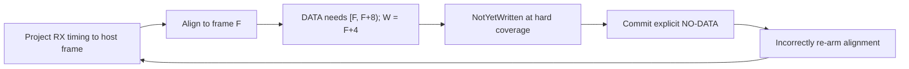
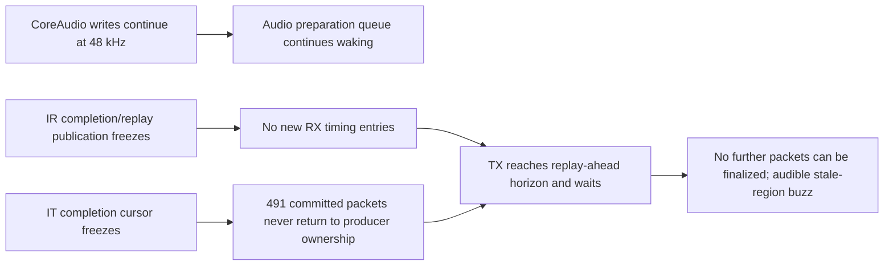

# DICE stream regression investigation

- Last updated: 2026-08-10
- Status: the audio ownership/cursor regressions are corrected on `DICE-fix`; a long-run hardware test then remained clean for about 2 h 10 min before exposing a separate, joint isoch progress stall. The retained MCP chronology is decisive. Payload-agnostic progress detection, bounded recovery, honest fatal stop, and first-fault/heartbeat instrumentation are now implemented and hardware-free verified; the next endurance capture must distinguish controller progress failure from dispatch/watchdog failure
- Working branch: `DICE-fix`, based on `ba0b4d1127e018953f7b2b641dc5b7076cc6bafe`
- Known-good comparison point: `9f2cb62d15382add519e02391c7781178aea281f`
  ([PR #69](https://github.com/mrmidi/ASFireWire/pull/69), 2026-07-15)

## Resolution implemented on `DICE-fix`

The regression was an ownership bug at the audio/transport seam, not evidence
that `IsochTransmitContext` cleared the audio ring. The old audio producer
release-committed a complete-looking AMDTP DATA packet while its PCM region was
still the packetizer's zero default. A different CoreAudio callback then tried
to patch those already-committed bytes. Both losing schedules were legal:

```text
packet commit -> OHCI consumes zeros -> late PCM write
host WriteEnd -> no packet mapping yet -> host PCM is forgotten -> later zeros
```

`commitGeneration` therefore promised more than audio had actually finished.
Cursor atomics could make the observation coherent, but could not make two
producers own the same payload bytes safely.

The repaired ownership chain is now:

```text
CoreAudio WriteEnd
    -> copy completed float32 frames into an audio-owned retention ring
    -> release-publish W only after the copy
TX preparation queue
    -> snapshot the exact DATA frame range
    -> build CIP + AM824 + PCM completely in a writable transport slot
    -> inspect and seal the final opaque bytes
    -> release-commit once; never mutate that generation again
Isoch transport
    -> acquire committed opaque bytes
    -> DMA them without audio knowledge
    -> verify the seal before returning slot ownership at completion
```

The implementation includes:

- `TxPcmStagingRing`: 16,384 retained frames, copied from the mapped HAL ring
  during WriteEnd. Atomic sample words plus per-physical-frame absolute tags
  make wrap races valid C++ and let two DICE TX streams read retained prefixes
  while unrelated frames are appended.
- `ITxPcmSource`: a read-only audio seam that returns caller-owned snapshots;
  neither transport nor the packetizer receives a pointer into the HAL ring.
- strict channel geometry: staging rejects a host-channel mismatch or an
  out-of-range stream window. Missing TX channels can no longer be synthesized
  as zero PCM inside an otherwise valid DATA packet.
- fill-before-commit AMDTP packetization. DATA is rejected unless all required
  PCM is present; no-data advances packet time but not DBC or the PCM cursor.
- append-only queue ownership. A producer may fill the quiesced startup lap,
  then can reuse a slot only after `completionCursor` returns it.
- explicit late/stale policy. Optional work defers. At a hard transport
  deadline, future/busy PCM emits one real no-data packet and holds its frame
  cursor for an exact retry. Only an overwritten range re-arms projection.
- complete-range alignment. Initial/recovery projection is clamped to a
  packet-aligned span wholly retained by the audio staging ring; it cannot name
  a block for which only a prefix has been written.
- replay peek/commit semantics. RX replay advances only after the corresponding
  output packet commits; optional preparation that reaches
  `kAheadOfProducer` waits instead of manufacturing a deep speculative no-data
  run.
- empty completed RX descriptors are no longer discarded. The master stream
  increments `rxEmptyCompletions`, records the descriptor as one outcome, and
  resets recovered replay timing exactly once.
- teardown drains the TX preparation queue after disabling new work and before
  releasing either staging or shared TX mappings.
- neutral FNV payload seals in queue ABI v6. `[TxPayloadSeal]` names any byte
  mutation between release commit and completion, including packet, slot,
  length, expected hash, and observed hash.
- `asfw_get_audio_cursors`: a read-only, value-owned MCP view with separate
  frame and packet units, staging/finalization/transport cursors, recovery
  counters, and a latched first-fault tuple. No live buffer pointer crosses MCP.
- the boundary correction: audio-wide geometry and HAL policy now live in
  `ASFWDriver/Audio/Shared`, ZTS telemetry lives in `Audio/Runtime`, and
  `Isoch` retains only payload-opaque queue, DMA, lifecycle, and raw timing
  contracts. `TransmitBoundaryTests` scans the transport sources to keep it so.

This removes the absorbing `W > E` design: there is no writable exposure state
anymore. The relevant frame invariant is `F <= W`, where `F` means immutable
PCM already encoded into committed DATA. A short `W-F` interval is normal
pending work; stale/deadline counters state whether it became an XRUN.

Host tests prove the ownership and recovery rules, but cannot prove OHCI cache
coherency, real DriverKit queue latency, device-specific DICE acceptance, or
audible stability. Those are the purpose of the hardware plan at the end of
this report.

## First `DICE-fix` hardware run: cursor feedback regression

The first dirty-stream run on 2026-08-10 was heavily distorted. Targeted,
read-only MCP log-ring inspection isolated a new regression introduced by the
hard-deadline recovery policy; it did not implicate opaque transport bytes or
post-commit mutation.

Observed facts:

- the log ring was healthy (`droppedRecords=0`) but `DirectAudio` accounted for
  420,155 of 422,191 records in the first snapshot;
- a later 200-record targeted sample contained 200 `[TxAlign]` records. Frame
  alignment advanced in eight-frame steps every few microseconds instead of
  occurring once at establishment;
- repeated `[TxContent]` faults said
  `action=deadline-xrun-rebase-nodata` and
  `reason=not-yet-written-at-deadline`;
- the captured geometry was exact and stable. For example, packet 1,035,647
  requested frame 6,213,896 with staging retained at
  `[6,197,516, 6,213,900)`: DATA required eight frames, but only four frames
  beginning at the aligned cursor had been published;
- `[TxPrep]` remained alive (margin 138 packets, no producer fatal), and there
  were no `[RxReplayReset]`, `[TxReplayRearm]`, `[TxProducerFatal]`, or
  `[TxPayloadSeal]` records in the targeted scans.

The failed state machine was therefore:



This loop emitted header-only NO-DATA at DATA opportunities and repeatedly
abandoned/reselected host content. That directly explains the severe audible
distortion. It is not a C++ data race: every observed read was coherent, but
the recovery policy transformed a four-frame producer shortfall into an
absorbing control loop.

The correction has two independent guards:

1. `SelectCompletePcmPacket` clamps initial/recovery alignment to an eight-frame
   block wholly inside the retained staging interval. In the captured example
   it selects frame 6,213,888, whose complete range ends at 6,213,896, instead
   of the partial block beginning at 6,213,896.
2. A recoverable `NotYetWritten` or `SnapshotBusy` result at hard coverage
   commits explicit NO-DATA but leaves frame alignment and `nextAudioFrame`
   unchanged. The next DATA opportunity retries the exact PCM range. Only
   `StaleOverwritten` may increment `txContentRebases` and re-arm.

New host proofs:

- `HardFutureShortageHoldsCursorUntilMissingSuffixIsPublished` reproduces the
  exact four-of-eight range, commits required NO-DATA, verifies DBC/PCM do not
  move, publishes the missing suffix, and then commits DATA from the original
  frame;
- `ContentShortagePolicyRebasesOnlyStalePcm` exhaustively checks the
  optional/hard future, busy, and stale decisions;
- `AlignmentSelectsACompleteRetainedPacket` checks the captured numeric tuple
  and rejects intervals without one complete packet.

The focused 18-test `AmdtpDirectTxTests` suite passes, and
`./build.sh --no-bump` compiles the real DriverKit target. The replacement dext
has not been installed while the dirty stream remains available as evidence.

Instrumentation gap observed in the deployed build:
`asfw_get_audio_cursors` and `asfw_get_audio_stream_health` both returned
`ok=true` with `endpointCount=0` even though the live driver was producing audio
logs. The replacement projection no longer silently drops a registered endpoint
when its local telemetry mapping is incomplete. It returns that endpoint with
`bindingReady=false` and the MCP verdict `bindingNotReady`; therefore a future
zero endpoint count has a narrower meaning (no registered endpoint or a failed
user-client/wire decode), while an incomplete binding is directly visible.

## Long-run hardware run: joint isoch progress stall

The next hardware run sounded clean and stable for approximately 2 h 10 min,
then changed to a repeating/stalled-region buzz. Read-only MCP ring inspection
captured a permanent transport-progress freeze rather than another PCM-content
failure.

The evidence is authoritative for the retained chronology:

- the ring had `capacityRecords=39718`, `oldestSequence=1`, and
  `droppedRecords=0`; the start, transition, and post-fault state were all
  retained;
- the stream began near host timestamp `260117.140 s`; the permanent freeze
  began at `267945.524 s`, about 7,828.38 seconds later
  (`2 h 10 min 28.38 s`);
- TX completion stopped permanently at packet `62626080`;
- the audio producer's immutable transport end stopped at packet `62626571`,
  leaving a constant 491-packet committed margin;
- RX timing replay stopped at producer/cursor `62626178` while TX next requested
  packet `62626571`, an ahead distance of 393 packets;
- CoreAudio continued publishing output. `TxPrepFrame.target` and
  `outputWrittenEndFrame` continued advancing by approximately 48,000 frames
  per second, while `finalizedFrameEnd` remained fixed at `375758696`;
- the exact frozen packet tuple remained unchanged for at least another
  12 minutes, through timestamp `268722.309 s`:

```text
[TxPrepRange] short=0 frame=1
  ret=62626080 base=62626571 until=62626571
  cov=62626224 lim=62626758 n=0 margin=491
```

The first frozen interval is especially useful:

```text
#3543 [TxReplay] fail=ahead pkt=62626571 cur=62626178 prod=62626178
#3545 [TxPrepRange] ret=62626080 base=62626553 until=62626571
                     cov=62626224 lim=62626758 n=18 margin=491
#3547 [TxPrepFrame] target=375758720 before=375758592
                    after=375758696 deficit=24 write=375758720 replay=1
```

The producer successfully committed its last 18 packets, then correctly stopped
when it reached the end of real RX replay timing. It did not zero, mutate, or
invent further DATA. The audio layer therefore exposed the lower-layer outage
without causing it.

No locally logged event explains or accompanies the transition:

- no bus reset and no later DICE clock/status transition;
- no `[RxReplayReset]`, `[TxPhase]`, `[TxProducerFatal]`,
  `[TxPayloadSeal]`, or exposure fault;
- only seven scattered TX content-deadline NO-DATA events existed in the whole
  run, with the last one about 6,705 seconds before this freeze;
- no `cycle` warning in `Hardware`, `Controller`, or `Isoch` after stream
  establishment;
- no `IT: refill watchdog engaged`, `IT FATAL`, or explicit context stop.

The observed state transition is:



### What this proves and what it does not

This proves a shared isoch progress failure below the audio packetizer. Both
the receive-derived timing frontier and transmit completion frontier stopped,
while the separate AudioDriverKit producer continued normally. It rules out the
former zero-PCM ownership bug as the proximate cause.

It does **not** yet prove which lower-level mechanism failed. The deployed
instrumentation did not latch the first frozen IT/IR CommandPtr, context
`RUN/ACTIVE/DEAD` bits, per-context event bits, global interrupt event, watchdog
tick, or interrupt count. Two important sub-causes therefore remain open:

1. OHCI/context completion stopped progressing while interrupts or stale events
   continued, creating false liveness.
2. The shared driver work queue, interrupt dispatch, or one-shot watchdog timer
   stopped servicing both IR completion work and transport maintenance.

The repeating buzz is consistent with stale DMA/device-buffer replay, but that
audible symptom is not a register-level proof of which component repeated the
region.

### Watchdog defect exposed by the capture

The TX watchdog in the captured/deployed build measures interrupt callbacks,
not DMA progress.
`IsochTransmitContext::Poll()` resets its stall state whenever
`interruptCount_` changes, and `HandleInterrupt()` increments that count before
checking whether CommandPtr or `completionCursor` moved
(`IsochTransmitContext.cpp:535-613`). `IsochTxDmaRing::Refill()` then returns
success when `deltaConsumed == 0`; only a positive delta publishes completion
and refills slots (`IsochTxDmaRing.cpp:397-519,731-737`). A stale/repeated
interrupt can therefore look healthy forever.

The timer is also not an independent witness: both the watchdog source and the
interrupt source are attached to the same service work queue
(`DriverContext.cpp:373-382`, `WatchdogCoordinator.cpp:35-63`). If that queue is
the failed component, the watchdog cannot report its own absence.

Linux supplies two useful behavioral checks, without prescribing ASFW's
architecture:

- completion retirement follows descriptor progress and invokes the client
  callback only for descriptors actually retired
  (`references/linux-ohci-firewire-low-level-stack/ohci.c:1144-1196`);
- descriptor publication is release-ordered before the branch link, and a
  queued/running context is explicitly woken
  (`ohci.c:1325-1359,3586-3592`).

The in-tree Apple `IOFireWireFamily` source exposes high-level force-stop and
overrun recovery, including stop/fix/start for an async-stream receiver
(`IOFWAsyncStreamReceiver.cpp:565-600`), but the corresponding low-level
`AppleFWOHCI` implementation is not present in this reference checkout. It is
therefore not evidence for the exact CommandPtr/WAKE policy.

### Neutral hardening implemented for the next endurance run

The follow-up is implemented entirely in generic `Isoch` and its neutral queue
contract. It has no DICE, AMDTP, CIP, PCM, sample-rate, or CoreAudio knowledge:

1. `IsochProgressMonitor` measures IT retirement through the absolute
   `completionCursor`. Interrupt delivery by itself is explicitly not progress.
   RX now publishes a one-second diagnostic heartbeat with the count and age of
   actual completed packets.
2. A stalled IT context gets one anomaly snapshot at 20 ms. It records host
   progress age, watchdog poll, interrupt count, CommandPtr,
   `RUN/ACTIVE/DEAD`, global and TX/RX event bits, cycle timer, transport
   completion/commit cursors, the hardware packet index, and the preceding
   completion descriptor status. A terminal snapshot is repeated at escalation
   so the final register state is retained as well.
3. `[IsochWatchdog]` emits one ring-only TX and RX heartbeat per second. TX
   includes poll/interrupt/completion/commit progress and recovery counts; RX
   includes polls, busy polls, completed packets, progress age, and the relevant
   OHCI registers. If both records stop, the shared queue/timer branch is
   implicated. If they continue with growing progress age, the captured OHCI
   state localizes the controller/context branch.
4. At 4 ms the IT detector permits exactly one recovery `WAKE`, and only for
   `RUN && !DEAD && !ACTIVE`. The write is flushed. No loop can repeatedly kick
   a dead, stopped, or active context.
5. If retirement remains frozen for 100 ms despite continuing callbacks, the
   context records `transportProgressStall`, advances `streamGeneration` once,
   masks its interrupt, and clears `RUN` with a posted-write flush. This bounds
   stale-region replay instead of letting the buzz continue indefinitely. The
   older no-interrupt watchdog remains the faster path for a completely silent
   interrupt source.
6. The Swift MCP projection names status 4 as `transportProgressStall` and
   treats it as a fatal cursor verdict. The endpoint binding fix is also in the
   source, so an incomplete endpoint is reported as `bindingNotReady` rather
   than silently disappearing.

Hardware-free verification completed on 2026-08-10:

- five pure policy tests prove that repeated callbacks are not progress, only
  one wake is issued per stall epoch, real retirement resets the deadline,
  stopped/dead contexts are never woken, and a backwards host clock starts a
  fresh epoch;
- three context integration tests reproduce continuing interrupts with a
  frozen CommandPtr, verify the one-wake bound, verify escalation to
  `transportProgressStall`, the flushed stop/generation transition, and prove
  that real completion postpones a later frozen-event fault;
- all 1,621 C++ tests pass (six reference/environment cases are skipped by
  their existing fixture guards), including `TransmitBoundaryTests`;
- the complete Swift/XCTest suite passes, including the new MCP fatal-status
  projection test;
- `./build.sh --no-bump` builds the Debug DriverKit target with no warnings or
  errors, and `git diff --check` is clean.

These tests prove policy, state transitions, neutral boundaries, and the host
model of the register writes. They cannot prove that the physical controller
honours `WAKE`, identify why both directions stopped after 2 h 10 min, or prove
long-run audible stability. Those are the explicit objectives of the next
hardware soak.

The existing structured MCP projection was a separate defect in the deployed
build: `asfw_get_audio_cursors` and `asfw_get_audio_stream_health` returned
`endpointCount=0`, so this diagnosis had to use ring chronology. The source-side
projection fix is included in the replacement dext.

## Pre-fix executive conclusion (captured 2026-08-09)

The sections below preserve the evidence and reasoning from the failing
`main` implementation. “Current” in those historical sections means the
pre-fix tree at `ba0b4d1`, not the `DICE-fix` implementation above.

The opaque transport refactor is directionally correct. The current
`IsochTransmitContext.cpp` is not clearing PCM samples and does not need to
learn about audio.

The 2026-08-09 DICE failure capture now establishes the immediate silence
chain. RX remained healthy, TX transport coverage remained full, and no
transport fatal occurred. Nevertheless, the audio exposure frontier `E`
advanced 1,984 fewer frames than CoreAudio's write frontier `W` in one
one-second interval. The stream went from `E-W=1772` to `W-E=212`. It never
recovered because packet exposure subsequently ran at approximately the same
rate as CoreAudio and could not repay the deficit.

The source explains why that crossing produces zero PCM:

1. Audio creates a valid AMDTP DATA packet with a deliberately zero-filled PCM
   area.
2. Audio release-commits that packet to the transport queue immediately.
3. The transport acquire-loads the commit and is therefore entitled to publish
   the packet for DMA.
4. A separate real-time callback tries to fill PCM into the already committed
   packet later. Once `W>E`, that callback has host frames for which no DATA
   packet exists yet; those frames are not retroactively copied when the packet
   is exposed later.

The release/acquire pair is functioning, but the ownership contract is wrong:
`commitGeneration` currently means “the zero-default packet exists,” while the
consumer necessarily interprets it as “all bytes are final and immutable.” The
captured exposure crossing therefore leaves the packetizer's initial zero PCM
in later DATA packets even though the CoreAudio host ring was never cleared.
The installed MCP build could not expose a host-buffer or prepared-packet
sample, so the final wire bytes were not read directly; the zero-retention path
is established by the cursor transition plus the current source ordering.

Other confirmed defects make that window wider or make recovery unstable:

- a zero-length completed RX descriptor is silently discarded, losing one
  receive-cycle outcome;
- `kAheadOfProducer` is converted into speculative no-data, which advances bus
  packet time while creating permanent content-frame debt;
- the packet timeline uses a pseudo-seqlock around concurrently accessed plain
  C++ fields and has two different modulo domains (1024 timeline entries over
  912 physical payload slots).

This is consistent with a Heisenbug, but the captured incident is **not** a TX
preparation-dispatch starvation: packet margin stayed at 672–678, nearly all
wakes completed below 250 microseconds, and only 11 of about four million wakes
exceeded 1.5 ms. The proximate event is an audio-frame-domain stall hidden by a
healthy packet-domain margin. Atomics on cursors alone cannot close an
ownership gap where payload bytes are modified after their release commit.

This report does **not** claim that every observed silence has the same cause.
The live transition reproduces F2's `W>E` absorbing state from
[`tools/asfw_sim/FINDINGS.md`](../tools/asfw_sim/FINDINGS.md), but not its originally
modelled preparation-dispatch cause: preparation stayed healthy. The supplied
pre-failure log also contains the smaller F9-like exposure-rate mismatch. The
exact cause of the captured 1,984-frame step remains open: replay misses were
zero at the transition, RX decoding was clean, and the retained logs do not
identify which content decision withheld those frames.

## Pre-fix comprehensive assessment

### The violated invariant

Four different frontiers are currently being treated as if they meant the same
thing:

- `W`: the end of the host frames CoreAudio has written;
- `E`: the highest audio frame for which the AMDTP timeline has reserved/exposed
  a DATA mapping so a future host callback can find it;
- a missing finalized-frame frontier: the packet ranges whose PCM has actually
  been copied from the host ring and is now immutable;
- the committed packet end: how far the opaque transport queue is populated.

A healthy TX stream needs all of these independent invariants:

```text
reserved DATA mappings E stay ahead of W by the writer cushion
once W covers a reserved packet, its PCM is finalized before release commit
committed finalized packets stay safely ahead of OHCI completion
```

The current code strongly enforces the last invariant as a packet-count target,
but does not represent the middle finalization state. `E` means that a
packet/frame mapping exists, not that its PCM was copied, and
`commitGeneration` means that the packet exists, not that all bytes are final.
This permits a full 678-packet transport margin to coexist with a failing
reservation frontier and unfinalized DATA bytes.

### Why the result is timing-dependent

The packetizer deliberately initializes the PCM portion of every DATA packet to
zero, exposes its frame range, and release-commits it. The CoreAudio callback is
a different producer that writes PCM afterward. There is no ordering in which
both sides are guaranteed to win:

| Legal ordering | Observable result |
| --- | --- |
| packetize/commit → transport consumes → host writer | transport may observe the zero-default packet; the later write is too late and violates post-commit immutability |
| host writer → packet exposure/commit | the writer records `framesWithoutPacket` and drops those frames; the later packet receives no historical backfill and retains zero PCM |
| packet exposure → host writer → transport consumes | audio happens to work, but only because scheduling placed the writer inside an undocumented ownership window |

That third ordering is why the stream can run for seconds or hours. The first
two are why it can fail suddenly. A torn atomic cursor is not required: the
deterministic tests reproduce both losing orderings on one thread. The confirmed
timeline data races and physical-slot aliasing can create additional failures,
but are not necessary to explain this capture.

### What the live incident established

Immediately before silence, packet preparation was healthy and remained at the
678-packet cap, but `TxPrepRange` reported `frame=1`: the frame target was already
short. The usable cushion was 1,772 frames, not the configured 2,400. In the next
one-second interval:

```text
W advanced 48,000 frames
E advanced 46,016 frames
shortfall          1,984 frames (41.33 ms)
state change       E-W=1772  ->  W-E=212
```

Every subsequent interval advanced `W` and `E` at approximately the same rate,
so the 212-frame inversion was never repaid. RX continued receiving and decoding
cleanly, the replay-entry count equalled the RX packet count, no transport fatal
was retained, preparation latency stayed normal, and the transition reported
zero replay misses. This isolates the captured failure to TX content
exposure/finalization, not an OHCI packet-coverage stall.

The host ring itself was not shown to become zero. The zeros have an identified
source: the audio packet slab is intentionally cleared before exposure. Direct
sampling of the final DMA image was unavailable in the deployed MCP adapter, so
the report distinguishes a source-and-cursor-confirmed zero-retention path from
a direct wire-byte capture.

### What is proved, and what remains open

**Established by source, live state, and executable characterization:**

- audio can release-commit DATA while its PCM still contains defaults;
- transport is allowed to consume that committed opaque image immediately;
- a non-zero host write made before exposure is discarded and never backfilled;
- a 1,984-frame content step crosses the observed 1,772-frame cushion while all
  packets continue publishing;
- after the crossing, normal equal-rate operation preserves the bad offset;
- the transport/audio separation is not the mistake—the missing finalization
  ownership protocol at that seam is.

**Not established by this capture:**

- which RX/replay/content decision caused the 1,984-frame step;
- whether the actual OHCI DMA read every affected packet before its late PCM
  write, because the installed adapter could not sample prepared packet bytes;
- whether DICE-R2, DICE-R4, or DICE-R5 caused a different earlier/later silence.

## Evidence labels

- **Confirmed — source:** unavoidable behavior or a C++ correctness violation
  visible in the current source/history.
- **Validated — reference binary:** independently confirmed behavior in the
  original Focusrite Saffire DICE driver loaded in IDA.
- **Validated — reference source:** behavior cross-checked against an in-tree
  Linux FireWire reference.
- **Confirmed — live DICE:** driver-held counters or retained-ring chronology
  captured from the reproducing stream without a bus transaction or control
  operation.
- **Runtime hypothesis:** a source-supported interleaving that still needs a
  DICE trace to establish frequency and first occurrence on this hardware.

## Ranked findings

| ID | Finding | Confidence | Likely role |
| --- | --- | --- | --- |
| DICE-R9 | Packet coverage can remain full while audio-frame exposure crosses behind `W` | Confirmed — live DICE | Proximate trigger in captured silence |
| DICE-R1 | DATA payload is committed before PCM is finalized | Confirmed — source and live cursor transition | Mechanism that turns DICE-R9 into zero PCM |
| DICE-R3 | Replay-ahead is converted into speculative no-data/content debt | Confirmed — source/live/reference | Reduces usable cushion; not proximate trigger in this capture |
| DICE-R2 | Empty RX completion is silently omitted | Confirmed — source/reference; not observed live | Latent timing/replay discontinuity trigger |
| DICE-R4 | Timeline pseudo-seqlock has concurrent non-atomic field accesses | Confirmed — source | Undefined behavior / torn metadata window |
| DICE-R5 | 1024-entry timeline aliases a 912-slot payload ring | Confirmed — source | Late-write corruption after wrap/stall |
| DICE-R6 | Configured 2,400-frame horizon is not maintained at the 678-packet cap | Confirmed — source/live | Lets a 41.3 ms content stall consume the real 36.9 ms cushion |
| DICE-R7 | TX callback/preparation teardown lacks an explicit drain contract | Confirmed gap; runtime impact pending | Restart/teardown race |
| DICE-R8 | Audio payload telemetry moved before final PCM write | Confirmed — source/history | Misleading diagnostic, not payload cause |

## DICE-R9 — live failure: packet coverage stayed healthy while frame exposure failed

### Before the crossing

The supplied log slice (sequences 462706–462753) shows the same state once per
second:

- `TxPrepRange short=0 frame=1`: transport packet coverage was satisfied, but
  the requested audio-frame target was not;
- committed packet margin was at its 678-packet limit;
- `E-W` was only about 1,724–1,748 frames although the configured target was
  2,400 frames;
- `TxPrepFrame` was already short by about 532–684 frames;
- preparation latency was healthy: almost every wake was in the first latency
  bucket, with a historical maximum of 2,398 microseconds.

The rendered `coverageLead=14` suffix is not an instantaneous measurement.
Current source passes the fixed `kTxCoverageLeadPackets` value, which is 144;
the retained-ring record's 232-byte message field truncates the final digit of
this long heartbeat. The live quantities are `short=0`, `margin=678`, and
`frame=1`: transport had packets while audio did not have the promised frame
horizon.

### Exact crossing captured from the retained ring

The first retained transition is:

```text
221206.311582  W=144481100  E=144482872  W-E=-1772
221207.312146  W=144529100  E=144528888  W-E=+212
                                      delta=+1984 frames
```

Over that interval `W` advanced 48,000 frames and `E` advanced only 46,016.
The 1,984-frame loss is 41.33 ms at 48 kHz. The usable pre-failure cushion was
1,772 frames, or 36.92 ms, so the event crossed the frontier in one sample.
At the same point:

```text
[TxPrepRange] short=0 ... margin=678
[TxPrepFrame] target=144531500 after=144528888 deficit=2612
[TxExposure] reason=stall d=212 dDelta=1984 miss=0
```

Afterward `W-E` remained roughly 140–332 frames and the requested frame target
remained about 2,550–2,700 frames short. Packet preparation continued normally
with 672–678 committed packets and no fatal record. This is a stable absorbing
state: the frame producer runs near the host rate but has no catch-up/backfill
operation.

### Post-failure isolation

The bounded MCP stream-health projection reported:

```text
streaming=true, verdict=receivingData, sampleRate=48000
packetsSeen=24557419, replayEntries=24557419
dataPackets=18418064, noDataPackets=6139355
shortPackets=0, rejectedPackets=0, invalidCipHeaders=0
geometryMismatch=0, zeroDataBlockSize=0, replayEpochResets=1
```

Thus device-to-host RX remained alive and every decoded packet produced a
replay entry. No `[RxReplayReset]`, `[TxPhase]`, or `FATAL` record was present
in the retained incident window, and `droppedRecords=0`. The failure is
isolated to host-to-device content exposure/finalization, not an IR decode or
IT descriptor-coverage failure.

The installed control-plane build returned `capabilityUnavailable` for both
`asfw_get_audio_cursors` and `asfw_read_audio_buffer`. Therefore the first-fault
latch and a bounded non-zero host-sample proof were unavailable. Do not claim a
direct payload capture from this run.

## DICE-R1 — a zero-default DATA packet is DMA-visible before PCM is final

### Source chain

The DICE TX policy always requests clearing before exposure:

- [`DiceTxStreamEngine.cpp`](../ASFWDriver/Audio/Engine/Direct/Tx/DiceTxStreamEngine.cpp)
  sets `clearPayloadBeforeExposure = true`.
- [`AmdtpTxPacketizer.cpp`](../ASFWDriver/Audio/Wire/AMDTP/AmdtpTxPacketizer.cpp)
  clears every DATA PCM quadlet, then exposes the packet on the audio timeline.
- `DiceTxStreamEngine::PrepareNextTransmitSlot()` calls the slot provider's
  `PublishSlot()` immediately after packetization.
- [`ASFWAudioDriverPrivate.hpp`](../ASFWDriver/Audio/DriverKit/ASFWAudioDriverPrivate.hpp)
  writes plain metadata and then release-stores `commitGeneration`; there is no
  separate `pcmFinalized` state.

The CoreAudio `WriteEnd` path has the opposite ordering:

- [`ASFWAudioDriverIO.cpp`](../ASFWDriver/Audio/DriverKit/ASFWAudioDriverIO.cpp)
  publishes `WriteEnd` and requests asynchronous preparation at lines 192–219;
- only afterward, at lines 221–241, it calls
  `WriteHostOutputFloat32()` to copy the just-written host frames into exposed
  packet payloads.

The preparation action runs on the dedicated
`com.asfw.audio.tx-preparation` queue created in
[`ASFWAudioDriverLifecycle.cpp`](../ASFWDriver/Audio/DriverKit/ASFWAudioDriverLifecycle.cpp).
It prepares toward `WriteEnd + 400 cycles` (about 50 ms at 48 kHz), so many
committed DATA packets necessarily describe host frames that CoreAudio has not
written yet.

On the other side of the seam,
[`IsochTxQueue.hpp`](../ASFWDriver/Isoch/Core/IsochTxQueue.hpp) explicitly defines
the normal producer contract: fill the plain fields, then release-store
`commitGeneration`; the consumer acquire-loads it. In
[`IsochTxDmaRing.cpp`](../ASFWDriver/Isoch/Transmit/IsochTxDmaRing.cpp), the
transport accepts that commit and publishes the opaque payload to the device
before publishing/waking descriptors. That is correct behavior for the stated
contract.

### Failure interleaving

```text
CoreAudio IO queue                TX-preparation queue             OHCI/core queue
------------------                --------------------             ---------------
Publish WriteEnd W
schedule preparation  ──────────► build future DATA packet
                                   clear PCM bytes to zero
                                   expose timeline entry
                                   release-commit packet ─────────► acquire commit
                                                                  publish for DMA
write PCM into exposed packet
(late, partial, missed, or racing)                                device reads zeros
```

The host ring need never be zeroed. The zeros originate in the packet payload
slab, by design, and become a fault only because the slab is committed before
the design has finished filling it.

The live `W>E` crossing makes the missed-write case concrete. The real-time
writer only copies frames from the current CoreAudio callback's
`HostAudioBufferView`. Once a callback declares frames beyond `E`, no exposed
DATA timeline entry covers those frames. When preparation exposes the
corresponding packet later, the original callback is gone and no producer
backfills that historical range from the still-valid host ring. The packet's
zero defaults are nevertheless release-committed and consumed by transport.

This incident does not require a torn write or an unusually slow preparation
queue. Those remain possible because of DICE-R4/DICE-R5, but the deterministic
missed-backfill path is enough to explain permanent silence after DICE-R9.

### Required invariant

For packet `p` and physical slot generation `g`:

```text
reserve(p,g) -> build CIP/header -> fill all PCM -> release commit(p,g)
             -> opaque DMA read -> completion(p,g) -> reuse allowed
```

No CPU write to metadata or payload may occur between `commit(p,g)` and
`completion(p,g)`. `NO-DATA` must be an explicit finalized packet, not a
partially prepared DATA packet whose zeros happen to provide silence.

## DICE-R2 — zero-length RX completion loses a cycle outcome

[`IsochRxDmaRing.hpp`](../ASFWDriver/Isoch/Receive/IsochRxDmaRing.hpp) considers a
descriptor complete when either transfer status is non-zero or residual count
changed. A status-only completion can therefore have `actualLength == 0`.
[`IsochReceiveContext.cpp`](../ASFWDriver/Isoch/Receive/IsochReceiveContext.cpp)
preserves the neutral `transferStatus`, `residualCount`, and empty payload when
it calls the audio consumer.

The current consumer discards that result immediately:

```cpp
if (packet.payload.empty()) {
    return;
}
```

See
[`DirectAudioReceiveConsumer.cpp`](../ASFWDriver/Audio/Engine/Direct/Rx/DirectAudioReceiveConsumer.cpp).
It publishes neither a replay entry nor an explicit discontinuity/reset. This
behavior was introduced by `951abcc70e2a35cc0f46d384b68f396f6c7d2b7a`
(`refactor(audio): move receive interpretation out of isoch`, 2026-07-18).
Before that change, the receive path sent every completion to packet parsing;
a short packet reset the replay epoch as a discontinuity.

Do not conflate this with a valid DICE no-data packet. ASFW's receive buffer
contains 8 bytes of OHCI/1394 prefix followed by the 8-byte CIP header, so a
valid CIP header-only no-data observation is 16 bytes and is already parsed as
an available replay entry with `dataBlocks == 0`. A zero-byte completed
descriptor is a status/error outcome and must be accounted for explicitly.

### Reference validation

- IDA: the Saffire receive path rejects wire payload lengths below 8 bytes but
  accepts an 8-byte CIP header as zero data blocks. It does not silently treat
  both cases as the same event.
- Linux: [`amdtp-stream.c`](../references/linux-sound-firewire-stack/firewire/amdtp-stream.c)
  preserves an empty isochronous cycle as `data_blocks = 0` where applicable;
  a real cycle discontinuity becomes an error or an explicitly synthesized
  quirk packet. It does not silently omit a completed cycle.

The audio-side fix should translate the neutral transport result into exactly
one content outcome: valid packet, deliberate no-data, or discontinuity. The
transport must remain payload-opaque.

### Relevance to the captured failure

This is a real source defect but was not observed as the trigger in the live
capture. Post-failure health showed `packetsSeen == replayEntries`, with zero
short, rejected, malformed-CIP, or geometry-mismatch packets. That projection
does not expose the transport's total completed-descriptor count, so it cannot
prove that no zero-byte descriptor was omitted; it does show that the retained
incident had no content-side RX rejection or replay reset.

## DICE-R3 — replay-ahead is converted into speculative no-data/content debt

In [`RxSequenceReplay.hpp`](../ASFWDriver/Audio/Wire/AMDTP/RxSequenceReplay.hpp),
`TryRead()` correctly does not advance its reader cursor on
`kAheadOfProducer`.

In [`ASFWAudioDriverZts.cpp`](../ASFWDriver/Audio/DriverKit/ASFWAudioDriverZts.cpp),
the `kAheadOfProducer` branch at lines 331–340 deliberately holds that replay
cursor and selects a no-data timing decision. The function then prepares and
commits a no-data packet and increments `nextPacketToPrepare` at lines 503–589.
A no-data packet correctly does not advance the AMDTP audio-frame cursor.

The result is asymmetric accounting:

```text
replay reader R: held
audio-frame cursor E: held
TX packet/queue cursor Q: advanced
```

Advancing the bus-packet cursor is not itself wrong: every FireWire cycle needs
an explicit outcome, and a legitimate DICE no-data cycle advances packet time
without consuming a PCM frame. The defect is using that same wire outcome for
**local speculation outrunning the replay producer**. `kAheadOfProducer` does
not say that the device emitted no-data; it says ASFW attempted to prepare a
future decision before RX published it. Turning it into no-data permanently
spends audio-frame lead.

The current behavior was added while addressing IT ring lap loss in
`c117ce7c990782c416d0979b41b43bc553900640` (2026-08-05). In the captured run,
three rate-limited replay-ahead records occurred after startup. The later two
showed the packet producer about 678 packets ahead of the replay producer,
exactly the preparation limit. Cumulative replay-attributed exposure debt was
12,336 frames and then remained fixed. At the DICE-R9 crossing itself,
`miss=0`, so replay-ahead was not the proximate 1,984-frame event; it had
already reduced available frame lead.

IDA provides a useful behavioral comparison: when the reference Saffire driver
does not have a valid RX-derived TX phase, it emits a deliberate no-data packet
with `SYT=0xffff` and does not advance/recycle the PCM content slot. DATA
resumes only after the phase is valid and bounded.

Linux's DICE path avoids speculative replay underflow altogether: it starts
host-to-device content only after the device-to-host sequence cache is more
than half full, then consumes both sides on the IEEE 1394 bus clock. For other
devices configured for on-the-fly replay, Linux falls back to an ideal nominal
sequence when insufficient cached cycles exist instead of asserting that the
unknown future cycle was no-data. See the Linux comparison below.

## DICE-R4 — the timeline seqlock is not valid C++ synchronization

[`AmdtpPacketTimeline.hpp`](../ASFWDriver/Audio/Wire/AMDTP/AmdtpPacketTimeline.hpp)
stores only `generation` and `state` atomically. Packet index, pointers, sizes,
frame ranges, and `dbs` are plain fields.

[`AmdtpPacketTimeline.cpp`](../ASFWDriver/Audio/Wire/AMDTP/AmdtpPacketTimeline.cpp)
mutates those fields on the preparation queue while the real-time payload
writer copies them. Reading `generation`, copying concurrent plain fields, and
then rechecking `generation` may detect a changed snapshot at the machine
level, but it does not make the intervening non-atomic C++ reads/writes legal.
Once they overlap, the program already has a data race and undefined behavior;
an acquire fence after the copy cannot repair it.

The writer also scans all 1024 timeline entries for each audio frame. At 48 kHz
the worst case is 49,152,000 slot probes per second before channel/sample work,
which makes scheduling jitter more likely in precisely the path whose timing
controls the regression.

`PacketSlotState::Published` is currently never stored. DATA entries remain
`ExposedForAudio` until overwritten by the timeline ring. The writer's
post-write checks can count a packet that became completed or a generation that
changed, but they cannot prevent the write that already landed in hardware-
owned or reused storage.

## DICE-R5 — timeline and physical payload rings have different modulo domains

[`AudioTimingGeometry.hpp`](../ASFWDriver/Audio/Shared/AudioTimingGeometry.hpp)
defines:

- `kTxSharedSlotPackets = 912` for physical payload/metadata storage;
- `kTimelineSlots = 1024` for audio-frame lookup entries.

Packet `p` and packet `p + 912` use the same physical payload slot but different
timeline entries. Because an old DATA timeline entry remains
`ExposedForAudio`, a late host-frame lookup can select it and overwrite the
physical bytes now owned by `p + 912`. The generation recheck observes the old
timeline entry, not the generation of the physical payload slot, so that alias
can pass its validation.

The existing static assertions prove that the physical ring is large enough
for the preparation lead. They do not prove one-to-one timeline/payload
ownership. Either use one modulo domain or carry and validate the physical slot
generation in every lookup/write.

## DICE-R6 — the configured 2,400-frame horizon is not an enforced invariant

`dd37f91545424f2935ec0f7e23759502cbb88732` (`Research stream stability`,
2026-07-19) made several interacting changes:

- increased the content exposure lead from 576 to 2400 frames;
- increased the preparation window to 534 packets;
- increased the physical packet ring to 912 slots;
- increased the timeline from 512 to 1024 entries;
- added the WriteEnd-driven preparation request before the payload write.

The zero-default/expose-later concept predates the known-good PR #69 commit, so
this is not proof that `dd37f915` is the first bad commit. It is, however, the
clearest trigger-window amplifier: it publishes more unfinished future DATA and
creates the 1024/912 alias described above. A bisect should test this commit and
the July 18 RX change independently rather than reverting the transport layer
boundary wholesale.

The live log now proves that the geometry comments and packet budget do not
enforce the intended content invariant. Before failure, the producer was at
the full 678-packet cap while `E-W` was only about 1,772 frames, and every
`TxPrepRange` heartbeat reported `short=0 frame=1`. The 2,400-frame value is a
request, not reserved/finalized audio.

This distinction mattered directly: the captured 1,984-frame event would have
fit inside a real 2,400-frame cushion, but exceeded the actual 1,772-frame
cushion. Increasing the numeric lead can postpone another failure, but it does
not repair the absent backfill/finalization state and should not be treated as
the final fix.

## DICE-R7 — callback and preparation teardown needs a drain barrier

The controller interrupt and watchdog sources are both bound to the core
driver's default work queue, so `IsochTransmitContext::state_` is not by itself
evidence of a steady-state interrupt/watchdog race under the current wiring.
Do not label every plain field in that class as a confirmed race.

There is still a cross-service boundary:

- the core's refill path invokes a plain `std::function`
  `txPreparationCallback_`;
- the audio nub installs/removes that callback from its own service context;
- the audio driver's preparation action runs on its dedicated preparation
  queue;
- `ASFWAudioDevice::StopIO()` clears mappings/provider pointers and frees TX
  resources without an explicit synchronous drain of the preparation queue.

An action that has passed its initial `txActive` check can therefore overlap
resource invalidation unless DriverKit supplies an ordering guarantee not
expressed in this code. This is a source-supported lifecycle hazard, but it is
not yet tied to the long-running DICE silence.

IDA strengthens the required ownership model: both Saffire RX and TX DCL
callbacks increment a shared atomic in-flight counter; stream stop first stops
all ports, then waits for the counter to reach zero, and only then releases DCL
objects and memory.

## DICE-R8 — current `[TxWire]` observation is not wire truth

Before the payload-opacity refactor, the payload gauge ran in the transport
refill path, close to device handoff. Commit
`1c6112ee1dfc5f77593c1e713ca99731ede61837` correctly removed content parsing
from transport, but moved `txWirePayloadTelemetry.Observe()` into
`DextTxSlotProvider::PublishSlot()` immediately before release commit.

At that point DATA PCM is deliberately still zero. A `[TxWire]` dropout can
therefore describe the provisional image, not bytes finally read by OHCI. This
diagnostic timing regression can mislead the investigation, but it does not
cause the payload fault.

Keep content inspection on the audio side, but run it after PCM finalization
and immediately before the final release commit. If transport-level validation
is needed, use a content-neutral checksum/generation recorded by audio and
compare it at completion rather than teaching transport about CIP or PCM.

## Linux DICE comparison — how it avoids this failure class

These are behavioral observations from the local Linux reference. The source
is GPL-2.0; use it to preserve wire and ownership behavior, not as code to copy.

### 1. DICE starts with a real replay backlog

Linux DICE starts the device-to-host and host-to-device streams, enables the
device, and calls `amdtp_domain_start(..., replay_seq=true,
replay_on_the_fly=false)` in
[`dice-stream.c`](../references/linux-sound-firewire-stack/firewire/dice/dice-stream.c)
lines 433–457.

The AMDTP domain initially queues/skips outgoing cycles while it fills the
incoming sequence cache. It does not begin content processing until every
associated playback stream has more than half of its source cache available;
see
[`amdtp-stream.c`](../references/linux-sound-firewire-stack/firewire/amdtp-stream.c)
lines 1593–1645. Once running, the replay producer and consumer share the IEEE
1394 bus clock, and incoming cycle discontinuities are checked before entries
are cached (lines 505–543 and 934–1016).

This removes ASFW's normal steady-state condition where the packet producer is
678 cycles ahead of the replay producer. Linux does not manufacture hundreds
of no-data decisions merely because its local preparation horizon outran
observed RX timing.

For domains that explicitly enable on-the-fly replay, Linux checks how many
cycles are cached. If the cache is not safely populated, it generates the
nominal ideal sequence instead of replaying unavailable future entries; see
`pool_seq_descs()` at lines 575–600. DICE chooses the stricter initial-backlog
model.

### 2. PCM is copied before the packet is queued

For host-to-device playback, one domain callback owns packet construction:

1. `generate_rx_packet_descs()` assigns cycle, SYT, DBC, data-block count, and
   the one physical packet-buffer pointer (lines 1030–1073).
2. `process_ctx_payloads()` invokes the AM824 encoder before queueing
   (lines 1171–1195).
3. [`amdtp-am824.c`](../references/linux-sound-firewire-stack/firewire/amdtp-am824.c)
   `process_it_ctx_payloads()` copies PCM directly from ALSA's `runtime->dma_area`
   into that packet buffer; `write_pcm_s32()` performs the AM824 conversion
   (lines 148–177 and 347–372).
4. Only after payload construction does `build_it_pkt_header()` describe the
   packet and `queue_out_packet()` hand it to the FireWire core
   (`amdtp-stream.c` lines 1214–1235).

There is no “expose zero packet now, patch it from another callback later”
stage. The packet buffer and descriptor use the same `packet_index`, and
`queue_packet()` advances that index only after a successful
`fw_iso_context_queue()` call (lines 652–670). A buffer is reused when its
completion returns through this same circular context path.

This is the most important behavior to adopt in ASFW: keep the CoreAudio host
ring separate, then have the audio-side final producer read the appropriate
already-written host frames and completely build the opaque packet before its
release commit to transport.

### 3. No-data advances bus time, not PCM time

Linux models every cycle with an explicit descriptor. In blocking mode,
`pool_blocking_data_blocks()` sets `data_blocks=syt_interval` for a DATA cycle
and `data_blocks=0` for a no-data cycle (`amdtp-stream.c` lines 365–380).
The bus packet is still queued, but `update_pcm_pointers()` advances the ALSA
PCM cursor by the sum of actual `data_blocks`, not by the number of packets
(lines 603–639 and 1147–1168).

That is the correct distinction for DICE-R3: a **real** no-data observation
advances FireWire cycle/packet state without consuming audio frames. An
unavailable future replay entry is not automatically a real no-data
observation.

### 4. Discontinuity and teardown are explicit

An unaccounted incoming cycle discontinuity returns `-EIO` instead of silently
dropping a cycle (`amdtp-stream.c` lines 956–1009). Stream cancellation marks
the PCM pointer as XRUN (lines 1075–1088). On stop, Linux synchronously cancels
period work, stops and destroys the isoch context, and only then destroys packet
buffers/descriptors (lines 1928–1959). The DICE domain stops its IRQ target
before the other streams and releases device resources afterward
(`dice-stream.c` lines 475–485 and `amdtp-stream.c` lines 2151–2171).

ASFW does not need Linux's internal layering, but it should preserve these
observable invariants: backlog before strict replay, one explicit result per
cycle, fill-before-queue ownership, no post-queue payload writes, and quiesce
before free.

## libffado DICE comparison — DATA publication follows PCM availability

The local, read-only libffado 2.5.0 source was traced from the client period
transfer through its DICE AMDTP transmit callback. It is GPL reference code,
so the value here is its behavioral ordering and failure policy, not code to
copy. It does not reveal the source of the captured 1,984-frame step, but it
independently confirms that ASFW's current publish-before-PCM interval is not a
normal DICE transmit design.

### A coherent content snapshot, not queue fill, decides eligibility

FFADO first encodes a client period into a separate `TimestampedBuffer`.
`StreamProcessor::putFramesWet()` invokes the buffer's block writer
(`references/libffado-2.5.0/src/libstreaming/generic/StreamProcessor.cpp:975-998`).
For direct writable spans, `blockProcessWriteFrames()` calls the AMDTP encoder
before advancing the ring write pointer, and it publishes the logical frame
count/timestamp only after the entire block has been processed
(`TimestampedBuffer.cpp:619-714`; `AmdtpTransmitStreamProcessor.cpp:482-500`).

The distinction between occupancy telemetry and content truth is explicit in
that implementation. `TimestampedBuffer::getBufferFill()` is documented as an
indication whose state is not guaranteed to be consistent under threading;
the comment directs callers to the timestamp accessors instead
(`TimestampedBuffer.cpp:299-315`). The packet generator obtains the buffer-head
timestamp and associated frame count together under the frame-counter mutex
(`TimestampedBuffer.cpp:915-929`) and uses that pair for the packet decision
(`AmdtpTransmitStreamProcessor.cpp:100-136`).

This is directly relevant to the live trace. ASFW's `margin=678` is valuable
transport/descriptor coverage telemetry, but it is not evidence that even one
of those committed slots contains finalized host PCM. A content-ready
frontier must be sampled independently and coherently.

### One callback owns DATA selection and payload construction

For each requested isoch cycle, FFADO uses the head PCM timestamp to compute a
presentation time, ideal transmit time, and allowable transmit window
(`AmdtpTransmitStreamProcessor.cpp:100-128`). A DATA result is possible only
when at least one complete SYT interval is available and its timestamp is in a
safe window (`AmdtpTransmitStreamProcessor.cpp:136-260`). The data stage then
copies exactly that interval from the content ring into the outgoing packet
before returning success (`AmdtpTransmitStreamProcessor.cpp:266-295`).

The generic transmit callback preserves that order: it calls
`generatePacketData()` after the header decision and returns `RAW1394_ISO_OK`
or `RAW1394_ISO_DEFER` only after packet data generation succeeds
(`StreamProcessor.cpp:742-824`). Thus a DATA packet cannot be handed to the
transport while relying on a later host callback to overwrite a zero-default
payload. There is a time-of-check/time-of-use interval between the coherent
frame-count snapshot and the ring read, but an unexpected read failure becomes
an XRUN and an empty packet; it is not treated as valid zero PCM
(`StreamProcessor.cpp:765-780`).

DriverKit/OHCI cannot adopt libraw1394's callback structure literally because
ASFW prepares DMA descriptors ahead of hardware. The portable invariant is
still exact: a slot may be reserved early, but it may not cross the
audio-to-transport commit seam as DATA until its complete PCM range is final.

### Shortage has an explicit retry-or-XRUN outcome

When fewer than one SYT interval is available, FFADO makes two outcomes
observable:

- If enough presentation margin remains, it returns `eCRV_Again` without
  consuming PCM (`AmdtpTransmitStreamProcessor.cpp:136-180`). The outer
  callback builds an explicit empty/no-data packet and defers the isoch result
  so the content block can get another opportunity (`StreamProcessor.cpp:847-862`).
- If the presentation deadline has been reached, it returns `eCRV_XRun`
  (`AmdtpTransmitStreamProcessor.cpp:142-149`). The stream processor records
  the XRUN, moves toward `WaitingForStreamDisable`, and emits an empty packet
  rather than a DATA packet with fabricated samples (`StreamProcessor.cpp:825-846`).

The no-data packet is a header-only eight-byte CIP packet with `FDF=0xff` and
`SYT=0xffff`; it does not advance DBC
(`AmdtpTransmitStreamProcessor.cpp:389-411`). The DICE setup explicitly
disables optional payload in no-data packets because DICE-II cannot handle it
and other DICE chips do not require it (`dice/dice_avdevice.cpp:953-972`). ASFW
already follows the material parts of this wire rule—header-only no-data and
unchanged DBC—so that detail is corroboration, not the likely regression.

Most importantly, no-data advances the bus cycle without consuming the pending
PCM range. If the shortage becomes an XRUN, FFADO does not attempt an invisible
self-heal: its manager disables processing, clears/re-primes the buffers, and
performs a synchronized restart (`StreamProcessorManager.cpp:1151-1203`). This
is the same fail-bounded policy required for ASFW when a host range has aged
out and can no longer be backfilled.

### Startup creates real content cushion

FFADO rounds its transmit prebuffer to a whole packet block, warns when total
buffer capacity cannot cover one client period plus synchronization delay,
sets the presentation timestamp of the first buffered sample, and schedules
transmit processing to start ahead of that presentation time
(`StreamProcessorManager.cpp:674-815`). On entry to the enable-wait state it
prefills the complete transmit ring with deterministic encoded silence before
making the data buffer live (`StreamProcessor.cpp:1578-1605`).

This silence is deliberate startup content with a timestamp and ownership; it
is not an uninitialized or prematurely committed DATA slot. That reinforces
the earlier Apple result: zero/silence bytes are not inherently defective.
The defect is losing the state that distinguishes intentionally finalized
silence from a placeholder that host PCM was still expected to replace.

### What ASFW should borrow—and what it should not

The useful FFADO invariants are:

- maintain a content ring/frontier separate from the isoch descriptor margin;
- publish a host range only after all encoded bytes for that range are ready;
- consume a range only while building a specific DATA packet;
- leave the PCM cursor unchanged for no-data/retry cycles;
- convert an irrecoverable deadline miss into a visible XRUN and synchronized
  re-prime instead of allowing permanent zero DATA;
- quiesce the stream state machine before treating its buffers as stopped
  (`StreamProcessorManager.cpp:1036-1148`).

FFADO's synchronization primitives themselves are not a model for modern
ASFW. Its historical SPSC byte ring uses `volatile` indices rather than C++
atomics (`libutil/ringbuffer.h:79-88`), while only the logical frame count and
timestamps are protected by a pthread mutex (`TimestampedBuffer.cpp:48-59`).
Also, the low-level read function may advance a partial read before reporting
shortage (`ringbuffer.c:165-198`). Those assumptions are unsuitable across
DriverKit services and arm64e queues. ASFW should implement the behavioral
ordering with explicit release/acquire publication, slot generations, and a
full-range reservation that never partially consumes on failure.

In short, FFADO supports the proposed P0/P1 direction: retain completed host
ranges as durable content work, reserve packet slots independently, finalize
PCM, and only then commit opaque packets to transport. It also supplies the
required fallback semantics: retry while the range is recoverable; otherwise
emit explicit no-data, declare XRUN, and rebase. It does not support merely
making the existing cursors atomic while keeping `Committed` earlier than PCM
finalization.

## IDA Pro validation record

The running IDA instance is analyzing the original Focusrite Saffire kext, not
the ASFW dext:

```text
binary:  /Volumes/SDExt/DEV/FirWireDriver/OTHER/KEXTs/unpacked/
         Saffire.kext-extracted/Saffire
bundle:  tc.tctechnologies.driver.Saffire
version: 4.1.4 (18735)
format:  Mach-O x86_64 kext
sha256:  b40b4c62dcc92eeac8c50620803ca31f0120d4f43d0f9541b2247f5240ad1872
```

It is a behavioral DICE reference, not binary proof of ASFW's C++ interleaving.
The following facts were independently checked in raw disassembly:

| Function | Address | Validated behavior |
| --- | ---: | --- |
| `Saffire::ReadFirewireBuffers` | `0xcf24` | `< 8` bytes is invalid; an 8-byte CIP header yields zero data blocks |
| `Saffire::FillFirewireBuffers` | `0xe778` | derives TX phase from RX clock; invalid/out-of-range phase emits no-data with `SYT=0xffff` |
| `Saffire::RecvGroupCallback` | `0xf678` | increments/decrements shared callback in-flight counter around RX processing |
| `Saffire::SendGroupCallback` | `0xf782` | increments/decrements the counter and fills TX synchronously in the callback |
| `Saffire::StopStreaming` | `0x10de0` | stops ports, waits for callbacks to drain, then releases DCL resources |
| `SaffireAudioEngine::clipOutputSamples` | `0x16580` | writes host floats into the packet backing pool selected by cursor/phase mapping |

Additional instruction-level checks:

- RX length gate: `cmp ax, 8` at `0xd4d6`, branch to invalid handling at
  `0xd4da`; the valid path computes `(length - 8) / (4 * dbs)`.
- TX phase bound: `extOffsetDiff` at `0xec85`, compared with 7620 ticks at
  `0xec8a`; outside the bound the code selects phase `-1` and `SYT=0xffff`.
- The reference clears a recycled DATA payload slot before reuse. Therefore
  clearing alone is not the defect; exposing/reusing the slot without a final
  ownership transition is.
- The invalid/no-data branch bypasses normal PCM slot recycle/advance. That
  supports DICE-R3's distinction: bus time may advance, but a no-data decision
  must not consume PCM, and local replay speculation must not be mislabeled as
  a device-derived no-data cycle.

## AppleFWAudio comparison — completed host work is retried, not forgotten

The subsequently loaded IDA database contains Apple's generic AV/C FireWire
audio driver. It is not Apple's DICE-specific driver, but its CoreAudio-to-AM824
transmit path is a close historical comparison for the ownership failure in
DICE-R1/DICE-R9:

```text
binary: /Volumes/SDExt/DEV/FirWireDriver/OTHER/KEXTs/applefwaudio/AppleFWAudio
slice:  32-bit i386 from a fat Mach-O
md5:    55de15c39938ce7389749a8521346596
```

These are behavioral reverse-engineering observations, not source-level API
contracts and not code to copy.

### Host PCM completion becomes durable queued work

The output call chain is explicit in the binary:

1. `AppleFWAudioEngineUserClient::performClientOutput` (`0x4ee4c`) first calls
   the base `IOAudioEngineUserClient` output implementation. That reaches
   `AppleFWAudioIsocEngine::clipOutputSamples` (`0x10f6`), which copies or clips
   the client samples into the stream sample buffer before notifying the device.
2. `AppleFWAudioDevice::PostProcessOutputSamples` (`0x122e8`) routes the
   completed `{firstFrame, frameCount}` range to the relevant writer.
   `AM824NuDCLWrite::PostProcessOutputSamples` (`0x47ff8`) puts that range into
   a 16-entry work ring. Queue overflow is explicitly logged as dropped
   samples; it is not represented as successful packetization.
3. Only after the base output operation returns does the user-client call
   `AppleFWAudioDevice::PerformClientIOOutput` (`0x124d0`), which invokes
   `AM824NuDCLWrite::PerformClientIOOutput` (`0x48280`) for each writer.

`PerformClientIOOutput` has an atomic compare-and-swap busy guard. It consumes
the queued host range frame by frame into the AM824 packet buffers, but stops
when its sample-insert packet cursor reaches the current CIP-insert frontier.
On a partial drain it advances the queued range's first frame, subtracts only
the frames actually copied, leaves the remainder at the queue tail, and returns
a retry delay (with a 1 ms minimum). It also skips an explicit no-data packet
without consuming a host PCM frame.

`AppleFWAudioEngineUserClient::performClientOutput` schedules that returned
delay. `AppleFWAudioIsocEngine::protectedWorkTimerEventHandler` (`0x32a6`)
calls `PerformClientIOOutput` again and reschedules itself while a non-zero
delay remains. Therefore a temporarily unavailable future packet is **pending
work**, not a permanent `framesWithoutPacket` loss. This is the most directly
applicable Apple clue for ASFW: the current host callback must not be the only
opportunity to fill a frame that arrived before its packet mapping.

### Apple kept separate transport, CIP, and sample cursors with a large horizon

`AM824NuDCLWrite::UpdateCIPInsertIndex` (`0x48e8c`) initializes the sample
insertion cursor at the observed extract position, while positioning the CIP
insertion target 400 packet cycles ahead for the 48 kHz family (450 for the
44.1 kHz family), modulo the packet ring. `PerformClientIOOutput` refuses to
cross that target. The normal default geometry is 100 groups of eight packets,
or 800 cycles, so the 48 kHz content target is roughly half a ring: 400 cycles,
50 ms, or about 2,400 frames.

This is much stronger than ASFW's captured 576-frame / 12 ms data exposure
lead. More importantly, Apple's lead is paired with retained pending work and
timed retry. Increasing ASFW's lead without adding that retry/backfill rule
would only make the same absorbing failure less frequent.

### Zero initialization is not the defect

Apple deliberately initializes DMA storage. `AllocateTransmitBuffers`
(`0x459ca`) zeroes the combined packet/header/index allocation. `Start`
(`0x4ba2e`) builds a template containing AM824 audio/MIDI labels with a silent
sample value. `TriggerOutput` (`0x4a050`) may seed future DATA packet buffers
from that deterministic silence template before later host PCM overwrites
them.

Apple does not confuse that with no-data. Before starting the isoch channel,
`Start` calls `FillSendBufferNoData` (`0x462ec`) for every group. That routine
sets `SYT=0xffff`, makes the DCL payload length zero, and explicitly notifies
the local isoch port of the changed commands. Later DATA/no-data command
changes are likewise published with an explicit DCL notification.

Thus Apple is not evidence for removing ASFW's packet clear. It is evidence
for three separate states: deterministic unused/silent storage, an explicit
header-only no-data bus packet, and a DATA packet whose host range remains
pending until filled. An actual underflow may intentionally produce silence,
but a missing mapping does not silently discard the only copy request and leave
the stream in permanent silence after host production continues.

### Stop precedes resource destruction

`AM824NuDCLWrite::Stop` (`0x45c76`) first sets its stopping state and calls
`StopCallback` (`0x47aee`), which stops the isoch channel. Only afterward does
it clear the running flag and call `CleanUpResources` (`0x4cde2`); cleanup
again stops the channel defensively, releases the send buffer/program, releases
the ports/channel, disposes sample buffers, and finally frees backing storage.

The read-only IOFireWireFamily source confirms the call-down ordering:
`IOFWIsochChannel::stop()` stops listeners and then the talker before returning
(`references/IOFireWireFamily.kmodproj/IOFWIsochChannel.cpp:482-513`), and
`IOFWLocalIsochPort::stop()` calls the program's `stop()` synchronously in its
call path (`IOFWLocalIsochPort.cpp:95-100`; `IOFWDCLTranslator.cpp:514-517`).
The unavailable controller-specific program implementation prevents claiming
more than this observed stop-before-release ordering, but it supports the drain
barrier required by DICE-R7.

### What to borrow—and what not to borrow

The useful behavioral model is:

- record completed host ranges durably;
- copy only frames for which a safe future packet exists;
- preserve and retry the unconsumed suffix;
- keep no-data from consuming PCM time;
- maintain a substantial content horizon independent of descriptor coverage;
- stop the producer/program before releasing its memory.

Apple's historical implementation is not a sufficient modern synchronization
model. Besides its compare-and-swap busy flag, several cursor fields appear as
plain machine-word accesses in the i386 slice. ASFW runs across DriverKit
services/queues on arm64e and must establish a real C++ happens-before relation
and explicit slot-generation ownership. The P1
`Reserved -> PCMFinalized -> Committed -> Completed` protocol should therefore
be stricter than a literal port of Apple's timing-dependent DCL scheme.

## Commit map from the known-good point

| Commit | Date | Relevance |
| --- | --- | --- |
| `9f2cb62d15382add519e02391c7781178aea281f` | 2026-07-15 | User-observed stable DICE baseline (PR #69 merge) |
| `951abcc70e2a35cc0f46d384b68f396f6c7d2b7a` | 2026-07-18 | Moved RX interpretation; introduced silent empty-completion return |
| `1c6112ee1dfc5f77593c1e713ca99731ede61837` | 2026-07-18 | Made TX transport payload-opaque; correct boundary, but moved payload gauge too early |
| `dd37f91545424f2935ec0f7e23759502cbb88732` | 2026-07-19 | Expanded preparation/exposure and added WriteEnd wake before PCM copy |
| `c117ce7c990782c416d0979b41b43bc553900640` | 2026-08-05 | Added replay-ahead hold while queue packet still advances |
| `2aa932e117a8be9361068f374a9677e4b4389368` | 2026-08-05 | Added deficit self-heal/diagnostics; does not close payload ownership |

The file named in the original investigation,
[`IsochTransmitContext.cpp`](../ASFWDriver/Isoch/Transmit/IsochTransmitContext.cpp),
is currently 645 lines / 26,421 bytes. Its substantive changes in this interval
are the payload-opacity refactor and later refill/lifecycle hardening. No PCM
payload clear was found there.

## Historical repair plan and implementation status

The plan below was written against the failing tree. On `DICE-fix`, P0 and P1
are implemented with durable staging and fill-before-commit rather than a
writable reservation state; P2's queue drain is implemented. The only part
that cannot be closed by host tests is the real hardware/DriverKit validation.

### Historical immediate containment — now implemented

The pre-fix containment requirements were:
absorbing state:

1. Treat `W >= E` as a real TX content underrun even when committed packet margin
   is healthy. Also report a danger state when the reservation lead `E-W` falls
   below one maximum host write window. Once finalization has its own frontier,
   guard its distance to transport consumption independently; packet margin must
   not suppress either signal.
2. If the missing packet ranges still refer to frames retained in the host ring,
   run one bounded catch-up pass from that ring. Do not depend on CoreAudio
   delivering the same historical callback again.
3. If the frames have aged out or safe backfill is impossible, perform one
   explicit frame-cursor rebase/XRUN or controlled TX restart at the next valid
   DICE timing point. One audible discontinuity is preferable to an indefinitely
   healthy-looking silent stream.
4. Continue publishing fully finalized FireWire packets during recovery. Use an
   explicit header-only no-data packet where policy permits; do not freeze the
   absolute packet cursor and create an OHCI coverage hole, and do not label a
   zero-filled DATA packet as recovery.
5. Rate-limit the recovery and carry a stream-generation token so a stale action
   cannot repeatedly rebase or cross a stop/restart boundary.

Moving the preparation request until after the current host copy can narrow one
race window, and increasing the real frame cushion/replay history can make the
event less likely. Neither is a correctness fix: the former still permits writes
to packets committed on an earlier wake, and the latter merely moves the cliff.
Do not remove payload clearing as a workaround; that would replace deterministic
silence with stale samples from a reused DMA slot.

### Historical P0 — implemented by retention plus fill-before-commit

1. Stop relying on a one-time CoreAudio callback to patch speculative packet
   payloads. Reserve future DATA mappings without making their bytes visible to
   transport. Once `W` covers a reserved packet's complete frame range, the
   audio-side final producer should copy that range from the shared host ring,
   verify that it is still valid, and only then release-commit it.
2. Track reserved DATA-frame coverage (`E`), finalized DATA-frame coverage, and
   committed packet coverage separately. A full 678-packet margin must not
   satisfy either audio invariant when those packets are no-data or still
   contain defaults.
3. When a transient event consumes the frame cushion, finalize pending packets
   from already-written frames in the host ring and catch up. If the required
   range has aged out, perform one explicit underrun/rebase or XRUN; do not enter
   permanent silent operation while reporting packet coverage healthy.
4. For DICE replay, follow Linux's strict-backlog model: start playback content
   only after enough real RX sequence is cached, and keep the required replay
   backlog at least as deep as any content-preparation lead. If a nominal
   predictor is used for `kAheadOfProducer`, label it as predicted timing and
   converge explicitly; do not call an unknown future cycle device no-data.
5. Convert every completed RX descriptor into exactly one audio-side result.
   For an empty/status-only completion, increment an anomaly counter and reset
   or mark the replay discontinuity exactly once. Preserve a valid 16-byte
   header-only DICE no-data packet as `dataBlocks == 0`.

Land replay policy, RX completion accounting, and finalization/backfill as
separate commits so each can be stress-tested and bisected. Do not simply stop
advancing the packet queue on replay-ahead; that would trade content debt for an
IT coverage hole.

### Historical P1 — implemented without a writable reservation state

1. Introduce audio-owned slot states such as
   `Free -> Reserved -> PCMFinalized -> Committed -> Completed`.
2. Make the final audio producer copy/encode PCM before the release commit.
   After commit, neither the IO callback nor preparation queue may touch that
   physical slot generation.
3. Use one physical ownership domain. Prefer a direct packet-index-to-physical-
   generation token rather than a 1024-entry searchable timeline over 912
   buffers.
4. Replace the pseudo-seqlock of plain fields with immutable descriptors passed
   through an SPSC-style ownership queue, or otherwise establish a real
   happens-before relationship with no overlapping non-atomic access.
5. Move audio payload telemetry to immediately before final commit. Record a
   content-neutral checksum/generation if later completion comparison is useful.
6. Treat both audio frontiers as checked runtime invariants: reservation lead is
   the CoreAudio writer's mapping cushion, while finalized frames/packets are the
   DMA safety cushion. Packet capacity alone proves neither.

This necessarily separates reservation from transport visibility. The audio
side may reserve/frame future packet slots so CoreAudio has a mapping, but a DATA
slot cannot enter the transport queue until its entire PCM range is final. If
the finalized queue cannot maintain the neutral transport coverage contract,
declare an underrun and use explicit no-data/recovery policy rather than
committing zero-default DATA.

The transport interface remains the same conceptual seam: fully framed opaque
packet bytes plus neutral length/header/generation metadata.

### Changes that are insufficient or unsafe by themselves

- Adding atomics to `W`, `E`, or timeline generations does not give one producer
  ownership of PCM bytes after commit.
- Increasing 2,400 frames, 678 packets, or replay capacity only increases the
  time before the same absorbing state.
- Holding `nextPacketToPrepare` on `kAheadOfProducer` creates an IT coverage hole;
  establish replay backlog or use an explicitly labelled predictor/no-data
  decision while packet time continues.
- Moving CIP/PCM parsing into `IsochTransmitContext` breaks the correct payload-
  opaque boundary and cannot repair audio ownership.
- Removing the zero initialization exposes stale audio or another generation's
  samples and makes the failure less deterministic, not safer.

### Historical P2 — queue drain implemented

1. Disable new refill-to-audio callbacks.
2. Cancel and synchronously drain the TX-preparation action/queue.
3. Stop/quiesce IT DMA and wait for in-flight core callbacks.
4. Only then clear mappings, callbacks, slot providers, and DMA resources.
5. Carry a stream-generation token through callbacks so a queued action from an
   old run cannot touch a restarted stream.

## Verification completed before hardware

The failing characterizations were replaced with acceptance tests for the new
contract. The important proofs are:

- `DataRequiresCompletePcmBeforeStateAdvances`: no PCM means no DATA commit and
  no DBC/frame-cursor advance.
- `HostWriteBeforePacketIsBackfilledAtCommit`: already-written host PCM is read
  from durable staging and encoded before publication.
- `PacketWaitsForPcmAndRetriesSameFrame`: an optional shortage does not consume
  packetizer state or replay timing.
- `PostCommitHostWritesCannotMutatePacketImage`: later host-ring changes cannot
  reach an immutable committed packet.
- `HardFutureShortageHoldsCursorUntilMissingSuffixIsPublished`: a recoverable
  hard deadline becomes explicit no-data, holds DBC/PCM, and retries the exact
  frame after the missing suffix is published.
- `ContentShortagePolicyRebasesOnlyStalePcm`: future/busy shortages defer or
  hold; only overwritten PCM can re-arm alignment.
- `AlignmentSelectsACompleteRetainedPacket`: initial/recovery projection cannot
  target a partial producer-frontier block.
- `ExplicitRecoveryCanRebaseNextDataWithoutConsumingDbcOrOldPcm`: a genuine
  timing/stale recovery can still reproject without consuming old PCM.
- `RetainsCaptured1984FrameStepBeyondHalRing`: the exact 1,984-frame event is
  retained even after the 1,536-frame HAL ring wraps.
- `ConcurrentSnapshotsAreWholeOrRetryable` and
  `ConcurrentAppendDoesNotInvalidateRetainedPrefixSnapshot`: concurrent wrap
  never yields torn samples, and a second DICE stream is not spuriously failed
  by an unrelated append.
- `OutOfRangeChannelWindowIsRejectedWithoutSynthesizingSilence` and
  `StageRejectsHostChannelGeometryMismatch`: a bad stream/profile channel
  window fails explicitly instead of creating zero PCM.
- `ProducerAcquiresOnlyAppendCursorOwnedSlot`: committed/in-flight physical
  slots cannot be reacquired before completion.
- `RefillDetectsPayloadMutationAfterReleaseCommitBeforeCompletion`: a deliberate
  one-byte post-commit mutation is detected and latched as a producer fault.
- `EmptyCompletionIsCountedAndInvalidatesReplayExactlyOnce`: a status-only RX
  completion is attributed and cannot silently disappear.
- the existing header-only no-data decode test accepts a valid DICE CIP image
  with zero data blocks.
- telemetry ABI/layout tests, MCP read-only/unit-separation tests, stop/quiesce
  service tests, and the complete repository suites all pass.

Final pre-hardware verification on 2026-08-10:

- `./build.sh --no-bump`: production Xcode/DriverKit build succeeded with no
  warnings or errors in the final run;
- `./build.sh --test-only`: 100% pass result across 1,613 discovered C++ tests;
  six environment/reference-fixture cases
  were explicitly skipped by their existing test gates;
- `./build.sh --swift-test-only`: the complete Swift/XCTest suite passed,
  including the read-only cursor tool and empty-completion attribution;
- `cd tools/asfw_sim && uv run pytest -q`: 104 simulator/parser tests passed;
  six real-capture or explicitly exploratory scenarios were skipped;
- `git diff --check`: clean.

These tests exercise real production packetizer, staging, queue metadata, and
DMA-ring logic without hardware. Host tests still cannot execute OHCI MMIO/DMA,
DriverKit scheduling, device clock drift, cache-coherency behavior, or prove
that a particular DICE firmware accepts the resulting long stream. No unit
test can honestly replace the next hardware run.

## Hardware validation plan

Use a known non-zero continuous output signal, begin at 48 kHz with one DICE
endpoint, and keep the first run short enough that an anomaly can be captured
immediately. Suggested progression: 5 minutes, 30 minutes, then an overnight
run; add sample-rate changes, stop/start, and multi-stream only after the basic
run is clean.

Before playback, while running, and immediately after any silence, query:

```text
asfw_get_audio_stream_health
asfw_get_audio_cursors
```

The healthy TX cursor verdict is `healthy` or `healthyPendingContent`.
`frameCursors` are absolute host frames; `transportCursors` are absolute isoch
packets and must never be subtracted from them. Normal pending content means:

```text
stagedOldest <= finalizedEnd <= stagedWrittenEnd
transport status == running
committedEnd >= completion
readsInvalid == 0
staleXruns == 0
deadlineNoData == 0
```

Capture anomaly-only driver logs from a real terminal; the agent sandbox cannot
read the unified log. In Codex, the `!` prefix runs this outside that sandbox:

```sh
!log stream --style compact --info --debug \
  --predicate 'eventMessage CONTAINS "[TxContent]" OR eventMessage CONTAINS "[TxOwnership]" OR eventMessage CONTAINS "[TxPayloadSeal]" OR eventMessage CONTAINS "[TxProducerFatal]" OR eventMessage CONTAINS "[TxPrepRange]" OR eventMessage CONTAINS "[TxWire]" OR eventMessage CONTAINS "[RxReplayReset]"' \
  | tee /tmp/asfw-dice-fix.log
```

Stop the first run and preserve the MCP result plus `/tmp/asfw-dice-fix.log` if
any of these occurs:

- `[TxPayloadSeal]`, `[TxOwnership]`, or `[TxProducerFatal]` — a hard ownership
  or producer invariant failed;
- cursor verdict `fatal`, `staleXrun`, or `deadlineNoData`;
- `rxEmptyCompletions`, `readsInvalid`, `staleXruns`, `deadlineNoData`, or
  `rebases` increases;
- `[TxWire] dropout=1` while the test signal is known non-zero;
- audible silence even though every counter stays clean.

Interpretation is now direct:

- non-zero final audio bytes followed by `[TxPayloadSeal]` prove mutation after
  commit;
- an all-zero `[TxWire]` observation before commit, with a non-zero test signal,
  points upstream to staging/channel mapping rather than transport;
- `not-yet-written-at-deadline` means the host/preparation schedule missed hard
  coverage and the driver deliberately sent no-data instead of zero DATA; the
  recoverable PCM cursor is held for retry and `rebases` must not increase;
- `stale-overwritten` means retained PCM aged out before use and one explicit
  XRUN/rebase occurred;
- rising `rxEmptyCompletions` or `[RxReplayReset] reason=empty-completion` names
  a receive-side initiating event;
- a clean cursor/seal trace with audible failure redirects the investigation to
  device state, clock/rate behavior, or a path not covered by the captured bug.

`asfw_read_audio_buffer` is intentionally not required: the new MCP endpoint is
value-owned and does not expose audio mappings. `[TxWire]` summarizes final
content before commit, and the neutral completion seal verifies immutability.

### Hardware observation: controlled NO-DATA click after the cursor fix

The replacement driver produced clean, undistorted audio, but one audible click
was reported near driver-ring sequences 1074-1075. The retained MCP ring had
`droppedRecords=0` (`oldestSequence=1`, `latestSequence=1097` at the initial
query), so the local chronology is complete.

The click coincides with a real host-content shortage, not with zeroed DATA or
post-commit corruption:

```text
#1074 [tx-content-deadline] (suppressed=137 prior)
#1075 [TxContent] action=deadline-xrun-hold-nodata
      reason=not-yet-written-at-deadline
      packet=10002 frame=59688 staged=[43304,59688)
      required=10003 completion=9859 committed=10002
```

`frame == staged.end` proves that no PCM frame for that packet had been
published. The producer therefore emitted explicit header-only NO-DATA and held
the PCM/alignment cursor, as designed. It did not encode a zero-filled DATA
payload. `committed - completion == 143`, exactly one packet below the current
144-packet hard coverage target; at 8,000 FireWire cycles/second this was still
about 17.875 ms of committed queue lead rather than an imminent wire deadline.

The logger's one-second rate limiter makes sequence 1074 a burst summary, not a
single event: 137 calls were suppressed between the visible events at
257751.215732 s and 257752.351337 s, and sequence 1075 is the latest sampled
miss. The audible click cannot be assigned to that final packet alone.

Companion evidence rules out the earlier absorbing/corruption failure:

- the only `TxAlign` after this stream start was the valid initial alignment at
  sequence 1067; no recovery re-alignment followed the click;
- there were no `[RxReplayReset]` records and no `[TxExposure...]` crossing
  records in the complete retained ring;
- the DICE notification immediately before the incident reported `LOCKED
  48000Hz`, `lock[ARX1]`, and `slip[none]`;
- the first DATA observation at sequence 1068 was non-zero
  (`maxAbs24=87999`, `dropout=0`);
- subsequent `[TxPrep]` heartbeats continued for at least 118.9 seconds with
  committed margins in the healthy 144-233-packet range, maximum observed
  preparation latency 1.351 ms, and `late1500=0`; no further content-deadline
  record was emitted.

This establishes where the fail-safe triggered, not why the producer arrived
late. The 144-packet transport refill target is also the current audio
must-cover threshold, but one event from an instrumented debug build does not
prove that threshold is wrong. A delayed CoreAudio callback, debug-code cost,
or telemetry/logging overhead can produce the same observation. Do not increase
the advertised safety offset or otherwise trade latency for this single sample.
Before changing timing policy, compare Release and Debug runs and measure the
CoreAudio callback/WriteEnd-to-preparation path with bounded Instruments
signposts and hot-path logging disabled. Only repeatable timing evidence can
justify separating or retuning the content-commit floor.

The same MCP session exposed an instrumentation defect:
`asfw_get_audio_cursors` returned `endpointCount=0` while the driver ring proved
an active, bound duplex endpoint. This is not evidence that audio stopped. The
deployed registration/projection path still needs tracing despite the host-side
registered-but-unbound coverage tests.

### DICE extended-status notification is healthy startup lock acquisition

The captured DICE sequence contains no clock-sync failure. `Global:
clock=LOCKED 48000Hz` and `slip[none]` remain true throughout. Before the
host-to-device stream is enabled, `ext=lock[none]` is expected because the
device has no active receive stream to lock to. After RX stream 0 is programmed
on isoch channel 0, notification bit `ExtStatus` reports an extended-status
*change*, not an error; the follow-up read becomes `ext=lock[ARX1]
slip[none]`, and the audio backend explicitly classifies it as `healthy`.

A bounded live-ring check with `droppedRecords=0` found zero DICE records
containing `failed`, zero `UNLOCKED` records, and zero Audio `DEGRADED` records.
The DICE category remained at 111 records while the stable stream continued, so
there was no later hardware clock notification. If this transition is presented
as a failure in UI wording, that is a diagnostics-label issue rather than a
hardware sync fault.

## Investigation log

| Date | Result |
| --- | --- |
| 2026-08-09 | Confirmed current transport does not clear PCM; it consumes a release-committed opaque packet as designed. |
| 2026-08-09 | Confirmed packet payload is deliberately zeroed, exposed, and committed before later RT PCM writes. |
| 2026-08-09 | Confirmed zero-length completed RX descriptors are silently dropped after the July 18 refactor. |
| 2026-08-09 | Confirmed replay-ahead is committed as speculative no-data while packet time advances, accumulating 12,336 frames of content debt; `miss=0` rules it out as the proximate transition in this capture. |
| 2026-08-09 | Confirmed timeline non-atomic access and 1024/912 physical aliasing hazards. |
| 2026-08-09 | IDA-validated reference DICE handling for short/no-data RX, RX-derived TX phase gating, no-data slot behavior, and callback drain before resource release. |
| 2026-08-09 | IDA-validated AppleFWAudio's durable host-range queue, partial-drain retry timer, explicit no-data packets, half-ring content horizon, and stop-before-release ordering. |
| 2026-08-09 | Captured live failure: `E-W=1772` became `W-E=212` after a 1,984-frame exposure step; packet margin remained 678 and replay miss delta was zero. |
| 2026-08-09 | Post-failure MCP health confirmed RX still streaming with 24,557,419 packets seen and the same number of replay entries; no content decode/reject counters increased. |
| 2026-08-09 | Post-failure ring confirmed no transport FATAL, normal TX-preparation latency, and a persistent 2,550–2,700-frame shortfall to the requested horizon. |
| 2026-08-09 | Linux DICE comparison confirmed half-cache startup backlog, single callback-owned PCM fill before queue, explicit no-data accounting, and synchronous context teardown. |
| 2026-08-09 | libffado DICE comparison confirmed coherent content-count/timestamp gating, encode-before-publish ordering, callback-owned DATA fill, retry/no-data before deadline, explicit XRUN/re-prime after deadline, and DICE-II header-only no-data. |
| 2026-08-09 | `asfw_get_audio_cursors` and `asfw_read_audio_buffer` were unavailable in the deployed MCP build; direct host/prepared-payload sampling remains pending. |
| 2026-08-09 | Added passing C++ characterizations for both zero-payload orderings and the exact `E-W=1772 -> W-E=212` / 1,984-frame absorbing transition while all 8,000 packets continue publishing. |
| 2026-08-10 | Replaced post-commit PCM patching with a 16,384-frame audio-owned staging ring and complete fill-before-release packet publication. Transport remains payload-opaque. |
| 2026-08-10 | Removed cross-queue writable timeline views; packet detail is preparation-queue-owned and only the finalized frame high-water is atomic diagnostic state. |
| 2026-08-10 | Made replay consumption transactional (`peek -> packet commit -> advance`), deferred optional replay/PCM shortages, and converted a hard miss into explicit no-data plus bounded XRUN attribution. |
| 2026-08-10 | Added append-only slot ownership validation and a neutral payload seal checked before completion returns the slot; post-commit byte mutation now stops and names the producer fault. |
| 2026-08-10 | Added explicit zero-length RX completion accounting/replay reset, synchronous TX-preparation drain during teardown, anomaly logs, and value-owned `asfw_get_audio_cursors` MCP diagnostics. |
| 2026-08-10 | First hardware run isolated an `Align -> partial 4/8 PCM -> hard NO-DATA -> re-arm` loop; no RX reset, producer fatal, or payload-seal fault accompanied it. |
| 2026-08-10 | Corrected alignment to select only complete retained packets and changed recoverable hard shortages to hold/retry; added exact regression tests and rebuilt the DriverKit target. |
| 2026-08-10 | Made registered-but-unbound telemetry endpoints visible as `bindingReady=false` instead of silently returning `endpointCount=0`; added C++ and MCP verdict tests. |
| 2026-08-10 | Moved shared audio geometry/HAL policy into `Audio/Shared`, moved ZTS telemetry into `Audio/Runtime`, removed audio policy/callback state from `IsochService`, generalized maintenance callbacks, and added recursive boundary tests. |
| 2026-08-10 | Removed the last TX silence-synthesis fallback: bad host-channel or secondary-window geometry now returns an explicit invalid-source fault rather than zero PCM. |
| 2026-08-10 | Final host verification passed: warning-free production build, 100% CTest result across 1,613 discovered tests (six gated skips), complete Swift/XCTest suite, 104 simulator tests (six gated skips), and clean diff checks. |
| 2026-08-10 | Hardware replacement produced clean audio; a captured click was a controlled `not-yet-written-at-deadline` NO-DATA burst at a 143-packet committed margin, with no phase re-align, RX replay reset, exposure crossing, DICE slip, zero-DATA evidence, or scheduler-latency failure. |
| 2026-08-10 | Reclassified the single content deadline as an observed fail-safe trigger, not proof that safety offset or coverage geometry is wrong; Release/Debug Instruments signposts are required before any latency-affecting tuning. |
| 2026-08-10 | Live MCP cursor projection still returned `endpointCount=0` for the log-proven active duplex endpoint; telemetry registration/projection remains incomplete on hardware. |
| 2026-08-10 | Confirmed the attached DICE `ExtStatus` notice is healthy `lock[none] -> lock[ARX1]` startup acquisition with global `LOCKED`, `slip[none]`; the complete ring contains no clock failure, unlock, or degraded-health record. |
| Hardware next | Determine whether the original 1,984-frame initiating event reappears as a true RX empty/no-data/replay discontinuity. It can no longer silently leave committed zero DATA; the new counters, first-fault tuple, `[TxWire]`, and payload seal distinguish the surviving cause. |
