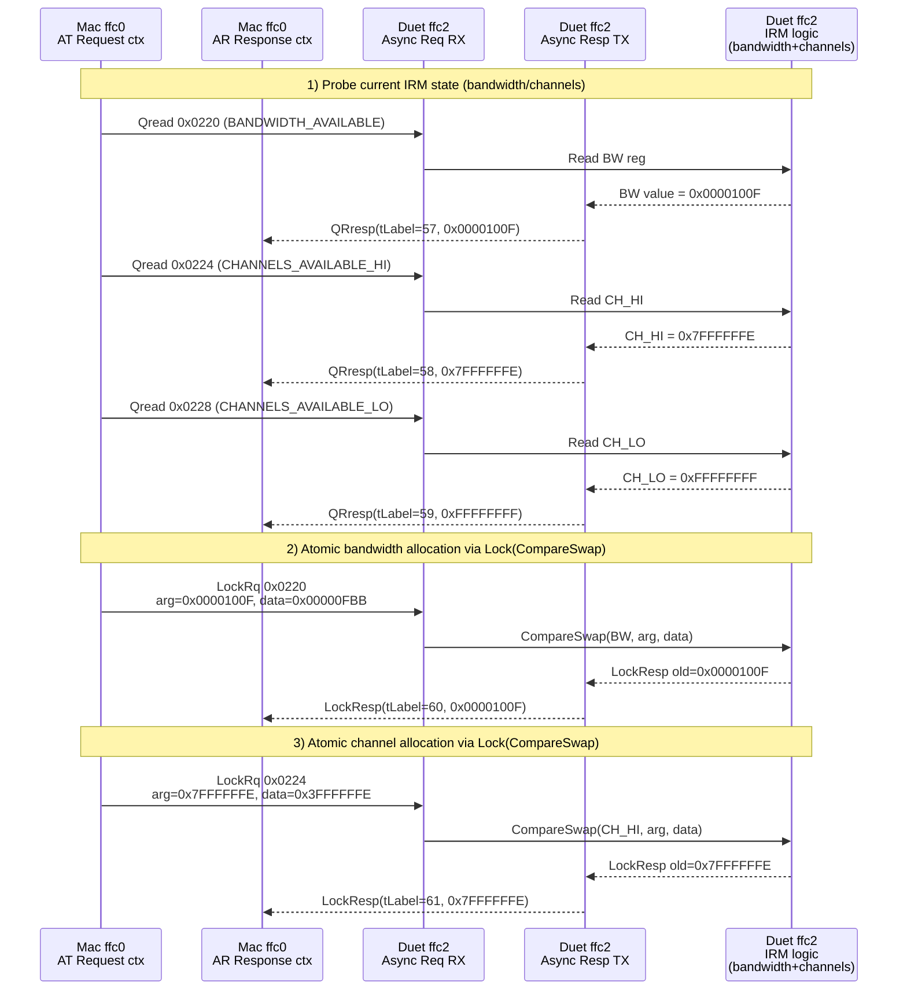

# IRM Explained
This trace is a textbook IRM client sequence: the Mac (`ffc0`) uses its **AT Request** context to `Qread` the IRM registers on the Duet (`ffc2`), then issues `Lock(CompareSwap)` calls that atomically (1) reserve bandwidth in `BANDWIDTH_AVAILABLE` (`0x0220`), and (2) clear a bit in `CHANNELS_AVAILABLE` (`0x0224`/`0x0228`) to grab one isoch channel. The AR context captures the QRresp/LockResp packets and the IRM decoder logs the “Allocate …” messages. Your earlier self-lock timing out had no remote IRM responder; here the Duet is itself the IRM and replies correctly.

---

## 1. What the registers are

These CSR offsets are the canonical Isochronous Resource Manager registers:

* `0x0220` – **BANDWIDTH_AVAILABLE** (32-bit)
* `0x0224` – **CHANNELS_AVAILABLE_HI** (32-bit, channels 63–32)
* `0x0228` – **CHANNELS_AVAILABLE_LO** (32-bit, channels 31–0)

In the IRM model:

* **Bandwidth** is a count of remaining bandwidth allocation units.
* **Channels** map to bits:
  * bit = `1` → channel free/available
  * bit = `0` → channel claimed/allocated

The IRM owner node implements these CSRs. In the trace: `ffc2` (Duet) is the IRM, and `ffc0` (Mac) is the client.

---

## 2. Decode the actual numbers

### 2.1 Bandwidth allocation

1. Mac probes bandwidth:
   ```text
   Qread ... 0x0220 ... QRresp value 0000100f
   ```
   So `BANDWIDTH_AVAILABLE = 0x0000100F`.

2. Mac wants to subtract 84 units:
   ```text
   LockRq ... 0x0220, size 8
       0000   0000100f 00000fbb
         arg  old      new
   IRM: Allocate 0x54 (84) BANDWIDTH units
   ```
   * `old = 0x0000100F`
   * `new = 0x00000FBB`
   * `old - new = 0x54` → 84 decimal

   Whispered in IRM parlance: “If the register is still `0x0000100F`, atomically set it to `0x00000FBB` (subtract 0x54).”

3. IRM acknowledges:
   ```text
   LockResp ... value 0000100f
   IRM: Change was accepted
   ```
   `LockResp` always returns the previous value. Because it equals `old`, the CAS succeeded and the register now holds `0x00000FBB`.

### 2.2 Channel allocation

1. Mac reads channels:
   ```text
   Qread ... 0x0224 ... QRresp value 7ffffffe
   Qread ... 0x0228 ... QRresp value ffffffff
   ```
   * `CHANNELS_AVAILABLE_HI = 0x7FFFFFFE`
   * `CHANNELS_AVAILABLE_LO = 0xFFFFFFFF`

   Interpretation:
   * All `1` bits mean the channel is free.
   * `0x7FFFFFFE = 0b0111...1110` (only bit 0 already zero).
   * `0xFFFFFFFF` means the lower half is fully free.

2. Mac picks a channel bit to clear and issues CAS:
   ```text
   LockRq ... 0x0224, size 8
       0000   7ffffffe 3ffffffe
             old       new
   IRM: Allocate channel 0x1 (1)
   ```
   * `old = 0x7FFFFFFE`
   * `new = 0x3FFFFFFE`
   * `old - new = 0x40000000`

   Clearing bit 30 registers that a specific high-channel is now marked allocated. The decoder prints “Allocate channel 0x1 (1)” because it maps that bit index to channel ID 1.

3. IRM replies:
   ```text
   LockResp ... value 7ffffffe
   IRM: Change was accepted
   ```
   With `resp == arg`, the CAS succeeded; the register now equals `0x3FFFFFFE`, and channel 1 is no longer available.

---

## 3. Timeline with host/device roles

```
01:6182:2356  Qread from ffc0 to ffc2.ffff.f000.0220, tLabel 57 [ack 2] s100
101:6184:2748  QRresp from ffc2 to ffc0, tLabel 57, value 0000100f [ack 1] s100
```
* **Mac (ffc0)** → **Duet (ffc2)**
  * Context: host AT Request
  * Action: read `BANDWIDTH_AVAILABLE`
  * Result: 0x0000100F

```
101:6185:1506  Qread from ffc0 to ffc2.ffff.f000.0224, tLabel 58 [ack 2] s100
101:6187:1888  QRresp from ffc2 to ffc0, tLabel 58, value 7ffffffe [ack 1] s100
```
* Mac → Duet: read `CHANNELS_AVAILABLE_HI` → value `0x7FFFFFFE`

```
101:6188:0277  Qread from ffc0 to ffc2.ffff.f000.0228, tLabel 59 [ack 2] s100
101:6190:1495  QRresp from ffc2 to ffc0, tLabel 59, value ffffffff [ack 1] s100
```
* Mac → Duet: read `CHANNELS_AVAILABLE_LO` → value `0xFFFFFFFF`

```
101:6191:0686  LockRq from ffc0 to ffc2.ffff.f000.0220, size 8, tLabel 60 [ack 2] s100
               0000   0000100f 00000fbb
    IRM: Allocate 0x54 (84) BANDWIDTH units
101:6193:2086  LockResp from ffc2 to ffc0, size 4, tLabel 60 [ack 1] s100
               0000   0000100f
    IRM: Change was accepted
```
* Mac → Duet: compare-swap `BANDWIDTH_AVAILABLE`
  * Cas arg: `0x0000100F`, data: `0x00000FBB`
  * IRM verifies, writes new value, replies with old value

```
101:6194:1277  LockRq from ffc0 to ffc2.ffff.f000.0224, size 8, tLabel 61 [ack 2] s100
               0000   7ffffffe 3ffffffe
    IRM: Allocate channel 0x1 (1)
101:6196:2042  LockResp from ffc2 to ffc0, size 4, tLabel 61 [ack 1] s100
               0000   7ffffffe
    IRM: Change was accepted
```
* Mac → Duet: compare-swap `CHANNELS_AVAILABLE_HI`
  * Arg: `0x7FFFFFFE`, data: `0x3FFFFFFE`
  * IRM acknowledges, channel bit cleared

At this point the Mac owns an isoch channel (channel 1) and 84 bandwidth units. The Duet IRM reflects the new register contents.

---

## 4. Flow chart with contexts



**Key points:**

* The **Mac** controls the AT Request context for writes and the AR Response context for replies.
* The **Duet** routes incoming requests to IRM logic, replies via the async resp context, and enforces CAS semantics.
* IRM debugging logs decode the QR/Lock responses and report the bandwidth/channel allocations.

---
