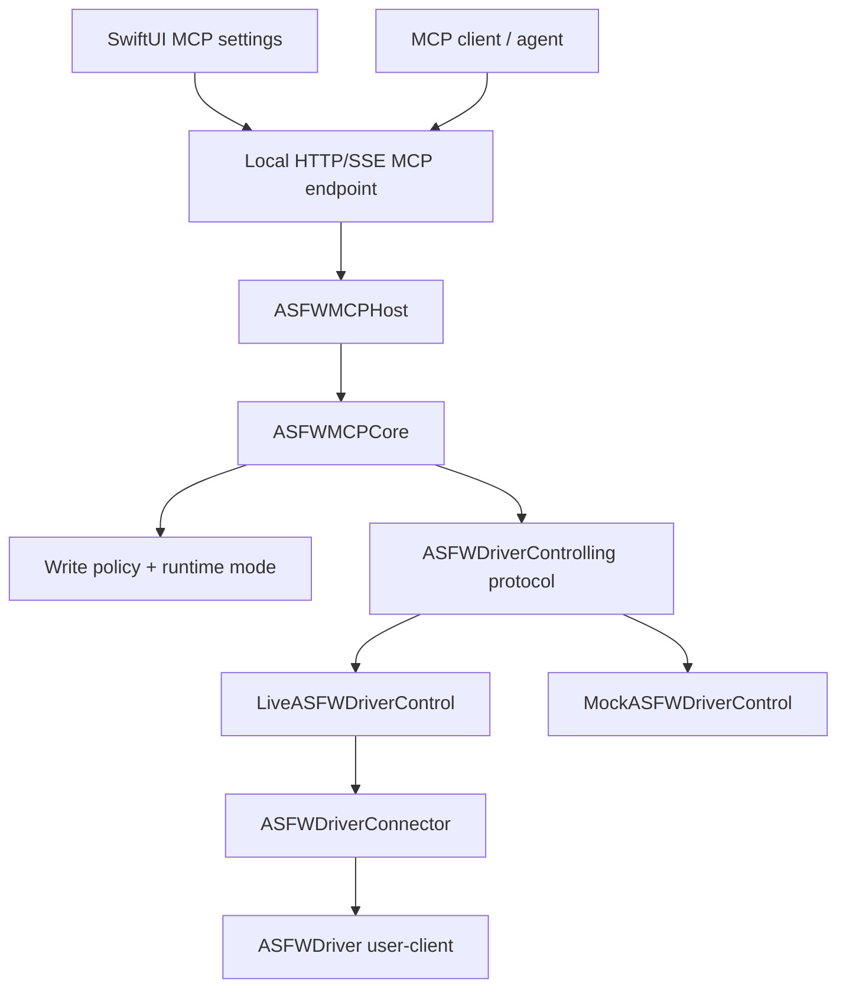

# ASFW MCP Control Plane Architecture

Linear: [FW-76](https://linear.app/asfirewire/issue/FW-76/define-mcp-host-architecture-and-transport-strategy)

Status: Accepted direction for the first MCP control-plane slice.

## 1. Goal

ASFW should expose a structured Model Context Protocol (MCP) control plane for
FireWire driver and protocol diagnostics. The first phase is not an audio-control
surface and not a production feature. It is a development-only interface for
agents to inspect ASFW state and, later, execute guarded low-level FireWire
operations without parsing log dumps.

The MCP host must fit inside the existing ASFW Xcode project. It must not assume a
separate Swift CLI project, and it must not enable agent access by default.

## 2. Non-goals

This architecture slice does not implement:

- audio mixer, phantom power, routing, or device-specific audio UX
- production MCP enablement
- write-capable hardware access
- a separate Swift package or standalone CLI project
- raw controller writes before the policy and test gates exist

## 3. Current Project Constraints

ASFW is currently organized as an Xcode project with:

- `ASFW`: SwiftUI control app
- `ASFWDriver`: DriverKit driver
- `ASFWTests`: existing Swift test target

The control app talks to the driver through `ASFWDriverConnector`, which wraps
IOKit/user-client calls and already exposes useful surfaces:

- controller status, topology, Config ROM, metrics, and logs
- async read/write/block-read/block-write and transaction polling
- compare-swap support
- AV/C and raw FCP commands
- temporary IRM and CMP test methods

The connector is a UI-facing object today. MCP handlers should not call it
directly. A narrow protocol boundary is needed so the MCP layer can be tested
with mocks and later backed by the live connector.

## 4. Proposed Layering



### 4.1 ASFWMCPCore

Pure Swift, testable, and independent of SwiftUI. This layer owns:

- tool and resource registry
- dynamic discovery rules
- request and result schemas
- policy decision integration
- compact telemetry/result formatting

This layer should avoid importing IOKit, SwiftUI, or DriverKit-specific code.

### 4.2 ASFWDriverControlling

A protocol boundary over the driver-facing capabilities MCP needs. It should be
async-friendly even if the first live implementation wraps existing synchronous
connector methods.

Example shape:

```swift
protocol ASFWDriverControlling {
    func controllerSnapshot() async -> MCPControllerSnapshotResult
    func listNodes() async -> MCPNodeListResult
    func readQuadlet(_ request: MCPReadQuadletRequest) async -> MCPTransactionResult
    func readBlock(_ request: MCPReadBlockRequest) async -> MCPTransactionResult
}
```

Initial implementations:

- `LiveASFWDriverControl`: wraps `ASFWDriverConnector`
- `MockASFWDriverControl`: deterministic tests without FireWire hardware

Write methods should exist only after the FW-79 policy model is ready, or should
return policy refusals without touching the live driver path.

### 4.3 ASFWMCPHost

The host layer imports the MCP Swift SDK and wires transport, server lifecycle,
tool listing, resource listing, and tool calls to `ASFWMCPCore`.

This layer should be thin. Tool behavior belongs in `ASFWMCPCore`; hardware
access belongs behind `ASFWDriverControlling`.

## 5. Runtime Modes

MCP is disabled by default.

| Mode | Purpose | Writes | Hardware access |
| --- | --- | --- | --- |
| `disabled` | Normal app behavior | No | No MCP exposure |
| `mock` | Unit tests and schema tests | No live writes | Mock only |
| `readOnlyDeveloper` | Local diagnostics | No writes | Live reads allowed |
| `developerWriteEnabled` | Explicit lab mode | Policy-gated writes | Live writes allowed only after test gate |

`developerWriteEnabled` requires the FW-79 policy engine and FW-89 Swift MCP test
gate. Before those exist, write tools may be modeled as schemas but must not reach
the live driver/user-client write path.

The SwiftUI app owns the enable/disable control and port selection. The first UI
surface should be intentionally small:

- enabled/disabled toggle
- local port setting
- runtime mode display
- active session indicator

The UI does not need a full session console in FW-76. It only needs to make it
obvious when an MCP endpoint is active.

## 6. Transport Decision

The Swift MCP SDK supports stdio transport and custom transports. It also supports
client-side HTTP transport and in-memory/testing patterns. ASFW should not select
stdio by default just because it is common for CLI MCP servers.

### 6.1 Selected v1 direction: app-hosted local HTTP/SSE

The first implementation should be app-hosted and local-only. The ASFW SwiftUI
app owns driver connection lifecycle, user-visible enablement, port selection,
and session-active display. When enabled, the app starts a local HTTP/SSE-style
MCP endpoint and routes requests through the MCP host/core layers.

```text
SwiftUI app
  owns enable/disable UI
  owns driver connection lifecycle
  starts local HTTP/SSE MCP endpoint only when enabled
      ↓
ASFWMCPHost
      ↓
ASFWMCPCore
      ↓
ASFWDriverControlling
      ↓
MockASFWDriverControl or real ASFWDriverConnector
```

The endpoint must bind to loopback only. No Unix domain socket transport is
planned for v1.

Advantages:

- reuses the app's existing driver connection and permissions
- no separate project
- clear UI/dev-mode control
- easy to keep disabled by default

Risks:

- lifecycle must be carefully tied to app enablement
- clients need a way to discover/connect to the local endpoint
- app sandbox and entitlement behavior must be verified
- server-side HTTP/SSE support may require an ASFW transport adapter if the SDK
  does not provide the exact server transport shape needed

### 6.2 Deferred fallback: helper target in the same Xcode project

No helper target should be created for v1/FW-76. It remains a fallback
architecture, not the first implementation. The current layering must keep
`ASFWMCPCore` and `ASFWMCPHost` free of SwiftUI dependencies so a helper can host
the same logic later if needed.

Use a helper target only if one of these becomes true:

1. MCP clients strongly expect to spawn a process.
2. SwiftUI app lifecycle makes long-lived MCP sessions annoying.
3. MCP should keep running while the UI window is closed.
4. HTTP server integration inside the app becomes messy.
5. Crash/process isolation from the app becomes important.
6. MCP needs a different entitlement/signing shape.

If app-hosted HTTP/SSE proves unsuitable, a helper target in the same Xcode
project may host the same `ASFWMCPHost` and `ASFWMCPCore` layers. The helper must
still use `ASFWDriverControlling` and must not bypass policy, test gates, or
app-level enablement rules.

Advantages:

- cleaner process boundary
- could use stdio if the MCP client expects to spawn a process
- can be tested independently from SwiftUI lifecycle

Risks:

- signing, entitlement, packaging, and installation complexity
- may duplicate driver connection lifecycle
- more launch/lifecycle logic
- harder disabled-by-default story
- more moving parts before any MCP value is visible

### 6.3 XPC helper

Mac-native boundary for a privileged/local service shape.

Advantages:

- well-understood local IPC model on macOS
- stronger boundary than in-app hosting

Risks:

- heavier than needed for the first spike
- more setup before any MCP value is visible

### 6.4 Stdio adapter

Useful for compatibility with MCP clients that launch tools as subprocesses, but
not the preferred first architecture for the ASFW app.

Advantages:

- common MCP deployment shape
- simple lifecycle when the client owns the process

Risks:

- poor fit for a signed app already managing DriverKit/user-client access
- encourages a separate CLI shape
- awkward for long-lived app state and UI-controlled enablement

## 7. Recommended FW-76 Decision

Use an app-integrated MCP architecture with app-hosted local HTTP/SSE as the
first transport direction. Do not create a helper target in v1.

Implement the internal boundaries first:

1. `ASFWMCPCore`
2. `ASFWDriverControlling`
3. `MockASFWDriverControl`
4. a thin `ASFWMCPHost` shell wired to an app-hosted local HTTP/SSE endpoint

Keep helper-target and stdio adapter options open as fallbacks. They must reuse
the same MCP core and driver-control protocol boundary if added later.

## 8. Initial Tool Surface for Architecture Validation

FW-76 should validate structure with a tiny read-only surface:

- `asfw_get_capabilities`
- `asfw_get_policy`
- `asfw_list_nodes`
- `asfw_get_node_summary`

These tools can run against `MockASFWDriverControl` first. Live driver reads can
be added only after the host lifecycle and runtime enablement are explicit.

No write-capable tool should be live in FW-76.

## 9. Safety Requirements

- MCP agent access is disabled by default.
- Tool handlers do not call `ASFWDriverConnector` directly.
- Live hardware access goes through `ASFWDriverControlling`.
- Mutating operations require FW-79 and FW-89.
- Denied and dry-run writes must not reach driver/user-client write APIs.
- Dynamic tool discovery must reflect current mode and capability state.
- Large/raw data should be opt-in, not default.

## 10. Open Questions

- Which concrete Swift HTTP/SSE server implementation should back the app-hosted
  endpoint?
- Should the local endpoint require a session token in addition to loopback
  binding?
- How should the selected port be persisted and validated?
- What exact active-session state should the app display: connected client count,
  last request timestamp, current tool call, or only active/inactive?
- How should MCP enablement interact with app relaunch and system extension
  reconnect behavior?

## 11. FW-76 Acceptance Criteria Mapping

- Architecture decision recorded: this document.
- App-hosted local HTTP/SSE is selected as the first transport direction.
- No separate standalone Swift CLI project is required.
- No helper target is created in v1/FW-76.
- Agent access remains disabled by default.
- The design creates a testable core and mock control adapter for FW-89 and FW-90.
