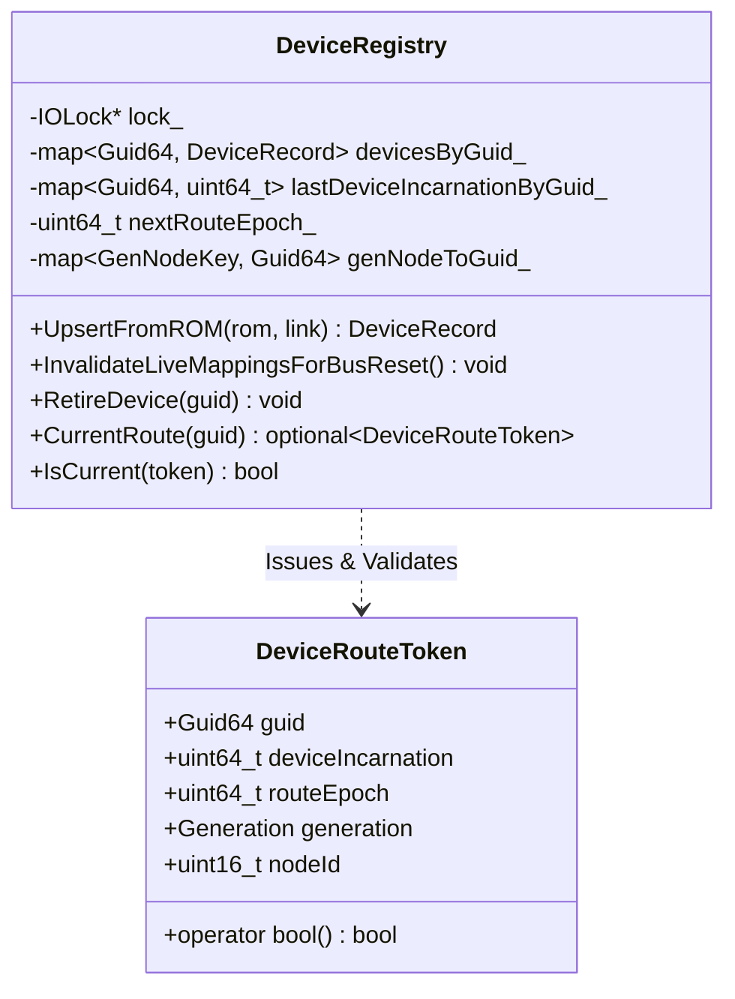
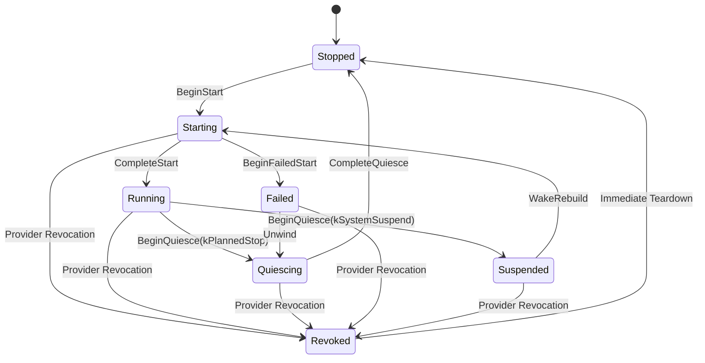
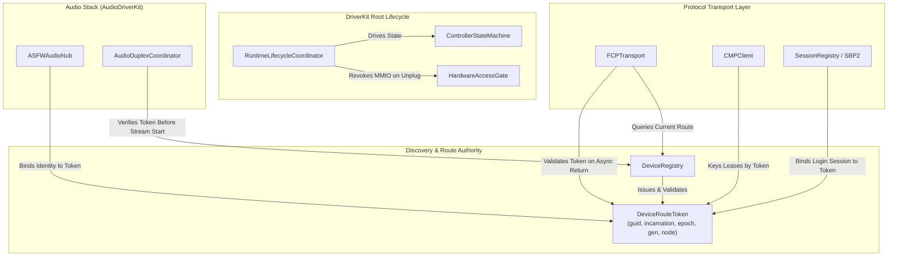

# Token-Based Device Route & Runtime Lifecycle Architecture

## 1. Executive Summary & Context

This document provides the authoritative architectural specification for the **Token-Based Device Route and Runtime Lifecycle** in the ASFW macOS DriverKit FireWire (IEEE 1394) driver (`ASFWDriver`).

Historically, FireWire control and transport pipelines relied on loose pairs of `(uint16_t nodeId, Generation generation)` passed across dispatch queues, async transaction callbacks, protocol engines (FCP, CMP, SBP-2), and CoreAudio audio nubs. Because FireWire bus resets dynamically reassign node IDs and increment bus generation numbers, asynchronously queued callbacks and multi-step transactions frequently suffered from race conditions:
- Late-arriving callbacks executing against a reassigned node ID (potentially targeting the wrong physical device).
- Stale asynchronous block-writes issued across a bus reset.
- Cross-service use-after-free (UAF) crashes when PCI providers or audio nubs were disconnected/re-plugged while background transactions remained inflight.

To eliminate these vulnerabilities, ASFW underwent a complete architectural cutover across commits `72777bc0` through `3746169f`:
1. **Replacement of raw `(nodeId, gen)` pairs with `DeviceRouteToken`**: Immutable value-type tokens issued and validated exclusively by [`DeviceRegistry`](../ASFWDriver/Discovery/DeviceRegistry.hpp).
2. **Device Incarnation & Route Epoch tracking**: Differentiating between physical device re-plugs (`deviceIncarnation`) and bus resets/rebinds (`routeEpoch`).
3. **Centralized Root Lifecycle Coordination ([`RuntimeLifecycleCoordinator`](../ASFWDriver/Service/Lifecycle/RuntimeLifecycleCoordinator.hpp))**: Standardizing the driver state graph ([`ControllerStateMachine`](../ASFWDriver/Controller/ControllerStateMachine.hpp)) and ensuring provider revocation dominance (`Revoked`) as specified in [`RUNTIME_LIFECYCLE_CONTRACT.md`](../ASFWDriver/Service/Lifecycle/RUNTIME_LIFECYCLE_CONTRACT.md).
4. **Revocable MMIO Access Scopes ([`HardwareAccessGate`](../ASFWDriver/Hardware/HardwareAccessGate.hpp) & [`HardwareAccessScope`](../ASFWDriver/Hardware/HardwareAccessScope.hpp))**: Protecting PCI register accesses against post-detach MMIO panics.

---

## 2. Token Specification: `DeviceRouteToken`

`DeviceRouteToken` ([`ASFWDriver/Discovery/DeviceRouteToken.hpp`](../ASFWDriver/Discovery/DeviceRouteToken.hpp)) is an immutable, 24-byte, copyable value type. Callers capture a token at request creation and ask [`DeviceRegistry`](../ASFWDriver/Discovery/DeviceRegistry.hpp) to validate it before executing any post-async action or mutating remote state.

### 2.1 Struct Layout & Definitions

```cpp
namespace ASFW::Discovery {

struct DeviceRouteToken {
    Guid64 guid{0};                // 64-bit IEEE 1212 EUI-64 global hardware identity
    uint64_t deviceIncarnation{0}; // Monotonic count; advances only on physical unplug & re-plug
    uint64_t routeEpoch{0};        // Monotonic count; advances on every bus reset, invalidation, & rebind
    Generation generation{0};      // IEEE 1394 bus generation number at route creation
    uint16_t nodeId{kInvalidNodeId};// Operational physical node ID (0..62)

    constexpr bool operator==(const DeviceRouteToken&) const = default;

    [[nodiscard]] constexpr explicit operator bool() const noexcept {
        return guid != 0 && deviceIncarnation != 0 && routeEpoch != 0 &&
               TryOperationalNodeId(nodeId).has_value();
    }
};

} // namespace ASFW::Discovery
```

### 2.2 Token Field Semantics

| Field | Type | Scope / Lifetime | Trigger for Value Change |
|---|---|---|---|
| `guid` | `Guid64` | Physical Hardware | Fixed for the life of the physical device. |
| `deviceIncarnation` | `uint64_t` | Device Service Instance | Incremented by `DeviceRegistry` when a device is retired and re-added (physical disconnect & reconnect). Prevents late callbacks from a previous device session from validating against a new session. |
| `routeEpoch` | `uint64_t` | Bus Reset & Route Rebind | Incremented by `DeviceRegistry` on every bus reset (`InvalidateLiveMappingsForBusReset`), device loss (`MarkLost`), or topology rebind (`UpsertFromROM`). |
| `generation` | `Generation` | IEEE 1394 Bus Topology | Incremented by controller Self-ID count after a bus reset. |
| `nodeId` | `uint16_t` | Self-ID Allocation | Physical 0..62 node ID assigned during Self-ID phase; set to `kInvalidNodeId` (0xFFFF) when unmapped. |

---

## 3. Device Registry (`DeviceRegistry`) as the Route Authority

`DeviceRegistry` (`ASFWDriver/Discovery/DeviceRegistry.hpp`) is the **sole authority** for issuing and validating `DeviceRouteToken` values.



### 3.1 Key Lifecycle Rules in `DeviceRegistry`

1. **No Escaping Mutable Pointers**: No raw, mutable `DeviceRecord*` pointers escape `DeviceRegistry`'s lock. All lookups return immutable snapshots (`DeviceRecord` value types) or route tokens (`DeviceRouteToken`).
2. **Bus Reset Invalidation (`InvalidateLiveMappingsForBusReset`)**:
   - Immediately called on the bus reset interrupt path.
   - Clears `genNodeToGuid_` mapping index.
   - Sets every live device's `nodeId` to `kInvalidNodeId`.
   - Allocates a new `routeEpoch` for every record.
   - Immediately invalidates all outstanding `DeviceRouteToken` instances across the driver!
3. **Device Retirement (`RetireDevice`)**:
   - Called when a device is physically disconnected or lost.
   - Retains `lastDeviceIncarnationByGuid_[guid]` so that a subsequent re-plug of the same physical unit allocates `deviceIncarnation + 1`. Old tokens from the previous session will fail `IsCurrent()` even if node IDs happen to match.
4. **Validation Contract (`IsCurrent`)**:
   ```cpp
   bool DeviceRegistry::IsCurrent(const DeviceRouteToken& token) const noexcept {
       if (!token) return false;
       IOLockLock(lock_);
       const auto it = devicesByGuid_.find(token.guid);
       const bool current = it != devicesByGuid_.end() &&
                            HasLiveRoute(it->second) &&
                            it->second.deviceIncarnation == token.deviceIncarnation &&
                            it->second.routeEpoch == token.routeEpoch &&
                            it->second.gen == token.generation &&
                            it->second.nodeId == token.nodeId;
       IOLockUnlock(lock_);
       return current;
   }
   ```

---

## 4. Subsystem Integration & Cutover Details

### 4.1 Function Control Protocol (`FCPTransport`)

In `FCPTransport`, commands are submitted with an implicit binding to the target's current `DeviceRouteToken`.

```mermaid
sequenceDiagram
    autonumber
    participant Client as FCP Client (AVCUnit/Protocol)
    participant FCP as FCPTransport
    participant Reg as DeviceRegistry
    participant Bus as FireWire Bus (Async Tx)

    Client->>FCP: SubmitCommand(frame, completion, policy)
    FCP->>Reg: CurrentRoute(deviceGuid)
    Reg-->>FCP: DeviceRouteToken T1
    FCP->>Bus: SubmitWriteCommand(frame, T1)
    
    alt Happy Path
        Bus-->>FCP: OnAsyncWriteComplete(T1, kSuccess)
        FCP->>Reg: IsCurrent(T1)
        Reg-->>FCP: true
        Bus-->>FCP: OnFCPResponse(srcNode, gen, payload)
        FCP->>Reg: IsCurrent(T1)
        Reg-->>FCP: true
        FCP-->>Client: Completion(kOk, responseFrame)
    else Bus Reset Mid-Flight
        Note over Bus: Bus Reset Occurs!
        Reg->>Reg: InvalidateLiveMappingsForBusReset()
        Note over Reg: RouteEpoch advances to T2; T1 becomes invalid
        Bus-->>FCP: OnAsyncWriteComplete(T1, kBusReset)
        FCP->>Reg: IsCurrent(T1)
        Reg-->>FCP: false
        alt Policy == kIdempotent
            Note over FCP: Enter awaitingRouteRevalidation state
            Note over Reg: Discovery completes Config ROM scan
            Reg->>FCP: OnRouteRevalidated(T2)
            FCP->>Bus: Re-issue WriteCommand with T2
        else Policy == kNever
            FCP-->>Client: Completion(kBusReset, empty)
        end
    end
```

### 4.2 Connection Management Protocol (`CMPClient`)

`CMPClient` manages IEC 61883 Plug Control Registers (oPCR / iPCR).
- **Lease Keying**: Leases are keyed by `LeaseKey { DeviceRouteToken route, PCRDirection dir, uint8_t plugNum }`.
- **Bus Reset Protection**: A bus reset clears hardware PCR state on remote devices. `CMPClient::InvalidateAllLeasesForBusReset()` purges local lease bookkeeping without attempting to send `BREAK` Compare-and-Swap quadlet writes to obsolete node IDs in a new generation.

### 4.3 Audio Layer & Audio Nubs (`ASFWAudioNub`, `AudioDuplexCoordinator`)

Audio publication and streaming are bound to `DeviceRouteToken`:
- `ASFWAudioNub` maintains a `DeviceRouteToken` describing its underlying hardware route.
- `AudioDuplexCoordinator` verifies `IsCurrent(token)` before issuing streaming start requests.
- Real-time audio processing threads operate on pre-allocated shared memory rings (`AudioTransportControlBlock`) and **never** acquire `DeviceRegistry` locks or perform MMIO calls.

### 4.4 SCSI Storage (`ASFWSBP2Nub`, `SBP2NubPublisher`, `SessionRegistry`)

- `SBP2NubPublisher` observes unit discovery events and manages `ASFWSBP2Nub` DriverKit service instances based on route token validity.
- `SessionRegistry` tracks SBP-2 login sessions keyed by route tokens, preventing login descriptor corruption upon bus resets.

---

## 5. Root Runtime Lifecycle & Hardware Access Control

The token-based routing architecture operates in unison with the centralized driver lifecycle and hardware isolation layers defined in [`RUNTIME_LIFECYCLE_CONTRACT.md`](../ASFWDriver/Service/Lifecycle/RUNTIME_LIFECYCLE_CONTRACT.md).



### 5.1 Controller State Machine (`ControllerStateMachine`)

The driver enforcing a single legal state graph:
`Stopped` $\rightarrow$ `Starting` $\rightarrow$ `Running` $\rightarrow$ `Quiescing` $\rightarrow$ `Stopped` (plus `Suspended`, `Failed`, and `Revoked`).

### 5.2 Provider Revocation Dominance

If the PCI provider (`PCIDevice`) is hot-unplugged or terminated by macOS:
1. `RuntimeLifecycleCoordinator` transitions state immediately to `Revoked`.
2. `HardwareAccessGate::RevokeAndDrain()` is invoked:
   - Sets `open_ = false` under lock.
   - Prevents any new `HardwareAccessScope` from being acquired.
3. Hardware register cleanup is **completely skipped** (preventing PCI MMIO panic on disconnected hardware).
4. Outstanding DriverKit callbacks and dispatch queues drain safely.

### 5.3 Hardware Access Scopes (`HardwareAccessScope`)

All local OHCI MMIO operations must be wrapped in a stack-bound `HardwareAccessScope`:

```cpp
// Correct MMIO Access Pattern
if (auto scope = hardwareAccessGate.TryBeginAccess(*hardwareInterface)) {
    scope.Write(Register32::kCommandRegister, 0x10000);
    uint32_t status = scope.Read(Register32::kStatusRegister);
} // scope automatically releases on destruction
```

**Scope Invariants**:
- Stack-bound, move-only, non-copyable.
- Must **never** be stored in class fields, captured in lambdas/callbacks, or held across asynchronous queue dispatches.
- Guarantees that when `RevokeAndDrain()` returns, no thread can execute MMIO instructions against unmapped PCI memory.

---

## 6. Comprehensive Architectural Flowchart

The overall relationship between runtime lifecycle, token validation, hardware gates, and protocol drivers is summarized below:



---

## 7. Verification & Cutover Rules

### 7.1 Mandatory Code Invariants
1. **No Raw `(nodeId, gen)` Parameters**: No public API across `Protocols/`, `Audio/`, or `SCSIController/` may accept separate `uint16_t nodeId` and `uint32_t generation` arguments without a `DeviceRouteToken`.
2. **Lock Isolation**: Audio real-time processing threads must **never** wait on `DeviceRegistry` or `HardwareAccessGate` locks.
3. **Idempotent Reset Handling**: Safe read-only transactions may revalidate routes via `OnRouteRevalidated(token)` after bus resets; state-changing writes must fail cleanly with `kBusReset`.
4. **Strict Teardown Cleanliness**: Legacy fallback routines (`QuiesceRuntime`, `CleanupStartFailure`, `ControllerCore::Stop`) have been eliminated in favor of unified `RuntimeLifecycleCoordinator` execution.
