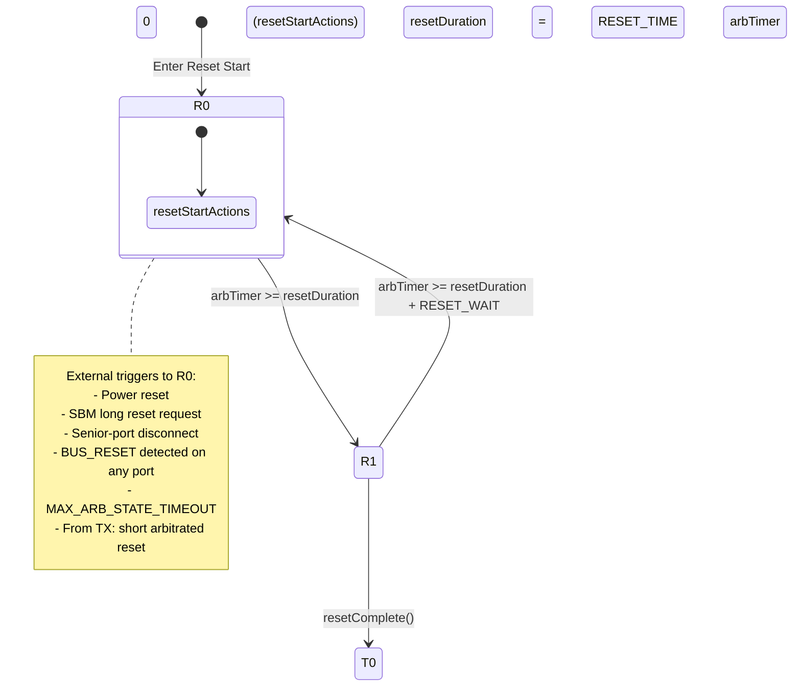

# IEEE-1394 Bus Reset State Machine  
(Modernized Technical Documentation)

This document re-expresses the IEEE-1394-1995 §16.4.5 “Bus Reset State Machine” in a clear, implementation-friendly format.  
The purpose is to make the behavior readable and actionable for engineers writing PHY drivers, link layers, or FireWire controller logic.

## 1. Overview

A bus reset is the PHY-level procedure used to reinitialize FireWire topology, detect port changes, and begin the Tree-ID and Self-ID phases.

A node enters this reset state machine when:

- The PHY senses BUS_RESET on any port (active/resuming/attaching)
- The local PHY initiates a reset (SBM long-reset request, senior-port disconnect)
- Arbitration stalls or exceeds defined timeout thresholds
- A short-reset is initiated from the transmit path following arbitration

The state machine consists of two runtime states:

- R0 — Reset Start
- R1 — Reset Wait

External transitions enter R0 from several conditions. R1 transitions to either R0 (if extended reset is required) or to Tree-ID Start (T0) once complete.

## 2. Mermaid.js State Machine Diagram

## 3. State Definitions

### R0: Reset Start

The node begins transmitting a BUS_RESET signal on all active ports.

Actions:

- Drive BUS_RESET for at least resetDuration
- Standard resets use RESET_TIME
- Short (arbitrated) resets use SHORT_RESET_TIME

### R1: Reset Wait

The node stops driving BUS_RESET and begins transmitting IDLE symbols.

Actions:

- Send IDLE continuously
- Wait for all connected ports to return IDLE or PARENT_NOTIFY
- If waiting exceeds resetDuration + RESET_WAIT, return to R0

### T0: Tree-ID Start

Triggered when:

- All ports show IDLE or PARENT_NOTIFY
- resetComplete() condition satisfied
- arbTimer reset to 0

## 4. Transition Rules

### ALL → R0a  
BUS_RESET detected on any port.

Produces:
- initiatedReset = FALSE

### ALL → R0b  
Local long reset request.

Triggers:
- SBM long reset request
- Senior-port disconnect

Effects:
- initiatedReset = TRUE
- resetDuration = RESET_TIME

### ALL → R0c  
Arbitration timeout or prolonged idle.

Effects:
- initiatedReset = TRUE
- resetDuration = RESET_TIME

### TX → R0  
Short, arbitrated reset after successful arbitration.

### R0 → R1  
Transition when:
arbTimer >= resetDuration

### R1 → R0  
If waiting exceeds:
arbTimer >= resetDuration + RESET_WAIT

Also sets:
resetDuration = RESET_TIME

### R1 → T0  
All ports IDLE/PARENT_NOTIFY. arbTimer = 0.

## 5. Timing Parameters

| Parameter | Description |
|----------|-------------|
| arbTimer | Time spent in R0/R1 |
| resetDuration | BUS_RESET duration |
| RESET_TIME | Standard BUS_RESET interval |
| SHORT_RESET_TIME | Arbitrated short reset interval |
| RESET_WAIT | Anti-oscillation buffer |
| MAX_ARB_STATE_TIMEOUT | Arbitration timeout |

## 6. Practical Implementation Notes

- State-entry actions complete before transitions
- R0 must drive BUS_RESET long enough for all nodes
- R1 ensures neighbor synchronization
- PHY, not link, generates BUS_RESET
- RESET_WAIT prevents oscillation
