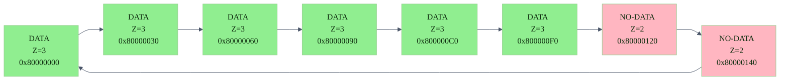

# IT DMA Program

- Channel: 0
- Sample Rate: 48000 Hz
- Blocking: Yes
- Schedule: `[8, 8, 8, 8, 8, 8, 0, 0]`

> **Note:** Some renderers (e.g., GitHub preview) ignore the inline Mermaid init block. If the theme does not appear, view in a renderer that supports `%%{init: ...}%%`.
